# Book Repository
[Book Repository on Heroku](https://book-repository-virtual.herokuapp.com/)

"A safe virtual repository for books, a digital version of your library that is searchable, and where you can share your book notes and thoughts with like-minded readers." - Gaff


The Book Repository is a digital or virtual library to store information about your books, such as title, author, year published, ISBN, genre, rating, description, and your reflection and comments.

The Book Repository provides a private and public search function too, using any combination of title, author, ISBN, genre, and rating.

An Admin Dashboard provides user management, loading of genres and books, as well as Book Repository statistics.

The Book Repository is inspired by my own love of books and reading, and my propensity to stack my books all over the house (makes it easy to see and read them), much to the annoyance of my wife. This way I have the means to store details of my books online, browse my digital stack and find the inspiration to read a book again, or better yet read a new book based on another reader's stack of books.


<details><summary>Please click to expand the ToC</summary>

- [Book Repository](#book-repository)
  * [Business](#business)
    + [External User's Goals](#external-user-s-goals)
    + [Site Owner's Goals](#site-owner-s-goals)
  * [User Experience](#user-experience)
    + [A Persona Summary of the Users/Readers of the Book Repository](#a-persona-summary-of-the-users-readers-of-the-book-repository)
    + [Strategy Trade-Off](#strategy-trade-off)
    + [User Stories, Use Cases, and Tasks Mapped to Information Architecture and Navigation](#user-stories--use-cases--and-tasks-mapped-to-information-architecture-and-navigation)
  * [Design Decisions](#design-decisions)
    + [Design Decisions Overview](#design-decisions-overview)
    + [Interface and Navigation Design](#interface-and-navigation-design)
    + [Design Details](#design-details)
      - [Typography](#typography)
      - [Colour Scheme](#colour-scheme)
      - [Buttons](#buttons)
      - [Navigation Bar](#navigation-bar)
      - [Fixed Footer](#fixed-footer)
      - [Background Image](#background-image)
      - [Flash Messages](#flash-messages)
      - [Tooltips](#tooltips)
      - [Breadcrumbs](#breadcrumbs)
      - [Pagination](#pagination)
      - [Logo](#logo)
      - [Favicon](#favicon)
      - [Book Stack](#book-stack)
      - [Tables](#tables)
  * [Features](#features)
    + [Existing Features](#existing-features)
      - [User Management:](#user-management-)
      - [Book Repository:](#book-repository-)
      - [Admin Dashboard:](#admin-dashboard-)
      - [Shared Features:](#shared-features-)
    + [Future Features](#future-features)
      - [User Management:](#user-management--1)
      - [Book Repository:](#book-repository--1)
      - [Admin Dashboard:](#admin-dashboard--1)
      - [Shared Features](#shared-features)
    + [Information and Visual Design](#information-and-visual-design)
      - [Wireframes and Visuals](#wireframes-and-visuals)
        * [Initial Wireframe Diagram of the Book Repository](#initial-wireframe-diagram-of-the-book-repository)
        * [Landing / Home Page](#landing---home-page)
        * [Register Page](#register-page)
        * [Sign In](#sign-in)
        * [Member's Page](#member-s-page)
        * [Admin Dashboard](#admin-dashboard)
        * [Visual Design, Information Architecture and Navigation](#visual-design--information-architecture-and-navigation)
      - [Code Walkthrough and Visual Design](#code-walkthrough-and-visual-design)
        * ['.env'](#-env-)
        * ['config.py'](#-configpy-)
        * ['app.py' extensions and shared features.](#-apppy--extensions-and-shared-features)
        * [[`flask_user_layout.html`](templates/flask_user_layout.html)](#--flask-user-layouthtml---templates-flask-user-layouthtml-)
        * [Landing / Home Page (User Management)](#landing---home-page--user-management-)
        * [Member's Page](#member-s-page-1)
        * [Add and Save Book](#add-and-save-book)
        * [Edit and Update Book](#edit-and-update-book)
        * [Delete Book](#delete-book)
        * [Search Books](#search-books)
        * [Search Books](#search-books-1)
        * [Admin Dashboard](#admin-dashboard-1)
        * [Admin Dashboard - Update User](#admin-dashboard---update-user)
        * [Admin Dashboard - Delete User](#admin-dashboard---delete-user)
        * [Register Page](#register-page-1)
        * [Sign In](#sign-in-1)
        * [Admin Dashboard](#admin-dashboard-2)
        * [CSS](#css)
        * [JavaScript](#javascript)
    + [Code...](#code)
    + [Features CRUD Table (Views)](#features-crud-table--views-)
    + [Application Logging and Flash Messaging Levels](#application-logging-and-flash-messaging-levels)
    + [Book Repository '.env' and Heroku Variables](#book-repository--env--and-heroku-variables)
    + [Flask-User and Book Repository Routes](#flask-user-and-book-repository-routes)
    + [Flask, Flask-User, and Book Repository Configuration Variables](#flask--flask-user--and-book-repository-configuration-variables)
  * [Technology](#technology)
    + [Technology Choices](#technology-choices)
    + [Code](#code)
    + [Development and Staging Platforms and Environments](#development-and-staging-platforms-and-environments)
    + [Documentation Tools](#documentation-tools)
    + [Acknowledgements and Attributions of Used Features and Functions](#acknowledgements-and-attributions-of-used-features-and-functions)
    + [General Knowledge and Hours of Reading](#general-knowledge-and-hours-of-reading)
  * [Testing and Validation](#testing-and-validation)
    + [Manual BDD](#manual-bdd)
    + [Automated BDD](#automated-bdd)
    + [Testing Notes](#testing-notes)
    + [Validation of HTML 5, CSS 3, JS and Python](#validation-of-html-5--css-3--js-and-python)
  * [Continuous Delivery and Deployment](#continuous-delivery-and-deployment)
  * [Credits](#credits)
    + [Content](#content)
    + [Media](#media)
    + [Acknowledgements](#acknowledgements)

<small><i><a href='http://ecotrust-canada.github.io/markdown-toc/'>Table of contents generated with markdown-toc</a></i></small>

</details>


## Business
The Business goals describe the expected user/reader and site owner goals, and drive the design, development, and deployment of the application which in this case is the Book Repository. The fulfillment of these goals detemine the success of the application.

### External User's Goals
Readers with libraries and/or stacks of books at home that they would like to catalogue online for easier access and overview, and share their ratings, thoughts and comments on their books with other Book Repository readers.

Seeking and finding inspiration on books to read as found by reading the book comments and ratings by the other readers.

### Site Owner's Goals
Inspire readers to find books they might not have heard of, and compel them to buy the books on Amazon or other book outlets, potentially providing comission to the site owner (this is not active as this is an educational project only).

Find new books to read, broadening my horizons, and enjoying the excitement of delving into the mind and perspective of the author.


## User Experience
User experience (UX) design is the design process used to create applications and websites that provide meaningful and relevant experiences to users.

### A Persona Summary of the Users/Readers of the Book Repository


The Book Repository is for readers of all ages (please see next paragraph), diverse demographics and interests, with a preference for real books as opposed to digital media like Kindle (digital media has online libraries and ways of sorting and sharing their books already), and who want to gain some measure of control over their growing stack or library of books through a Book Repository with the additional means to share their views and ratings on books, while also gaining insights and ideas from fellow readers.

The age limit of 18 exists as some books shared may not be suitable for children, and may not be marked as hidden by the user/reader from public searches. It's recommended that people under the age of 18 use the Book Repository under the supervision of a parent or other guardian.

Since the Book Repository aims to satisfy the requirements of a diverse demographic and age group, ease-of-use is key which is described in the section on Design Decisions and Technology Choices.

### Strategy Trade-Off
UX Design is driven by business goals and user needs, and features developed are aligned to these. However, each feature requires time and effort, and often time is constrained as is effort as the greater the effort the higher the cost. Therefore some features are prioritised or mandatory, while others are optional and developed pending time and ultimately cost.

The selected features are driven by the opportunity matrix, which helps us understand what is both more important and viable to create. In this case all features mentioned below are implemented as the features made sense to provide in this initial release. Additional and future features are documented under the Features section, and not documented here.

A Trello Board was used to list the Use Cases and Features, and grew over time as new ideas were added inspired by the project development. In other words, not all these ideas came about before the project development began. An Agile methodology was applied throughout this project.

#### Opportunity Matrices for User Management, Book Repository, Admin Dashboard and Shared Funtions

<!--<details><summary>Please click to expand: Opportunity Matrices - Tables and Scatter Diagrams</summary>-->

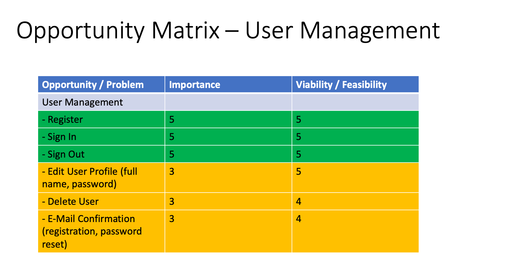

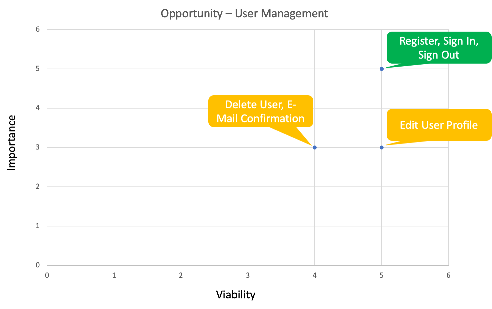


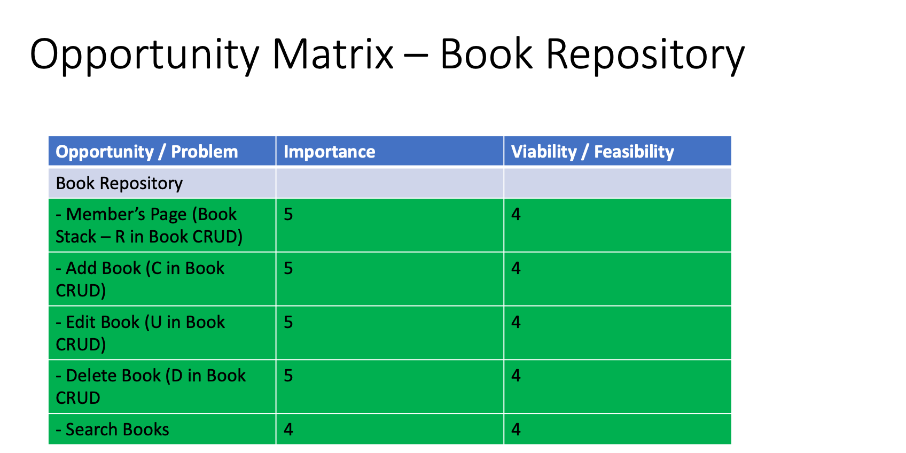

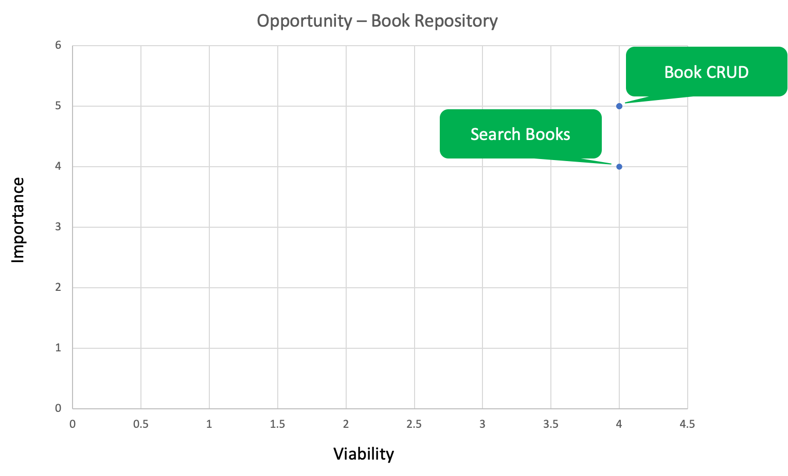


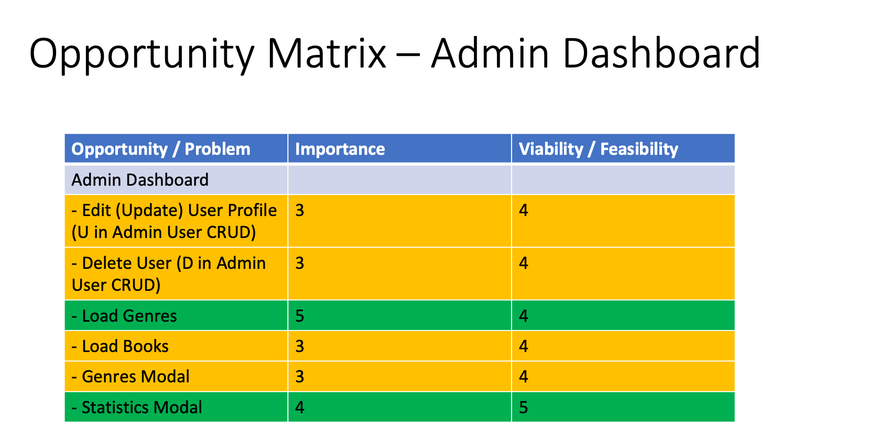

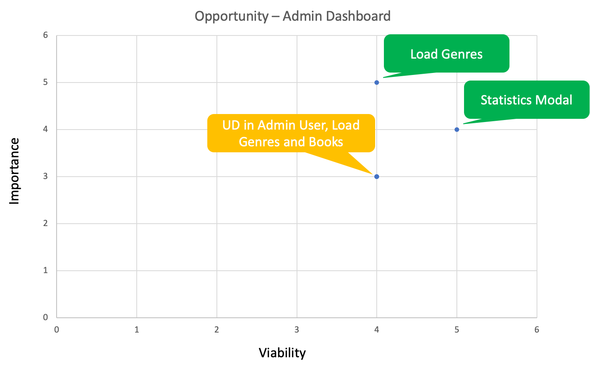


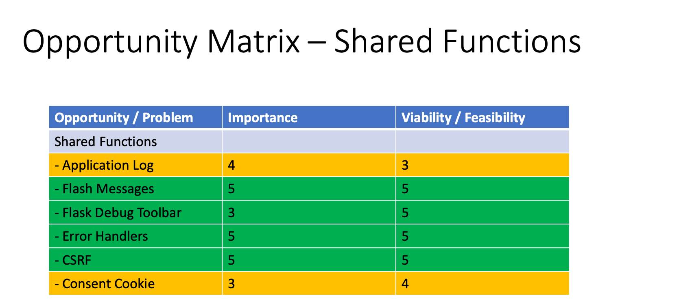

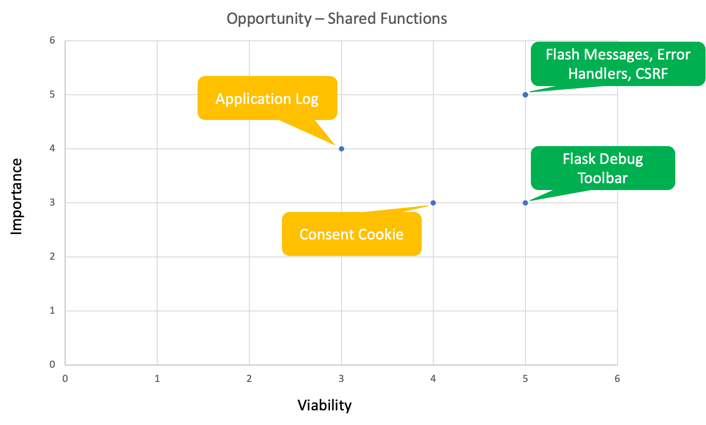

<!--</details>-->

[Initial thoughts and plans for the Book Repository](https://github.com/NaoiseGaffney/BookRepository/wiki/Initial-Project-Design-Thoughts---have-since-changed-with-new-knowledge-and-skills.) The initial plan (scribbled on an A4) is similar to the end result in terms of user outcomes and high-level functions, however, it changed as I wrote things down on the Trello Board and researched some of the technology choices and their capabilities, as technical, functional, and skill contstraints emerged.

### User Stories, Use Cases, and Tasks Mapped to Information Architecture and Navigation
The User Experience links the Business goals of the external user and site owner to a number of user stories. A user story captures a description of a software feature from an end-user perspective. A user story describes the type of user, what they want and why. A use case is a list of actions or event steps describing the interactions between a role and a system to achieve a goal.

A user story has one or more use cases with one or more tasks with steps associated with it, describing how the user story, and subsequent fulfillment of the external user's and site owner's business goals are realised: Business Goals -> User Story -> Use Case(s) -> Task(s).

Information Architecture is sequential with modals, leading the user/reader along at every stage. The navigation bar provides a different set of options depending on the role (user or Admin), and whether authenticated or not. The breadcrumbs provide the "trodden path", making it easy to get back to where the user/reader started while also clarifying where they are (please note, once signed in, the Landing/Home Page redirects to the Member's Page). On pages with many books (Member's Page, Search Results Page) and many users/readers (Admin Page) pagination navigation is provided at the top of the book stack/user table to either select a page directly or go through them using the < (previous page) and (next page) >.

---


* **User Story 001 (User/Reader):** as a new user/reader I want to join the Book Repository to store details about my books so that I can share them with a wider audience.
	* **Use Case 001-001 (C in User CRUD):** as a new user/reader I want to register an account with the Book Repository.
		*  **Tasks 1:** [Book Repository Home/Landing Page](https://book-repository-virtual.herokuapp.com/) -> read and accept the Consent Cookie (optional) -> click on Register in the naviagtion bar or the hamburger-menu followed by Register [Register](https://book-repository-virtual.herokuapp.com/user/register) -> fill in the form: username, email address, password, password confirmation, and click on the Register button -> if successful: a success Flash message, otherwise a danger Flash message.
		*  **Tasks 2:** a confirmation email with a link is sent to the email address specified during registration -> click on the link -> you're accepted and signed in at the same time -> Member's Page -> two success Flash messages, one for registration and one for sign in.
	*  **Use Case 001-002:** as a user/reader I want to Sign In to the Book Repository to access my stack of books.
		*  **Tasks 1:** [Book Repository Home/Landing Page](https://book-repository-virtual.herokuapp.com/) -> read and accept the Consent Cookie (optional) -> click on Sign In in the navigation bar or the hamburger-menu followed by Sign In [Sign In](https://book-repository-virtual.herokuapp.com/user/sign-in) -> enter your username and password (the same credentials used when registering), click on the Remember Me box (optional), and click on the Sign In button -> success Flash message and [Member's Page](https://book-repository-virtual.herokuapp.com/members).
	*  **Use Case 001-003:** as a user/reader I want to reset my password as I have forgotten it.
		*  **Tasks 1:** [Book Repository Home/Landing Page](https://book-repository-virtual.herokuapp.com/) -> read and accept the Consent Cookie (optional) -> click on Sign In in the navigation bar or the hamburger-menu followed by Sign In [Sign In](https://book-repository-virtual.herokuapp.com/user/sign-in) -> click on [Forgot Your Password?](https://book-repository-virtual.herokuapp.com/user/forgot-password) -> enter your email address, the same one you used o register your acccount and click on the Send Reset Password Email button -> success Flash message.
		*  **Tasks 2:** a password reset email is sent to the provided email address, provided it exists in the Book Repository -> click on the password link to reset your password or ignore if you don't need to reset your password -> [Reset Password](https://book-repository-virtual.herokuapp.com/user/reset-password/...) -> enter your new password, retype your new password to confirm, and click on the Change Password button -> success Flash message and [Member's Page](https://book-repository-virtual.herokuapp.com/members).
		*  **Tasks 3:** an email confirming your password change is sent to the email address you provided -> if you initiated the password change, do nothing, otherwise click on the "click here to reset it" link.
	*  **Use Case 001-004 (C in Book CRUD):** as a user/reader I want to add a book to my virtual library/stack of books.
		*  **Tasks 1:** [Member's Page](https://book-repository-virtual.herokuapp.com/members) -> click on the Add Book button on the page if you have no books, or hover over the drop-down menu (open book) and click on Add Book -> [Add Book](https://book-repository-virtual.herokuapp.com/add_book) fill in the form: title, author, year published, ISBN (used for book front cover, link to book on Amazon UK, and link to ISBN Search), book description (optional), book comments (optional), book rating (from 1 to 10, where 10 is spectacular), genre, and toggle the private switch if you want your book to remain hidden from other users/readers, and click on the Add Book button -> success Flash message and [Member's Page](https://book-repository-virtual.herokuapp.com/members)
	*  **Use Case 001-005 (R in Book CRUD):** as a user/reader I want to view a book in my virtual library/stack of books.
		*  **Tasks 1:** [Member's Page](https://book-repository-virtual.herokuapp.com/members) -> click on the "book spine" and it will pop-out displaying the collapsible-content with book details -> click on the title link to view the book in a separate tab on Amazon UK (uses the ISBN as a reference, for example: https://www.amazon.co.uk/s?k=9780141185378 for Burmese Days) -> click on ISBN link to view the book in a separate tab on ISBN Search (uses the ISBN as a reference, for example: https://isbnsearch.org/isbn/9780141185378 for Burmese Days).
	*  **Use Case 001-006 (U in Book CRUD):** as a user/reader I want to update/edit an existing book in my Book Repository stack.
		*  **Tasks 1:** [Member's Page](https://book-repository-virtual.herokuapp.com/members) -> click on the dark blue pencil link on the book spine of the book you want to update -> [Edit Book - Burmese Days](https://book-repository-virtual.herokuapp.com/edit_book/5f480c6727f905184bcf1a51) -> make the necessary changes to title, author, year published, ISBN (to update the front cover thumbnail, Amazon UK and ISBN Search links), book description, book comments (add new, update or delete existing comments), rating, genre, and whether the book is hidden (private) from public searches, and click on the Add Book button -> success Flash message and [Member's Page](https://book-repository-virtual.herokuapp.com/members).
	*  **Use Case 001-007 (D in Book CRUD):** as a user/reader I want to delete an existing book in my Book Repository stack.
		*  **Tasks 1:** [Member's Page](https://book-repository-virtual.herokuapp.com/members) -> click on the pink dustbin/rubbish bin link on the book spine of the book you want to delete the book -> [Delete Book - Burmese Days](https://book-repository-virtual.herokuapp.com/members#delete_book_5f480c6727f905184bcf1a51) -> the delete book modal provides a yes (permanently delete book: [Delete Book - Yes](https://book-repository-virtual.herokuapp.com/delete_book/5f480c6727f905184bcf1a51)) button and a no (close modal: [Delete Book - No](https://book-repository-virtual.herokuapp.com/members#!)) button -> success Flash message and [Member's Page](https://book-repository-virtual.herokuapp.com/members).

---

*  **User Story 002 (User/Reader):** as a user/reader I want the ability to manage my user profile so that I can have the best possible user/reader exeperience.
	*  **Use Case 002-001 (U in User CRUD):** as a user/reader I want to update my user profile.
		*  **Tasks 1:** [Member's Page](https://book-repository-virtual.herokuapp.com/members) -> click on the user profile (username) on the navigation bar [Edit User Profile](https://book-repository-virtual.herokuapp.com/user/edit_user_profile) -> add/edit your First and Last Name, click on the Update button -> success Flash message and [Member's Page](https://book-repository-virtual.herokuapp.com/members).
	*  **Use Case 002-002 (U in User CRUD):** as a user/reader I want to change my password.
		*  **Tasks 1:** [Member's Page](https://book-repository-virtual.herokuapp.com/members) -> click on the user profile (username) on the navigation bar [Edit User Profile](https://book-repository-virtual.herokuapp.com/user/edit_user_profile) -> click on [Change Password](https://book-repository-virtual.herokuapp.com/user/change-password) -> enter your current/old password, your new password, retype your new password for confirmation, and click on the Change Password button -> success Flash message and [Member's Page](https://book-repository-virtual.herokuapp.com/members).
		*  **Tasks 2:** an email is sent to the user's/reader's email address, confirming the password change -> if the password change wasn't initiated by the user/reader they can click on the link in the email to change the password.
	*  **Use Case 002-003 (D in User CRUD):** as a user/reader I want to delete my account.
		*  **Tasks 1:** [Member's Page](https://book-repository-virtual.herokuapp.com/members) -> click on the user profile (username) on the navigation bar [Edit User Profile](https://book-repository-virtual.herokuapp.com/user/edit_user_profile) -> click on [Delete User](https://book-repository-virtual.herokuapp.com/user/edit_user_profile#delete_user) -> click on yes to permanetly delete the user/reader and associated books from the Book Repository or no to close the delete user modal -> success Flash message [Landing/Home Page](https://book-repository-virtual.herokuapp.com/index.html).

---


*  **User Story 003 (User/Reader):** as a user/reader I want to search for books in the Book Repository so that I can find new books to read, inspired by reader comments, and possibly purchase on Amazon UK or from other vendors.
	*  **Use Case 003-001 (R in Book CRUD):** as a user/reader I want to search for a specific book in my Book Repository using the ISBN.
		*  **Tasks 1:** [Member's Page](https://book-repository-virtual.herokuapp.com/members) -> via the drop-down menu click on Search Books -> [Search Books](https://book-repository-virtual.herokuapp.com/search_book) -> enter the ISBN (9780141185378) of the book I'm searching for, toggle the private switch on (private search), and click on the Search Books button -> [Search Results](https://book-repository-virtual.herokuapp.com/search_results) -> Burmese Days by George Orwell -> Book CRUD operations apply as this is my book.
	*  **Use Case 003-002 (R in Book CRUD):** as a user/reader I want to search for books in my Book Repository using any combination of title, author, and rating (not genre, nor ISBN).
		*  **Tasks 1:** [Member's Page](https://book-repository-virtual.herokuapp.com/members) -> via the drop-down menu click on Search Books -> [Search Books](https://book-repository-virtual.herokuapp.com/search_book) -> enter any combination of title (empty, partial, or full), author (empty, partial, or full) of the book I'm searching for, toggle the private switch on (private search), rating (from 1 to 10, value searched for is >= value entered), and click on the Search Books button -> [Search Results](https://book-repository-virtual.herokuapp.com/search_results) -> stack (list) of books found -> Book CRUD operations apply as these are my books.
	*  **Use Case 003-003 (R in Book CRUD):** as a user/reader I want to search for all my books in my Book Repository using an empty form search.
		*  **Tasks 1:** [Member's Page](https://book-repository-virtual.herokuapp.com/members) -> via the drop-down menu click on Search Books -> [Search Books](https://book-repository-virtual.herokuapp.com/search_book) -> leave all form fields empty, toggle the private switch on (private search), and click on the Search Books button -> [Search Results](https://book-repository-virtual.herokuapp.com/search_results) -> stack (list) of books found (same result as my Book Stack in my Member's Page) -> Book CRUD operations apply as these are my books
	*  **Use Case 003-004 (R in Book CRUD):** as a user/reader I want to search for a specific book the Book Repository using the ISBN.
		*  **Tasks 1:** [Member's Page](https://book-repository-virtual.herokuapp.com/members) -> via the drop-down menu click on Search Books -> [Search Books](https://book-repository-virtual.herokuapp.com/search_book) -> enter the ISBN (9780141185378) of the book I'm searching for, leave the toggle switch off (public search), and click on the Search Books button -> [Search Results](https://book-repository-virtual.herokuapp.com/search_results) -> Burmese Days by George Orwell (if the book isn't marked as private/hidden by users/readers) -> Book CRUD operations apply as this is my book, otherwise only R in Book CRUD as the book belongs to someone else.
	*  **Use Case 003-005 (R in Book CRUD):** as a user/reader I want to search for books in the Book Repository using any combination of title, author, and rating (not genre, nor ISBN).
		*  **Tasks 1:** [Member's Page](https://book-repository-virtual.herokuapp.com/members) -> via the drop-down menu click on Search Books -> [Search Books](https://book-repository-virtual.herokuapp.com/search_book) -> enter any combination of title (empty, partial, or full), author (empty, partial, or full) of the book I'm searching for, leave the toggle switch off (public search), rating (from 1 to 10, value searched for is >= value entered), and click on the Search Books button -> [Search Results](https://book-repository-virtual.herokuapp.com/search_results) -> stack (list) of books found that are not  marked as private/hidden by users/readers -> Book CRUD operations apply to my books, only R in Book CRUD for books belonging to other users/readers.
	*  **Use Case 003-006 (R in Book CRUD):** as a user/reader I want to search for all the books in the Book Repository using an empty form search.
		*  **Tasks 1:** [Member's Page](https://book-repository-virtual.herokuapp.com/members) -> via the drop-down menu click on Search Books -> [Search Books](https://book-repository-virtual.herokuapp.com/search_book) -> leave all form fields empty, leave the toggle switch off (public search), and click on the Search Books button -> [Search Results](https://book-repository-virtual.herokuapp.com/search_results) -> stack (list) of books found that are not  marked as private/hidden by users/readers -> Book CRUD operations apply to my books, only R in Book CRUD for books belonging to other users/readers.

---


*  **User Story 004 (User 'admin' and user/reader with Admin Role):** as an admin or user/reader with the Admin Role I want to manage the users, genres, books, and statistics so that I can provide the best possible Book Repository experince for the users/readers.
	*  **Use Case 004-001 (R in Admin User CRUD):** as an admin I want to view the users/readers in the Book Repository.
		*  **Tasks 1:** [Member's Page](https://book-repository-virtual.herokuapp.com/members) -> click on [Admin Page](https://book-repository-virtual.herokuapp.com/admin_dashboard) -> view the paginated table (10 users per page) and navigate between the pages using the < > and the page numbers -> click on a user/reader link -> view: active/inactive status, first and last name, password (hidden and hashed), and email address, and click on the Cancel button to get back to [Admin Page](https://book-repository-virtual.herokuapp.com/admin_dashboard).
	*  **Use Case 004-002 (U in Admin User CRUD):** as an admin I want to update the user/readers details in the Book Repository.
		*  **Tasks 1:** [Member's Page](https://book-repository-virtual.herokuapp.com/members) -> click on [Admin Page](https://book-repository-virtual.herokuapp.com/admin_dashboard) -> view the paginated table (10 users per page) and navigate between the pages using the < > and the page numbers -> click on a user/reader link -> view: active/inactive status, first and last name, password (hidden and hashed), and email address -> update the form fields: activate/deactivate (inactive) user/reader (inactive = user/reader can't sign in), first and last name, password and retype password (once submitted the new password is hashed), and email address, and click on the Update button when done or Cancel button if no updates are required -> sucess Flash message and [Admin Page](https://book-repository-virtual.herokuapp.com/admin_dashboard).
	*  **Use Case 004-003 (D in Admin User CRUD):** as an admin I want to delete the user/reader and associated books permanently.
		*  **Tasks 1:** [Member's Page](https://book-repository-virtual.herokuapp.com/members) -> click on [Admin Page](https://book-repository-virtual.herokuapp.com/admin_dashboard) -> view the paginated table (10 users per page) and navigate between the pages using the < > and the page numbers -> click on a user/reader link -> view: active/inactive status, first and last name, password (hidden and hashed), and email address -> click on the Delete button (there is no "Are you sure?" modal) or Cancel button if no deletion is required -> success Flash message and [Admin Page](https://book-repository-virtual.herokuapp.com/admin_dashboard).
	*  **Use Case 004-004 (C in Genre CRUD):** as an admin I want to load the 'genre.json' file (book genres) to the Genre Collection so that they can be used by the users/readers when adding, updating, and viewing books.
		*  **Tasks 1:** (optional) update the 'genre.json' file to suit your Book Repository requirements: genre and description.
		*  **Tasks 2:** [Member's Page](https://book-repository-virtual.herokuapp.com/members) -> click on [Admin Page](https://book-repository-virtual.herokuapp.com/admin_dashboard) -> hover over the drop-down (category icon) menu and click on the Load Genres button -> if the Genre Collection already exists a Flash message will say so, otherwise a Flash message will say successful creation and [Admin Page](https://book-repository-virtual.herokuapp.com/admin_dashboard).
	*  **Use Case 004-005 (R in Genre CRUD):** as an admin I want view the list of genres.
		*  **Tasks 1:** [Member's Page](https://book-repository-virtual.herokuapp.com/members) -> click on [Admin Page](https://book-repository-virtual.herokuapp.com/admin_dashboard) -> hover over the drop-down (category icon) menu and click on the List Genres button -> scroll through the list of genres and their descriptions in the modal, click on the Done button to close -> [Admin Page](https://book-repository-virtual.herokuapp.com/admin_dashboard).
	*  **Use Case 004-006 (C in Book CRUD):** as an admin I want to load a sample book file, 'book.json', to the Book Collection so that I can start off the Book Repository with some books and also use for BDD testing purposes.
		*  **Tasks 1:** (optional) update the 'book.json' file to suit your Book Repository requirements.
		*  **Tasks 2:** [Member's Page](https://book-repository-virtual.herokuapp.com/members) -> click on [Admin Page](https://book-repository-virtual.herokuapp.com/admin_dashboard) -> hover over the drop-down (category icon) menu and click on the Load Books button -> if the Book Collection already exists a Flash message will say so, otherwise a Flash message will say successful creation and [Admin Page](https://book-repository-virtual.herokuapp.com/admin_dashboard).
	*  **Use Case 004-007 (R in Statistics CRUD):** as an admin I want to view the number of users, number of books, and the most popular genres in the Book Repository.
		*  **Tasks 1:** [Member's Page](https://book-repository-virtual.herokuapp.com/members) -> click on [Admin Page](https://book-repository-virtual.herokuapp.com/admin_dashboard) -> hover over the drop-down (category icon) menu and click on the Statistics button -> scroll through the statitics and click on the Done button to close the modal -> [Admin Page](https://book-repository-virtual.herokuapp.com/admin_dashboard).


## Design Decisions
The design decisions cover the look-and-feel, typography, colour scheme, forms, buttons, navigation elements, tooltips and more. They put "lipstick-on-the-pig", in other words make the Book Repository application appealing to and easy-to-use for a user/reader. They make the functions come alive and provide information and interaction with the user/reader.

### Design Decisions Overview
Flask-User uses Bootstrap-3 by defualt, a CSS Framework, I've opted for [Materialize 1.0.0](https://materializecss.com/) instead as it provides a clean, crisp look and is based on principles of Material Design. While there is a Flask extension called Flask-Materialize, it's based on a previous version of Materialize and doesn't offer the same stable features as a result, nor is it as flexible as using Materialize in this way. It also means that JavaScript is used to initialise the features, and doesn't rely on jQuery which improves performance, and jQuery doesn't need to be loaded.

[Material Icons](https://material.io/resources/icons/?style=baseline) are used too, for their clean, crisp look. They work well together with the CSS Framework Materialize 1.0.0.

The Forms and Fields follow the same look-and-feel consistenly across the Book Repository. The base is Materialize 1.0.0, the icons used are Material Icons, each field has a descriptive label that moves out-of-the-way when the field is selected, and each icon has a hover-tooltip to explain the field's purpose.

The colour scheme has changed over time to provide improved contrast and user feedback. As a general rule the main colours are blue darken-4 and white, used interchangeably to good effect. Teal lighten-1 is used for success messages and views, pink darken-1 is used for failure and delete, and charcoal is used for information.

The buttons are white text on blue darken-4 with icons to the right to provide a clear visual clue and reminder. In one instance the button is pink darken-1 with white text (Delete User in the Admin User Modal). The hamburger-menu for mobile devices has the icons on the left as it looks better than having them on the right of the text.

Flash Messages use the colour scheme to provide additional insights as to the success or failure of the attempted function. Teal lighten-1 for success, pink darken-1 for failure, and charcoal for information.

Text is either white (on blue darken-4), black, blue darken-4 (on white or background), or pink darken-1, depending on function. The text colour decisions were made over time based on the style of the surrounding components.

Error Handlers are displayed on the 'oops.html' page, the title is in pink darken-1, the text in black on a Materialize Card with a burning book image (following the Book Repository book theme).

### Interface and Navigation Design
* Information Architecture is sequential with modals, leading the user/reader along at every stage. The navigation bar provides a different set of options depending on the role (user or Admin), and whether authenticated or not.
* Breadcrumbs provide a clear view of where the user/reader is, and has been, with the option to click on any breadcrumb to go back to a previous page (please note, once signed in, the Landing/Home Page redirects to the Member's Page).
* Pagination is provided in the Member's Page and Search Results if 8 books or more exist. The pagination navigation is placed at the top of the book stack for ease-of-use. 
* The Book Repository emails for user/reader registration, password change, and password reset all provide ample explanations on what to do and why (click on the email link).
* Help tooltips (hover) and form field tooltips (hover) exist for every page and form, aiding the user/reader in understanding and using the Book Repository.
* Flash messages provide instant user/reader feedback on either the success or failure of a task (sign in, sign  out, register, update profile, change or reset password, add book, update book, delete book, and incorrect form field entries). The same Flash message feedback is used for the Admin Dashboard too, to aid an admin in using the existing features without having to read documentation or resort to trial-and-error.
* All from fields provide immediate user/reader feedback too, when selecting an empty field, when entering an incorrect entry, and when a required entry is needed (notable exception is the Admin Dashboard User Modal where some of the authentication is performed in 'app.py').
* All buttons (form buttons and navigation bar) combine text and icon consistently to aid in the function recognition and use. For all form fields the icon is to the left of the field. For all buttons the icon is on the right of the text. The navigation bar has the icons on the right of the text, except for the hamburger-menu where the icons are on the left of the text as it looks nicer from a layout perspective.
* Responsive Web Design: the Book Repository works across all devices and screen sizes. In fact, it looks somewhat better on mobile device than on the desktop if anything.
* The colour scheme has changed over the course of the project, aiming to provide a clear and clean user interface with a good contrast.
* The font used throughout the Book Repository is Raleway, provided by Google Fonts. It's an easy-to-read font on all device/screen sizes and is comfortable to read over long periods of time.
* The 4 error handlers handle the unfortunate incidents where a user/reader goes astray, or an internal issue has occured. The error handlers provide a means to get back to the Member's Page or Sign Out, as well as an apology for the incident and an explanation of what has occured and potentially why.
* The Book Repository logo is easily recognisable and simple in its design. It's a stack of books with the text, "Book Repository".

### Design Details
This section describes the visual components in detail, and with examples, to clarify their design and purpose.

#### Typography


[Google Fonts: Raleway](https://fonts.google.com/specimen/Raleway#standard-styles)

The font used throughout the Book Repository is Raleway, provided by Google Fonts. It's an easy-to-read font on all device/screen sizes and is comfortable to read over long periods of time.

#### Colour Scheme


[Coolors Colour Scheme](https://coolors.co/0d47a1-26a69a-d81b60-ffffff-37474f)

The colour scheme has changed over the course of the project, aiming to provide a clear and clean user interface with a good contrast.

| Function                                 | Coolors                      | Materialize        | Sample                                 | Use                                                                                                                                                                                          |
|------------------------------------------|------------------------------|--------------------|----------------------------------------|----------------------------------------------------------------------------------------------------------------------------------------------------------------------------------------------|
| Logo                                     | Cobalt Blue #0D47A1          | blue darken-4      |  | Logo.                                                                                                                                                                                        |
| Primary and  Background Colour (reverse) | Cobalt Blue #0D47A1          | blue darken-4      |  | Together with white and black in some cases - button and navigation bar background, secondary button text over white background, active form field icons and labels, links, active elements. |
| Secondary and Font Colour (reverse)      | White #FFFFFF                | white              | 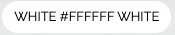 | Together with blue - button and navigation bar text and icons, secondary button background over blue background.                                                                             |
| Tertiary Colour                          | Dark Cornflower Blue #0C4091 | no equivalent      |  | Toggle switch on, background colour.                                                                                                                                                         |
| Quaternary Colour                        | Black #000000                | black              | 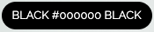 | Most text is black, form field, book details, and table text.                                                                                                                                |
| Accent Colour 1                          | Ruby #D81B60                 | pink darken-1      |  | Flash message failure, delete book, delete user.                                                                                                                                             |
| Accent Colour 2                          | Persian Green #26A69A        | teal lighten-1     |  | Flash message success, view book.                                                                                                                                                            |
| Accent Colour 3                          | Charcoal #37474F             | blue-grey darken-3 | 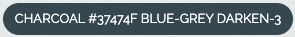 | Flash message info.                                                                                                                                                                          |

#### Buttons
The buttons are consistent in style and instantly recognisable with both text and icons making it easier for users/readers to understand and recognise their purpose. Text uses the Raleway font, and the icons are [Material Icons](https://material.io/resources/icons/?style=baseline).


All buttons are styled the same, with capitalised text on the left and an icon on the right. Primary buttons have a "blue darken-4" background with white text and icon, except for the Delete (Delete User) button in the Admin Dahsboard User Modal as it doesn't have a "Are you sure you wish to do this?" feature.

.png)

The seceondary, drop-down menu buttons have a white background with "blue darken-4" text on the left and icon on the right.

#### Navigation Bar
The Navigation Bar is styled the same way as the primary buttons, with white text on the left and icon on the right on a "blue darken-4" background. The Navigation Bar is controlled by the Jinja template 'flask_user_layout.html' where if-else statements check whether the user/reader is authenticated or not, and whether the user is authenticated and has the role of Admin.


Navigation Bar when unauthenticated.


Navigation Bar when authenticated as a user/reader.


Navigation Bar when authenticated as an Admin.

The hamburger Bar is styled the same way as the primary buttons, however, the white text is on the right and icon on the left on a "blue darken-4" background as it looks nicer from a layout perspective. The Hamburger Bar is controlled by the Jinja template 'flask_user_layout.html' where if-else statements check whether the user/reader is authenticated or not, and whether the user is authenticated and has the role of Admin.


Hamburger Bar when unauthenticated.


Hamburger Bar when authenticated as a user/reader.


Hamburger Bar when authenticated as an Admin.

#### Fixed Footer

The fixed footer has grey text and a white icon on a blue darken-4 background. The text is provided by two Flask-User variables defined in 'config.py'.


The About Modal contains short descriptions on the purpose of the Book Repository, my "ego-page", and a code overview with a link to the GitHub Repository.

#### Background Image


[Sharon McCutcheon - Photographer](https://unsplash.com/@sharonmccutcheon?utm_source=unsplash&amp;utm_medium=referral&amp;utm_content=creditCopyText)

The background image, a stack of books, photographed by Sharon McCutcheon on Unsplash is the perfect shade of blue-white with the books off-centre and to the right which means they are not interfering with the book stack and book details. It's also suitable as it has a stack of books, the Book Repository logo is a stack of books, and the user's/reader's stack of books are viewed on the Member's Page.

#### Flash Messages
Flash messages provide immediate user feedback on either the success or failure of a function (sign in, sign out, add book, and more). Teal lighten-1 for success, pink darken-1 for failure, and charcoal for information.

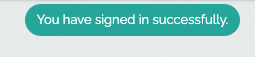

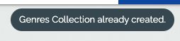

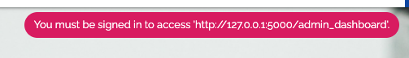

#### Tooltips
Tooltip messages, on hover over the help (? icon) and icons, are white text on charcoal background (good contrast, easy to read).

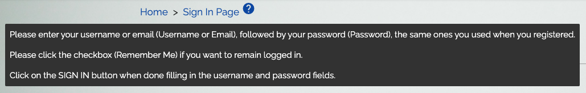

#### Breadcrumbs
Breadcrumbs provide a path for the user/reader to follow, letting them know where they've been, where they are, and an ability to get back to a previous page.

I had three options in creating the breadcrumbs. Programatically, using Flask-Breadcrumbs (additional overhead), Materialize 1.0.0 (styling), or create my own in HTML. I opted for the latter as it was the easiest choice, easiest to implement.

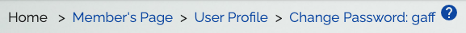

#### Pagination
Pagination allows for the browsing of pages when there are too many books (Member's Page and Search Results Page) or users (Admin Dashboard table) to display on a single page.

A user/reader/admin can navigate back and forth using the < and >, or by clicking on a page number. The current/active page number is in white text on a blue darken-4 square.

In the case of too many pages, and ellipsis is used which makes it suitable for smaller screens/devices.

The pagination function is a part of Flask-MongoEngine, and rendered in Jinja2 using a macro.

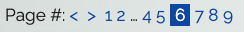

#### Logo
The Book Repository logo is easily recognisable and simple in its design. It's a stack of books with the text, "Book Repository".

The Book Repository logo is created in Microsoft PowerPoint, using a stock logo of stacked books with the text, "Book Repository". It matches the colour scheme, using the colour blue darken-4.


#### Favicon
The Favicon is the stack of books without the text from the Book Repository Logo.


[Favicon.io Favicon Generator](https://favicon.io/) was used to create the Favicon.

#### Book Stack
The Member's Page and Search Results Page book stack displays virtual book spines. Once clicked on to view it pop-outs to display book details.

The book spine has 3 small icons, teal eye to view the book details, pink bin link to delete a book, and blue pen link to update the book details. The title links to Amazon UK using ISBN, the ISBN link links to ISBN Search using ISBN, and the front cover thumbnail uses ISBN to get it from the Google Books API.

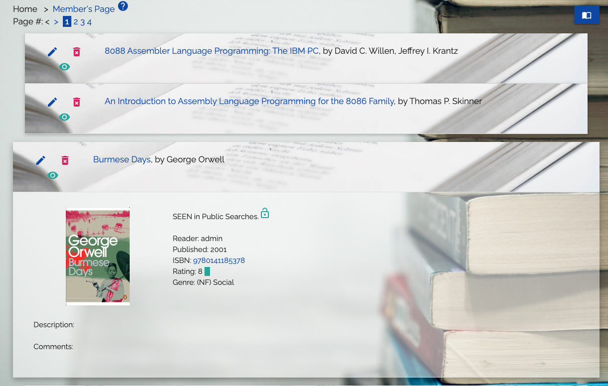

#### Tables
Tables are an effective way to display and work with large amounts of similar data. List Genres uses a table or the book genres and their descriptions, Admin Dashboard user table is good for when the site grows with many users, and the Statistics Modal uses a table to display the book genres used and their numbers.

One caveat is that tables can become too wide to view comfortably on smaller screens/devices, however, all tables have been tested on an Apple iPhone 5 and work well.

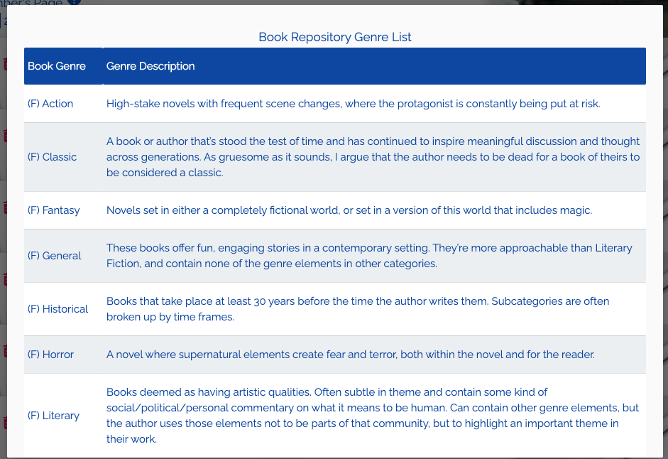


## Features
A feature is some action that can be performed by a user of an application, or is some internal function of an application. The features support the User Experience mentioned above and are implemented based on the business goals, user stories and use cases.

The features are divided into 4 main areas, User Management, Book Repository (the main book and library features), Admin Dashboard, and Shared Features.

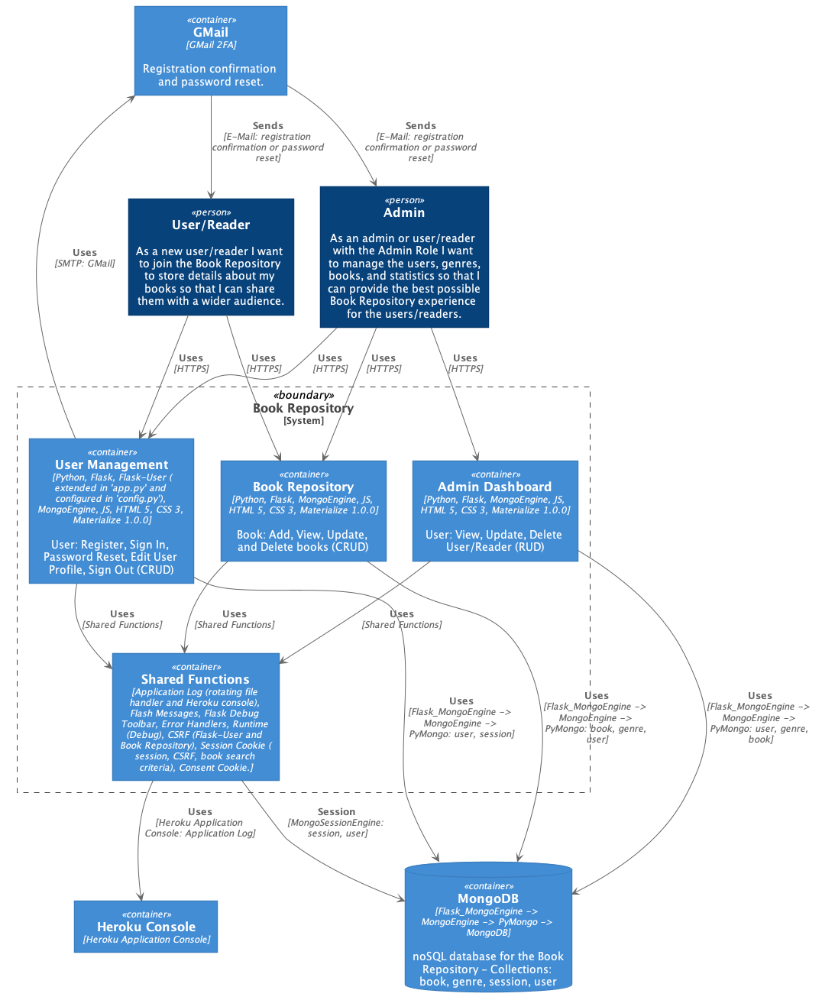

### Existing Features
Features currrently implemented as a part of the Book Repository.

#### User Management:

* Flask-User extension with:
	* User/reader registration with email confirmation (C is User CRUD).
	* User/reader sign in after registration (R in User CRUD).
	* User/reader password reset with email confirmation.
	* User/reader user profile update, with first and last name, and password change (U in User CRUD).
	* User/reader sign out.
* Added user/reader delete user/reader modal to Flask-User user profile update (D in User CRUD).

#### Book Repository:

* Member's Page with:
	* The user's/reader's virtual stack of books to ilicit the same feeling as walking into a library at home, or a public library.
	* The ability to view the stack, the book details, edit/update a book, and delete a book (RUD in Book CRUD).
	* The ability to add a new book via the drop-down menu (C in Book CRUD).
	* The ability to search for books via the drop-down menu (R in Book CRUD).
	* The ability to view the list of book genres and their descriptions (R in Book CRUD).
	* The ability to view a book on Amazon UK if it exists (using ISBN) via the title link.
	* The ability to view a book on ISBN Search if it exists (using ISBN) via the ISBN link.
* Add Book with (C in Book CRUD):
	* The ability to add books with title, author, year published, ISBN (used for book front cover, link to book on Amazon UK, and link to ISBN Search), book description, book comments (personal thoughts and comments shared with other readers), book rating (1 to 10, where 10 is spectacular), genre (1 of 32 genres), and whether to hide the book from other readers during public book searches.
	* List genres via the drop-down menu to aid in selecting the most appropriate genre for the book.
* Search Books with (R in Book CRUD):
	* The ability to search for public (all books except those marked private/hidden) or private (own books).
	* The ability to search for books using ISBN.
	* The ability to search for books using a combinaition to title (partial or full) and author (partial or full), rating equal to or greater than, and genre (none or 1 of 32).
* Search Books Results with:
	* The ability to browse and view books matching the search criteria.
	* The ability to edit/update books belonging to the current user/reader (books belonging to other users/readers can't be edited/updated, nor deleted).

#### Admin Dashboard:

* Admin Page with:
	* User Management table, User, Full Name, Active, E-mail.
		* User modal to update user details, set user to active/inactive, and permanently deleter the user/reader and associated books (RUD in User CRUD).
		* Load Genres via the drop-down menu in case the genres collection wasn't created by the first access to the Landind Page or was accidentally deleted  (C in Book Genre CRUD).
		* Load Books via the drop-down menu to load a sample of 28 books to populate the Book Repository and use for testing purposes (C in Book CRUD).
		* List Genres, to view the 32 genres and their description. Future feature to add, update, and delete genres here (R in Book Genre CRUD).
		* Book Repository Statistics via the drop-down menu to vie the number of users, number of books, and number of books in each genre (R in Statistics CRUD).

#### Shared Features:

* Added:
	* Help tooltips (? icon).
	* Breadcrumbs for navigation.
	* Pagination for Member's Page, Search Results Page, and Admin Page (user table).
	* Icons with text for fields and buttons for a better user experience and design.
	* Icon tooltips to guide the user/reader when filling in forms.
	* Drop-Down Menu.
* Fixed Navigation Bar (Hamburger-Menu) with:
	* User/reader:
		* Unauthenticated - Home, Sign In, Register.
		* Authenticated - Member's Page, User Profile Update (username), Sign Out.
	* Admin Role:
		* Unauthenticated - Home, Sign In, Register.
		* Authenticated - Admin Page, Member's Page, User Profile Update (username), Sign Out.
* Fixed Footer About Modal with:
	* Book Repository explanation.
	* Short "ego-page".
	* Code stack description and link to the project on GitHub.
* Styling and Layout using Materialize CSS 1.0.0 for a clean crisp interface that's easy to view and use.
* Osano Consent Cookie.

### Future Features
Future features are planned features that didn't make it into this first release due to time, effort, current knowledge and skills constraints (I know it can be done, I haven't yet figured out how).

#### User Management:

* Username update by user/reader under update user profile, with automatic update of books belonging to the user/reader.

#### Book Repository:

* Validate ISBN using Python extension isbnlib when books are added and updated.
* Support for ISBN with the check digit of 'X'.
* Get full Google Books API details when adding and updating books.
* Support for multiple languages using Flask-BabelEx (i18n/i10n).
* Shared book comments.
* User/reader messaging/message board.

#### Admin Dashboard:

* User 'admin' can activate/revoke Admin role in the Admin Dashboard User Modal to share the administrative responsibilities when the site grows.
* Number of books per user/reader and genre breakdown per user/reader.
* Username update with book updates of new username.
* Save and load several book JSON files.
* Undo delete of user/reader and books (within 5 days, placing all deleted items in a separate collection(s)).
* Create user/reader without the user/reader having to register via the register page.
* Update, add, delete genres in the genres collection.
* Application Log view in the Admin Dashboard, primarily to view rogue users/readers and to revoke their access to the Book Repository.

#### Shared Features
* Implement [Flask-Paranoid](https://flask-paranoid.readthedocs.io/en/latest/) to protect against stolen user session cookies (Flask-Login 'SESSION_PROTECTION = "strong"' when "Remember Me" is enabled isn't enough).

### Information and Visual Design


#### Wireframes and Visuals
The initial wireframe diagram describes the first draft of the Book Repository. Further research and education formed the next release of the Book Repository, the wireframe diagrams below. The Book Reposiory changed over time, as increased knowledge and improved skills were gained, and as the development inspired further improvements.

Trying to come up with all the features up-front leads either to "Paralysis by analysis" or a  severly limited list of features not likely to satisfy any client requirements and needs. The backlog developed over time after each iteration inspired further items to be added to the backlog as the undersanding of the next feature or function to staisfy the overall requirements became clear.

<details><summary>Please click to expand: Wireframes and Visuals</summary>

##### Initial Wireframe Diagram of the Book Repository


##### Landing / Home Page

[Link: Landing / Home Page](https://book-repository-virtual.herokuapp.com/)


##### Register Page

[Link: Register Page](https://book-repository-virtual.herokuapp.com/user/register)


##### Sign In

[Link: Sign In Page](https://book-repository-virtual.herokuapp.com/user/sign-in)


##### Member's Page

[Link: Member's Page](https://book-repository-virtual.herokuapp.com/members)


##### Admin Dashboard

[Admin Dashboard](https://book-repository-virtual.herokuapp.com/admin_dashboard)


</details>

##### Visual Design, Information Architecture and Navigation
These diagrams correspond to the similar diagrams in the User Experience (User Story) section above and are screenshots from the Production application.

**Visual Design - User Management**
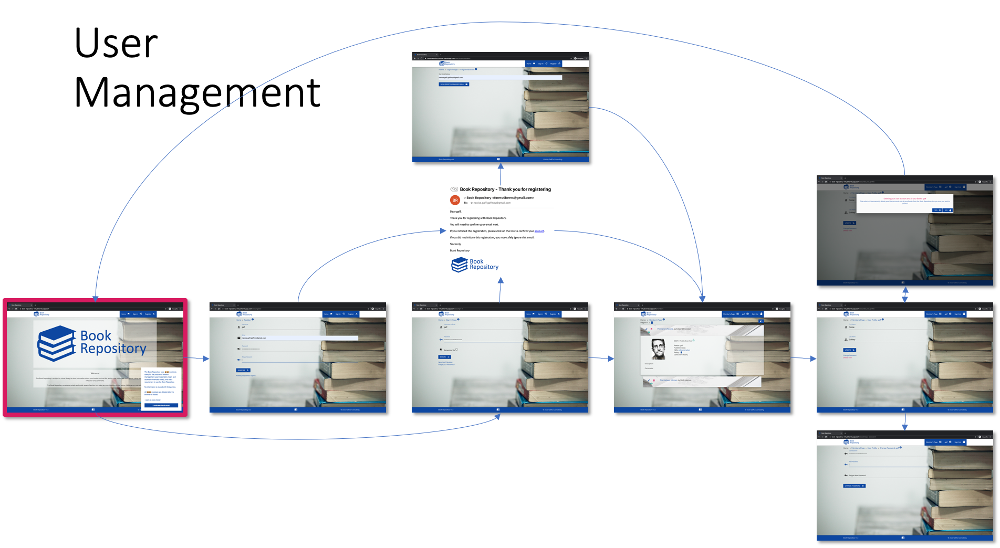

**Visual Design - Book Repository**


**Visual Design - Admin Dashboard**
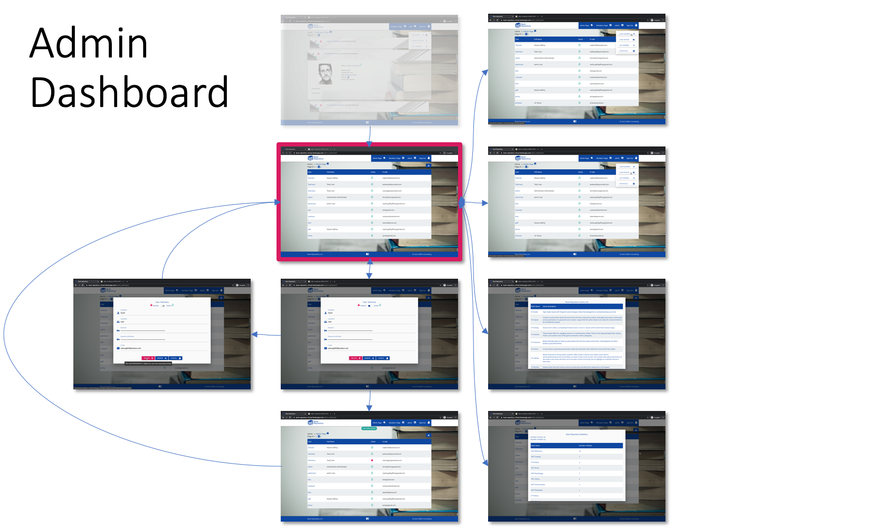

#### Code Walkthrough and Visual Design

##### '.env'
'.env' file is local and contains the variables required to run the Book Repository. These variables are configured on the Heroku platform too. These variables are read by 'config.py' and 'app.py' at startup. Please see "Book Repository '.env' and Heroku Variables" below for further details.

<details><summary>Please click to expand: '.env'</summary>

```
MONGO_URI_BR = "mongodb+srv://mdb_c_root:************************************/BookRepositoryDev?retryWrites=true&w=majority"
GOOGLE_API_KEY = "*****************************************"
MONGO_DBNAME = "BookRepository"
SECRET_KEY = "*******************************************************************************************************************************************"
MAIL_SERVER = "smtp.gmail.com"
MAIL_PORT = 587
MAIL_USERNAME = "*****************"
MAIL_PASSWORD = "*****************"
MAIL_USE_TLS = True
MAIL_USE_SSL = False
MAIL_DEFAULT_SENDER = "*****************"
USER_EMAIL_SENDER_EMAIL = "*****************"
ADMIN_PASSWORD = "*****************"
LOGGING_LEVEL="INFO"
USER_ENABLE_CHANGE_USERNAME = False
ENABLE_FILE_LOGGING = True
PRODUCTION = OFF
FDT = ON
APPDEBUG = ON
```

</details>

##### 'config.py'

'config.py' loads the variables from the '.env' file. The secret key is loaded for use by the itdangerous library and sessions. The Book Repository URI to MongoDB Atlas is next (user, password, and database name). Flask-User settings configuring the features to enable, and the mail parameters (GMail) for registration confirmation and password reset. Flask Session settings to enable strong protection and use of HTTPS only, as well as setting the timeout for the "Remember Me" function. Please note that there might still be a vulnerability in this that may be remedied by using Flask-Paranoid (future feature).

<details><summary>Please click to expand: 'config.py'</summary>

```
import os
from datetime import timedelta

from dotenv import load_dotenv
from pathlib import Path
env_path = Path(".") / ".env"
load_dotenv(dotenv_path=env_path)


class ConfigClass(object):
    """ Flask application config """
    # Flask settings
    SECRET_KEY = os.environ.get("SECRET_KEY")

    # Flask-MongoEngine settings
    MONGO_DB_URL = os.environ.get("MONGO_URI_BR")
    MONGODB_SETTINGS = {
        'host': MONGO_DB_URL
    }

    # Flask-User settings
    # Shown in email templates and page footers
    USER_APP_NAME = "Book Repository"
    USER_ENABLE_EMAIL = True      # Enable email authentication
    USER_ENABLE_USERNAME = True    # Enable username authentication
    USER_ENABLE_CONFIRM_EMAIL = True  # Enable email after registration
    USER_ENABLE_FORGOT_PASSWORD = True # Enable email after forgot password
    USER_ENABLE_CHANGE_PASSWORD = True # Enable email after password change
    USER_SEND_PASSWORD_CHANGED_EMAIL = True # Enable email after password change
    USER_REQUIRE_RETYPE_PASSWORD = True
    USER_ENABLE_CHANGE_USERNAME = False

    MAIL_SERVER = os.environ.get("MAIL_SERVER")
    MAIL_PORT = os.environ.get("MAIL_PORT")
    # TLS Port: 587, SSL Port: 465 --> TLS or SSL: True/False
    MAIL_USERNAME = os.environ.get("MAIL_USERNAME")
    MAIL_PASSWORD = os.environ.get("MAIL_PASSWORD")
    MAIL_USE_TLS = True
    MAIL_USE_SSL = False
    USER_EMAIL_SENDER_EMAIL = os.environ.get("USER_EMAIL_SENDER_EMAIL")

    # Flask Session Configuration for Session Protection and "Remember Me" function
    SESSION_PROTECTION = "strong"
    REMEMBER_COOKIE_DURATION = timedelta(seconds=3600) # Logged out after 1 hour (come back in without logging in too)
    SESSION_COOKIE_SECURE = True

    # Flask User Manager Configuration
    USER_COPYRIGHT_YEAR = 2020
    USER_CORPORATION_NAME = "GaffCo Consulting"
```

</details>

##### 'app.py' extensions and shared features.
Loading of environment variables from '.env' or Heroku variables. The code ensures that the '.env' file is accessed.

<details><summary>Please click to expand: 'app.py' Code Snippet</summary>

```
import os
...
from dotenv import load_dotenv
from pathlib import Path
env_path = Path(".") / ".env"
load_dotenv(dotenv_path=env_path)
```
</details>

**Application Factory Setup:** [based on the Flask-User example for MongoDB](https://flask-user.readthedocs.io/en/latest/mongodb_app.html). `from config import ConfigClass` loads the varibles defined in 'config.py' which gets most variables from '.env', and is used by `app.config.from_object(__name__ + ".ConfigClass")`.

The end checks that all the variables that are crucial to the Book Respository are defined, and if not raise and exception (application won't run). There is also a check to see whether the application is running in debug mode or not. By default, debug is off, unless specifically turned on by `APPDEBUG = ON`. This means it won't be turned on by mistake on Heroku in Production.

<details><summary>Please click to expand: 'app.py' Code Snippet for the Application Factory Setup</summary>

```
from config import ConfigClass
...
# --- // Application Factory Setup (based on the Flask-User example for MongoDB)
# https://flask-user.readthedocs.io/en/latest/mongodb_app.html
# Setup Flask and load app.config
app = Flask(__name__, static_folder="static", template_folder="templates")
app.config.from_object(__name__ + ".ConfigClass")
...
# export PRODUCTION=ON | OFF in TEST
# PRODUCTION App -> Settings -> Reveal Config Vars -> KEY: PRODUCTION,
# VALUE: ON
if __name__ == "__main__":
    if not os.environ.get("MONGO_URI_BR"):
        raise ValueError(
            "MongoDB Uniform Resource Identifier is missing, which means that we can't access the database.")
    elif not os.environ.get("ADMIN_PASSWORD"):
        raise ValueError(
            "Admin Password is not set which means that the Admin user can not be created.")
    elif not os.environ.get("MAIL_SERVER"):
        raise ValueError(
            "Mail Server Configuration error: MAIL_SERVER is not defined.")
    elif not os.environ.get("MAIL_PORT"):
        raise ValueError(
            "Mail Server Configuration error: MAIL_PORT is not defined.")
    elif not os.environ.get("MAIL_USERNAME"):
        raise ValueError(
            "Mail Server Configuration error: MAIL_USERNAME is not defined.")
    elif not os.environ.get("MAIL_PASSWORD"):
        raise ValueError(
            "Mail Server Configuration error: MAIL_PASSWORD is not defined.")
    elif not os.environ.get("USER_EMAIL_SENDER_EMAIL"):
        raise ValueError(
            "Mail Server Configuration error: USER_EMAIL_SENDER_EMAIL is not defined.")
	elif os.environ.get("APPDEBUG") == "ON":
        app.run(host=os.environ.get("IP"),
                port=os.environ.get("PORT"), debug=True)
    else:
        app.run(host=os.environ.get("IP"),
                port=os.environ.get("PORT"), debug=False)
```

</details>

**MongoDB Connection:** ODM (Object Document Mapper) Flask-MongoEngine/MongoEngine is used to perform the CRUD operations in MongoDB. This is preferred to using PyMongo directly as it's easier to use once the database schema is created to suit this approach (requires a bit of thought and changes during the development process). I can concentrate on the application logic, as opposed to spending time and effort on databse operations. However, as neither Flask-MongoEngine nor MongoEngine have a lot of documented examples this turned out initially not to be true. I've spent countless hours scouring Stackoverflow, YouTube, Programiz, MongoEngine documentation, googling, and trial-and-error testing to understand Flask-MongoEngine and MongoEngine. Strangely enough I found the most elucidating documentation in the Django Framework. Now that I know it well I can concentrate on the application logic... :-)

'config.py' contains the MongoDB URI (databse, user, passsword) loaded from the environment variable ('.env') and is used during db setup in 'app.py'.

The beauty of using the ODM MongoEngine is that the database is created dynamically, it's collections on an as-per-needed basis which makes development easier as I can drop a collection or database only to have it reappear, created by MongoEngine again.

<details><summary>Please click to expand: 'config.py' and 'app.py' Code Snippets for the MongoDB Connection</summary>

```
 # Flask-MongoEngine settings
    MONGO_DB_URL = os.environ.get("MONGO_URI_BR")
    MONGODB_SETTINGS = {
        'host': MONGO_DB_URL
    }
```

```
from flask_mongoengine import MongoEngine, MongoEngineSession, MongoEngineSessionInterface
...
# Setup Flask-MongoEngine --> MongoEngine --> PyMongo --> MongoDB
db = MongoEngine(app)
```

</details>

**CSRF for non-Flask-User templates and functions:** Flask-User creates it's own CSRF Token (for example, `csrf_token	<function generate_csrf at 0x7f9d70230160>`), used by the User Management functions and templates. MongoSessionEngine has its own CSRF Token too (for example, `session	<MongoEngineSession {'_permanent': True, 'csrf_token': 'b90b7c0f751cc2ce1125455d1c354df157638067', '_fresh': False}>`), which I could use in my non-Flask-User templates. However, I wanted to use the `@app.errorhandler(CSRFError)` for each function/end_point to catch the error.

<details><summary>Please click to expand: 'app.py' and '.html' Code Snippets for the CSRF for non-Flask-User templates and functions</summary>

```
from flask_wtf.csrf import CSRFProtect, CSRFError
...
csrf = CSRFProtect(app)
csrf.init_app(app)
...
@app.errorhandler(CSRFError)
...
@app.errorhandler(CSRFError)
def handle_csrf_error(error):
    excuse = "Apologies, the Librarian Security Detail have omitted to secure this page! We're calling them back from their lunch-break to fix this. Please click on the pink pulsating buoy to go to the Home Page (registering or signing in) or Member's Page (signed in), or click on Sign Out below."
    try:
        app.logger.critical(f"{current_user.username} has encountered a 400 CSRF Error (Bad Request), {error.description}: [FAILURE].")
    except AttributeError:
        app.logger.critical(f"Unauthenticated user has encountered a 400 CSRF Error (Bad Request), {error.description}: [FAILURE].")
    finally:
        return render_template("oops.html", error=error.description, excuse=excuse, error_type="Client: 400 - Bad Request")
```

In templates (.html):

```
...
<input type="hidden" name="csrf_token" value="{{csrf_token()}}">
...
```

</details>

**Flask Sessions with MongoSessionEngine:** adding Server-side Session to the Book Repository to increase the security of the application. This way we track the user/reader session and store it in MongoDB (session collection) instead of on the client.

<details><summary>Please click to expand: 'app.py' and '.html' Code Snippets for the Flask Sessions with MongoSessionEngine</summary>

```
from flask_mongoengine import MongoEngine, MongoEngineSession, MongoEngineSessionInterface
...
# Use Flask Sessions with Mongoengine
app.session_interface = MongoEngineSessionInterface(db)
...

```

</details>

**Application Log:** Rotating File Handler and Heroku Console. If the app is running locally it uses the Rotating File Log Handler as it's easier to read logs in a log file than on a console. Heroku doesn't approve of log files, prefering it's own console or one of several paid for logging applications. Log files are key to perform root cause and impact analysis over time, and a future feature of the Admin Dashboard of the Book Repository is to view log events related to a specific user filtered by date, time, and severity. Being able to trace a user's/reader's path through the application to the event of the fault is key to root cause analysis.

The log level is set by an environment variable (LOGGING_LEVEL), which makes it easy to modify when furhter analysis and testing is required.

<details><summary>Please click to expand: 'app.py' Code Snippet for the Application Log</summary>

```
import logging
from logging.handlers import RotatingFileHandler
...
# Initialise rotating file logging in Development, not on Heroku
# Set after app initialisation
if os.environ.get("ENABLE_FILE_LOGGING") == "True":
    logging.basicConfig(
        handlers=[RotatingFileHandler("./logs/book_repository.log", maxBytes=100000, backupCount=10)],
        level=os.environ.get("LOGGING_LEVEL"),
        format="%(asctime)s — %(name)s — %(levelname)s — %(funcName)s:%(lineno)d — %(message)s"
    )
else:
    # Initialize logging to console, works on Heroku
    logging.basicConfig(
        level=os.environ.get("LOGGING_LEVEL"),
        format="%(asctime)s — %(name)s — %(levelname)s — %(funcName)s:%(lineno)d — %(message)s"
    )
...
app.logger.critical("Genre file can't be found. The filename is 'genre.json' and contains the Book Genres: [FAILURE] - (index.html).")
...
app.logger.critical("Genre file isn't a proper JSON file. Please correct the issues with the file 'genre.json' and try to load it again: [FAILURE] - (admin_dashboard.html).")
...
app.logger.critical(f"{current_user.username} has NOT loaded the Genre Collection to the Book Repository, 'genre.json' file has JSON Schema errors. Please correct the genre '{genre_genre}': [FAILURE] - (admin_dashboard.html).")
```

</details>

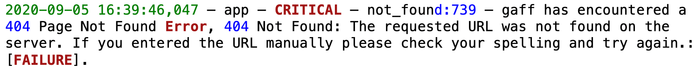

**Flask Debug Toolbar:** is based on the original [django-debug-toolbar](https://github.com/jazzband/django-debug-toolbar) and provides useful debugging information. It aided me in solving two bugs, and creating a workaround for a third as I could view the templates and request variables. It also aids greatly in increasing the understanding of the Flask framework.

Security risk: don't enable FDT on Heroku or any other public platform as all configuration variables are revealed in clear-text (passwords)! This is why I removed FDT from 'requirements.txt' and encased the FDT statements in if-statements checking for the variable (FDT = ON).

<details><summary>Please click to expand: 'app.py' Code Snippet for the Flask Debug Toolbar</summary>

```
if os.environ.get("FDT") == "ON":
    from flask_debugtoolbar import DebugToolbarExtension
...
if os.environ.get("FDT") == "ON":
    app.debug = True
...
# Initiate the Flask Debug Toolbar Extension
if os.environ.get("FDT") == "ON":
    toolbar = DebugToolbarExtension(app)
```

</details>

**Classes / Collections:** User collection is a Flask-User (Flask-Login) class with mandatory and optional fields. `email_confirmed_at = db.DateTimeField()` is required for the registration confirmation (email), and is activated by `USER_ENABLE_EMAIL = True` in 'config.py'.

`from flask_mongoengine import MongoEngine, MongoEngineSession, MongoEngineSessionInterface` enables MongoDB (database)/server-side session management which is more secure than client-side session management. This is handled solely by MongoEngineSession. It uses the User collection.

`from flask_user import login_required, UserManager, UserMixin, current_user, roles_required` enables the user functions of Flask-User.

Book colletion contains the books added by users/readers and its schema is defined by me. book.user = user.username to link the book to the user/reader that added the book.

All collections have a meta tag, `"auto_create_index": True,` which ensures indexing is performed (default, paranoia-setting), `"index_background": True,` ensures the indexing is performed in the background for performance reasons (once the repository grows), `"indexes": ["..."]` creates an additional index to speed up read access, and `"ordering": ["..."]` orders the documents in the collection by whatever field is defined (for example, no sorting required when listing the book genres).

<details><summary>Please click to expand: 'app.py' Code Snippet for the Classes / Collections</summary>

```
from flask_mongoengine import MongoEngine, MongoEngineSession, MongoEngineSessionInterface
from flask_user import login_required, UserManager, UserMixin, current_user, roles_required
...
# --- // Classes -> MongoDB Collections: User, Book, Genre.
# Flask-User User Class (Collection) extended with email_confirmed_at
# Added username indexing and background-indexing for performance
class User(db.Document, UserMixin):
    # Active set to True to allow login of user
    active = db.BooleanField(default=True)

    # User authentication information
    username = db.StringField(default="")
    password = db.StringField()

    # User information
    first_name = db.StringField(default="")
    last_name = db.StringField(default="")
    email = db.StringField(default="")
    email_confirmed_at = db.DateTimeField()
    # Required for the e-mail confirmation, and subsequent login.

    # Relationships  (Roles: user or user and Admin)
    roles = db.ListField(db.StringField(), default=["user"])

    meta = {
        "auto_create_index": True,
        "index_background": True,
        "indexes": ["username"]
    }


# Book Class (Collection) linked to User Class via user=username
# Title indexing, ordering, and background-indexing for performance
class Book(db.Document):
    title = db.StringField(default="", maxlength=250)
    author = db.StringField(default="", maxlength=250)
    year = db.IntField(maxlength=4)
    ISBN = db.IntField(maxlength=13)
    short_description = db.StringField(default="", maxlength=2000)
    user = db.StringField(required=True)
    creation_date = db.DateTimeField(default=datetime.datetime.now)
    comments = db.StringField(default="", maxlength=3500)
    rating = db.IntField(choices=[1, 2, 3, 4, 5, 6, 7, 8, 9, 10])
    genre = db.StringField(default="")
    private_view = db.StringField(default="off")
    book_thumbnail = db.StringField(default="")

    meta = {
        "auto_create_index": True,
        "index_background": True,
        "indexes": ["title"],
        "ordering": ["title"]
    }


# Genre Class (Collection), loaded via 'genre.json'
# Genre indexing,ordering, and background-indexing for performance
class Genre(db.Document):
    genre = db.StringField(default="")
    description = db.StringField(default="")

    meta = {
        "auto_create_index": True,
        "index_background": True,
        "indexes": ["genre"],
        "ordering": ["genre"]
    }
...
# Setup Flask-User and specify the User data-model
user_manager = UserManager(app, db, User)
```

</details>

##### [flask\_user\_layout.html](templates/flask_user_layout.html)
This is the Flask-User Base template for the Book Repository. To override the Flask-User default templates the directory structure and files are copied to the project's template directory. My own templates are in the templates directory, all Flask-User templates are in the /templates/flask_user and /templates/flask_user/emails directories with the notable exception of flask\_user\_layout.html. All files have been updated to suit the Book Repository.

At a high level the following sections make up this template:

* Head
	* Meta name description to aid search engines.
	* Google Font CDN for the Raleway Font.
	* Materialize CSS 1.0.0 CDN.
	* Style.css, my Book Repository CSS.
	* Osano Consent Cookie CSS.
* Body
	* Navigation Bar and Hamburger-Bar with if-statements to control what is shown to authenticated or admin role.
	* Flash Messages with categories.
* Footer
	* USER\_APP\_NAME and USER\_APP\_VERSION
	* About Modal with tabs: Book Repository, "ego-page", Code.
* Scripts
	* Materialize CSS 1.0.0 JavaScript
	* materialize.js to auto-initialize Materialize CSS 1.0.0 functions.
	* Flash message chip timeout, message.js.
	* Osano Consent Cookie JavaScript.
	* Osano Concent Cookie configuration, cookies.js.

<details><summary>Please click to expand: 'app.py' Code Snippet for flask\_user\_layout.html</summary>

```
<!DOCTYPE html>
<html lang="en">

<head>
    <meta charset="utf-8">
    <meta http-equiv="X-UA-Compatible" content="IE=edge">
    <meta name="viewport" content="width=device-width, initial-scale=1">
    <meta name="Description" content="Developer and Designer: Naoise Gaffney - 'Gaff'. Title: Book Repository. Reason: third 
        milestone project for the Code Institute's Diploma in Full Stack Development. Description: The 
        Book Repository is a digital or virtual library to store information about your books, such as 
        title, author, year published, ISBN, genre, rating, description, and your reflection and comments.
        The Book Repository provides a private and public search function too, using any combination of title, 
        author, ISBN, genre, and rating.">
    <link rel="apple-touch-icon" sizes="180x180" href="/static/images/apple-touch-icon.png">
    <link rel="icon" type="image/png" sizes="32x32" href="/static/images/favicon-32x32.png">
    <link rel="icon" type="image/png" sizes="16x16" href="/static/images/favicon-16x16.png">
    <link rel="manifest" href="/static/images/site.webmanifest">
    <title>{{ user_manager.USER_APP_NAME }}</title>

    <!--Import Google Icon Font-->
    <link href="https://fonts.googleapis.com/icon?family=Material+Icons" rel="stylesheet">
    <!--Import materialize.css-->
    <link rel="stylesheet" href="https://cdnjs.cloudflare.com/ajax/libs/materialize/1.0.0/css/materialize.min.css">
    <!-- Custom CSS -->
    <link rel="stylesheet" type="text/css" href="{{ url_for('static', filename = 'styles/style.css') }}">
    <!-- Cookie Consent by Osano: https://www.osano.com/cookieconsent/download/ -->
    <link rel="stylesheet" type="text/css"
        href="https://cdn.jsdelivr.net/npm/cookieconsent@3/build/cookieconsent.min.css" />

    <!-- HTML5 Shim and Respond.js IE8 support of HTML5 elements and media queries -->
    <!-- WARNING: Respond.js doesn't work if you view the page via file:// -->
    <!--[if lt IE 9]>
      <script src="//cdnjs.cloudflare.com/ajax/libs/html5shiv/3.7/html5shiv.js"></script>
      <script src="//cdnjs.cloudflare.com/ajax/libs/respond.js/1.4.2/respond.js"></script>
    <![endif]-->

    {# *** Allow sub-templates to insert extra html to the head section *** #}
    
</head>

<body>
    <header>
        
        <nav class="nav-wrapper white">
            <div class="container">
                <a href="{{url_for('home_page')}}"></a>
                <a href="#" class="sidenav-trigger" data-target="mobile-links">
                    <i class="material-icons blue-text text-darken-4" id="matnavbar">menu</i>
                </a>
                <ul class="right hide-on-med-and-down blue darken-4 waves-effect" id="nav-mobile">
                    
                    
                    <li>
                        <a href="{{ url_for('admin_dashboard')}}">Admin Page<i
                                class="material-icons right">admin_panel_settings</i></a>
                    </li>
                    
                    <li>
                        <a href="{{ url_for('member_page')}}">Member's Page<i
                                class="material-icons right">dashboard</i></a>
                    </li>
                    <li>
                        <a href="{{ url_for('user.edit_user_profile') }}">{{ current_user.username or current_user.email }}<i
                                class="material-icons right">account_box</i></a>
                    </li>
                    <li>
                        <a href="{{ url_for('user.logout') }}">Sign Out<i
                                class="material-icons right">pan_tool</i></a>
                    </li>
                    
                    <li>
                        <a href="{{ url_for('home_page')}}">Home<i class="material-icons right">home</i></a>
                    </li>
                    <li>
                        <a href="{{ url_for('user.login') }}">Sign In<i
                                class="material-icons right">login</i></a>
                    </li>
                    <li>
                        <a href="{{ url_for('user.register')}}">Register<i
                                class="material-icons right">how_to_reg</i></a>
                    </li>
                    
                </ul>
            </div>
        </nav>
        <!-- Naviagtion for Mobile devices using a "Hamburger-menu" which must be defined outside of <nav></nav> to function in Materialize 1.0.0 -->
        <ul class="sidenav blue darken-4" id="mobile-links">
            
            
            <li>
                <a href="{{ url_for('admin_dashboard')}}" class="white-text">Admin Page<i
                        class="material-icons white-text left">admin_panel_settings</i></a>
            </li>
            
            <li>
                <a href="{{ url_for('member_page')}}" class="white-text">Member's Page<i
                        class="material-icons white-text left">dashboard</i></a>
            </li>
            <li>
                <a href="{{ url_for('user.edit_user_profile') }}"
                    class="white-text">{{ current_user.username or current_user.email }}<i
                        class="material-icons white-text left">account_box</i></a>
            </li>
            <li>
                <a href="{{ url_for('user.logout') }}" class="white-text">Sign Out<i
                        class="material-icons white-text left">pan_tool</i></a>
            </li>
            
            <li>
                <a href="{{ url_for('home_page')}}" class="white-text">Home<i
                        class="material-icons white-text left">home</i></a>
            </li>
            <li>
                <a href="{{ url_for('user.login') }}" class="white-text">Sign In<i
                        class="material-icons white-text left">login</i></a>
            </li>
            <li>
                <a href="{{ url_for('user.register')}}" class="white-text">Register<i
                        class="material-icons white-text left">how_to_reg</i></a>
            </li>
            
        </ul>
    </header>
    
    

    <div id="main-div" class="container center">
        {# One-time system messages called Flash messages #}
        
        
        
        
        
        
        
        <div class="message chip message-{{category}}">{{ message|safe }}</div>
        
        
        
        
    </div>

    
    
    

    <footer class="page-footer transparent">
        <div class="footer-copyright blue darken-4">
            <div class="left-align">{{ user_manager.USER_APP_NAME }} {{ user_manager.USER_APP_VERSION }}</div>
            <div class="center-align"><a class="modal-trigger" href="#about"><i class="material-icons white-text"
                        id="menu_book">menu_book</i></a></div>
            <div class="right-align">&copy; {{ user_manager.USER_COPYRIGHT_YEAR }}
                {{ user_manager.USER_CORPORATION_NAME }}</div>
        </div>
        <div class="container">
            <div id="about" class="modal center">
                <div class="modal-content">
                    <ul class="tabs blue darken-4 center">
                        <li class="tab">
                            <a href="#bookrepo" class="active blue darken-4 white-text waves-effect">Book Repository</a>
                        </li>
                        <li class="tab">
                            <a href="#gaff" class="active blue darken-4 white-text waves-effect">Gaff</a>
                        </li>
                        <li class="tab">
                            <a href="#code" class="active blue darken-4 white-text waves-effect">Code</a>
                        </li>
                    </ul>
                    <div id="bookrepo">
                        <p class="tab_content_heading"></p>
                        <p>A safe virtual repository for books, a digital version of your library that is searchable,
                            and where
                            you can share your book notes and thoughts with like-minded readers.
                        </p>
                    </div>
                    <div id="gaff">
                        <p class="flow-text blue-text text-darken-4 tab_content_heading">Naoise Gaffney - "Gaff"</p>
                        <p></p>
                        <p>Code Institute Learner and Developer of this Book Repository, a Milestone Project 3
                            (Data-Centric) for the Code
                            Institute Diploma in Full Stack Development. Full Stack Developer and UX Designer.</p>
                    </div>
                    <div id="code">
                        <p class="flow-text blue-text text-darken-4 tab_content_heading">Code on GitHub</p>
                        <p>Front-end: HTML 5, CSS 3, and JavaScript</p>
                        <p>Application: Python, Flask, Flask Extensions, and MongoEngine</p>
                        <p>Database: MongoDB</p>
                        <p>API: Goggle Books API</p>
                        <p>External Links: Amazon UK and ISBN Search</p>
                        <p><a href="https://github.com/NaoiseGaffney/BookRepository" target="_blank" rel="noopener"
                                class="pink-text text-darken-1 waves-effect">&nbsp;Book Repository on GitHub&nbsp;</a>
                        </p>
                    </div>
                    <div class="modal-footer">
                        <a href="#!" class="modal-close btn waves-effect waves-light blue darken-4">Thank You!<i
                                class="material-icons right">thumb_up</i></a>
                    </div>
                </div>
            </div>
        </div>

    </footer>
    

    <!-- Compiled and minified JavaScript -->
    <script src="https://cdnjs.cloudflare.com/ajax/libs/materialize/1.0.0/js/materialize.min.js"></script>
    <!-- Initialise MaterializeCSS 1.0.0 Features -->
    <script src="{{ url_for('static', filename = 'scripts/vendor/materialize.js') }}"></script>
    <!-- Message Chip Timeout -->
    <script src="{{ url_for('static', filename = 'scripts/message.js') }}"></script>
    <!-- Cookie Consent by Osano: https://www.osano.com/cookieconsent/download/ -->
    <script src="https://cdn.jsdelivr.net/npm/cookieconsent@3/build/cookieconsent.min.js" data-cfasync="false"></script>
    <script src="{{ url_for('static', filename = 'scripts/vendor/cookies.js') }}"></script>

    {# *** Allow sub-templates to insert extra html to the bottom of the body *** #}
    
</body>

</html>
```

</details>

##### User Management and Book Repository - Landing / Home Page

[Link: Landing / Home Page](https://book-repository-virtual.herokuapp.com/)


'app.py' home_page()

Three routes are defined to "catch" the most common URL's used to access a website. Landing/Home Page, accessible before sign in/login. If logged in, user is redirected to the Member's Page. At first access/touch the user 'admin' is created using environment variables for the password and email address. At first access/touch the genre collection for the books is created based on 'genre.json'. Both the user and genre creations are here as they will be created twice on Heroku if placed in the main code. If the database doesn't exist it's created, as are the collections.

Create admin user as first/default user, if admin does not exist. Password and e-mail are set using environment variables.

Create the Genre Collection if it does not exist. Genre descriptions taken from https://bookriot.com/guide-to-book-genres/. First validation: Genre Collection exists. Second validation: FileNotFound ('genre.json'). Third validation: JSONDecodeError (valid JSON format). Fourth validation: correct JSON Schema = Genre Class.

<details><summary>Please click to expand: 'app.py' and 'index.html' Code Snippets for the home_page()</summary>

```
import json
from json.decoder import JSONDecodeError
...
from jsonschema import validate, ValidationError
...
# --- // Book Repository Main Routes (Endpoints): CRUD.
@app.route("/")
@app.route("/index")
@app.route("/index.html")
def home_page():
    """
    Landing/Home Page, accessible before sign in/login. If logged in, user is redirected to the Member's Page.
    At first access/touch the user 'admin' is created using environment variables for the password and email address.
    At first access/touch the genre collection for the books is created based on 'genre.json'. Both the user and genre
    creations are here as they will be created twice on Heroku if placed in the main code.
    """
    if current_user.is_authenticated:
        return redirect(url_for("member_page"))

    # Create admin user as first/default user, if admin does not exist.
    # Password and e-mail are set using environment variables.
    if not User.objects.filter(User.username == "admin"):
        try:
            user = User(
                username="admin",
                first_name="Administrator",
                last_name="Administrator",
                email=os.environ.get("MAIL_DEFAULT_SENDER"),
                email_confirmed_at=datetime.datetime.utcnow(),
                password=user_manager.hash_password(os.environ.get("ADMIN_PASSWORD"))
            )
            user.roles.append("Admin")
            user.save()

            flash("'admin' account created.", "success")
            app.logger.info("'admin' account is created at startup if the user doesn't exist: [SUCCESS] - (index.html).")
        except Exception:
            flash("'admin' account not created.", "danger")
            app.logger.critical("'admin' account is created at startup if the user doesn't exist: [FAILURE] - (index.html).")

    # Create the Genre Collection if it does not exist. Genre descriptions taken from https://bookriot.com/guide-to-book-genres/
    # First validation: Genre Collection exists. Second validation: FileNotFound ('genre.json').
    # Third validation: JSONDecodeError (valid JSON format). Fourth validation: correct JSON Schema = Genre Class.
    if not Genre.objects():
        try:
            with open("genre.json", "r", encoding="utf-8") as f:
                genre_dict = json.load(f)
        except FileNotFoundError:
            flash("'genre.json' can't be found.", "danger")
            app.logger.critical("Genre file can't be found. The filename is 'genre.json' and contains the Book Genres: [FAILURE] - (index.html).")
            return render_template("index.html")
        except json.decoder.JSONDecodeError:
            flash("'genre.json' isn't a proper JSON file.", "danger")
            app.logger.critical("Genre file isn't a proper JSON file. Please correct the issues with the file 'genre.json' and try to load it again: [FAILURE] - (admin_dashboard.html).")
            return render_template("index.html")

        genre_schema = {
            "type": "object",
            "properties": {
                "genre": {"type": "string"},
                "description": {"type": "string"},
            },
        }

        try:
            for genre in genre_dict:
                validate(instance=genre, schema=genre_schema)
        except ValidationError:
            genre_genre = genre["genre"]
            flash("'genre.json' has JSON Schema errors.", "danger")
            app.logger.critical(f"{current_user.username} has NOT loaded the Genre Collection to the Book Repository, 'genre.json' file has JSON Schema errors. Please correct the genre '{genre_genre}': [FAILURE] - (admin_dashboard.html).")
            return render_template("index.html")

        try:
            genre_instances = [Genre(**data) for data in genre_dict]
            Genre.objects.insert(genre_instances, load_bulk=False)
            flash("Genres Collection created.", "success")
            app.logger.info("Genres Collection created: [SUCCESS] - (index.html)")
        except Exception:
            flash("Genres Collection NOT created.", "danger")
            app.logger.critical("Genres Collection NOT created: [FAILURE] - (index.html)")
        finally:
            return render_template("index.html")

    return render_template("index.html")
```

`index.html`

```


<section class="container center">
    <br>
    <div class="landing_page">
    
    </div>
    <br>
    <div class="landing_page">
    <h6>Welcome!</h6>
    <br>
    <p>The Book Repository is a digital or virtual library to store information about your books, such as
    title, author, year published, ISBN, genre, rating, description, and your reflection and comments.</p>
    <br>
    <p>The Book Repository provides a private and public search function too, using any combination of title,
    author, ISBN, genre, and rating.</p>
    </div>
</section>

```

</details>

##### User Management and Book Repository - Member's Page
[Link: Member's Page](https://book-repository-virtual.herokuapp.com/members)


'app.py' member_page(page=1)

The Member's Page book stack is populated once the user/reader is authenticated. If no books, the user/reader is requested to add a book.

If there are 8 or more books the results are paginated `books_pagination = Book.objects.filter(user=current_user.username).paginate(page=page, per_page=7)` and for navigation purposes `return render_template("members.html", books_pagination=books_pagination, page_prev=(page - 1), page_next=(page + 1), genre_list=genre_list)` the paginated results, as well as the previous and next pages are provided to the Jinja template. The template uses a macro to create the page numbers (from the Flask-MongoEngine documentation) and I've added the prevous next feature and styling.

The breadcrumbs describe the path taken to get to here, and pending on whether the user is authenticated or not the "Home Page" is either clickable or not (authenticated).

Help tooltip (? icon) describes what features this page has, and how to use them.

The books are populated in Materialize 1.0.0 collapsible popout elements with the view, update, delete icons on the left of the title (link to Amazon UK using ISBN) and author. Clicking on the "book spine" pops-out the book details. The blue edit/update (pen icon) opens the edit_book page, the pink bin the delete book modal, and the teal eye indicates that the book spine opens to reveal the book details.

The book details contain the hidden/open status of the book (hidden from public book searches or not), reader (user field in the book document), published, ISBN and ISBN link to ISBN Search, rating (from 1 to 10) and a colour indicator, genre (from the genre collection), description (book description), and comments (user/reader) comments.

The drop-down menu has three buttons, Add Book, Seach Books, and List Genres (modal with a table).

The book title link to Amazon UK and the ISBN link to ISBN Search have a tooltip to describe the link.

<details><summary>Please click to expand: 'app.py' and '' Code Snippets for the member_page(page=1)</summary>

```
@app.route("/members")
@app.route("/members/<int:page>")
@login_required
def member_page(page=1):
    """
    The "R" in CRUD, a virtual library or stack of books to browse in the Member's Page.
    """
    app.logger.info(f"{current_user.username} is accessing the Member's Page: [INFO] - (members.html).")
    genre_list = Genre.objects()
    books_pagination = Book.objects.filter(user=current_user.username).paginate(page=page, per_page=7)
    return render_template("members.html", books_pagination=books_pagination, page_prev=(page - 1), page_next=(page + 1), genre_list=genre_list)
```

members.html

```


<div class="container">
    <h6>
        
        Home
        
        <a href="{{ url_for('home_page')}}">Home</a>
        
        &nbsp; > &nbsp;<a href="{{ url_for('member_page') }}">Member's Page</a>&nbsp;<i
            class="material-icons prefix tooltipped blue-text text-darken-4" data-position="bottom" role="tooltip" data-tooltip="<p class='left-align'>To view a book, click on the 'book spine' or eye icon.</p><br>
        <p class='left-align'>To edit a book's details, click on the pencil icon for the book you want to edit.</p><br>
        <p class='left-align'>To delete a book, click on the rubbish bin/dust-bin icon and answer yes or no to the question.</p><br>
        <p class='left-align'>Use the page numbers to navigate to a different page.</p><br>
        <p class='left-align'>Click on the book title link to view the book on Amazon UK. Click on the ISBN link in the book details section to view the book on ISBN Search.</p><br>
        <p class='left-align'>To add a book, or search for books, or view the list of genres and their description, please click on the 'Book' icon under the navigation menu.</p>">help</i>

        <span class="book-dropdown right">
            <span class="white-text btn waves-effect waves-light right blue darken-4"><i
                    class="material-icons white-text">import_contacts</i></span>
            <span class="book-dropdown-content">
                <span><a href="{{ url_for('add_book')}}" class="blue-text btn text-darken-4 white">Add Book&nbsp;<i
                            class="material-icons blue-text text-darken-4 right">import_contacts</i><i
                            class="material-icons blue-text text-darken-4 right">plus_one</i></a></span>
                <span><br>&nbsp;<br></span>
                <span><a href="{{ url_for('search_book')}}" class="blue-text btn text-darken-4 white">Search
                        Books<i class="material-icons blue-text text-darken-4 right">search</i></a></span>
                <span><br>&nbsp;<br></span>
                <span><a href="#genre_list" class="blue-text btn text-darken-4 white modal-trigger">List
                        Genres&nbsp;&nbsp;&nbsp;&nbsp;&nbsp;<i class="material-icons blue-text text-darken-4 right">list</i></a></span>
            </span>
        </span>
    </h6>
    <div id="genre_list" class="modal center">
        <div class="modal-content">
            <h6>Book Repository Genre List</h6>
            <table>
                <tr class="white-text blue darken-4">
                    <th>Book Genre</th>
                    <th>Genre Description</th>
                </tr>
                
                <tr class="{{loop.cycle('white','blue-grey lighten-5')}}">
                    <td>{{genre.genre}}</td>
                    <td>{{genre.description}}</td>
                </tr>
                
            </table>
        </div>
        <div class="modal-footer">
            <a href="#!" class="modal-close btn waves-effect waves-light blue darken-4"><i
                    class="material-icons white-text right">done</i>&nbsp;Done!</a>
        </div>
    </div>
    {# Macro for creating navigation links #}
    
    <div class="pagination">Page #:
        
        &lt;&nbsp;
        
        <a href="{{ url_for(endpoint, page=page_prev) }}">&lt;&nbsp;</a>
        
        
        <a href="{{ url_for(endpoint, page=page_next) }}">&gt;&nbsp;</a>
        
        &gt;&nbsp;
        
        
        
        
        <a href="{{ url_for(endpoint, page=page) }}">{{ page }}</a>
        
        <span style="background-color: #0D47A1; color: white; padding: 1px 5px;">{{ page }}</span>
        
        
        <span class="ellipsis">…</span>
        
        
    </div>
    

    {{ render_navigation(books_pagination, 'member_page') }}

    

    <ul class="collapsible popout">
        
        
        <li class="row">
            <div class="collapsible-header">
                <div class="book_spine">
                    <div class="book_actions">
                        <a href="{{url_for('edit_book', book_id=book.id)}}"><i class="material-icons blue-text text-darken-4">create</i></a>
                        <a class="modal-trigger" href="#delete_book_{{book.id}}"><i class="material-icons pink-text text-darken-1">delete_forever</i></a>
                        <i class="material-icons teal-text text-lighten-1">visibility</i>
                    </div>
                    <div id="delete_book_{{book.id}}" class="modal">
                        <div class="modal-content">
                            <h6 class="pink-text text-darken-1">Deleting Book: {{book.title}}, by {{book.author}}</h6>
                            <p>This action will permanently delete this book from your Book Repository. Are you sure you
                                wish to
                                do this?</p>
                        </div>
                        <div class="modal-footer">
                            <a href="{{url_for('delete_book', book_id=book.id)}}"
                                class="modal-close btn blue darken-4"><i class="material-icons white-text right">delete_forever</i>&nbsp;Yes</a>
                            <a href="#!" class="modal-close btn blue darken-4"><i class="material-icons white-text right">pan_tool</i>&nbsp;No</a>
                        </div>
                    </div>
                </div>
                <div class="col s12">
                    <h6><a href="https://www.amazon.co.uk/s?k={{book.ISBN}}" target="_blank" rel="noopener"
                            class="tooltipped" data-position="right" data-tooltip="Link to the book at Amazon UK.">{{book.title}}</a>, by {{book.author}}</h6>
                </div>
            </div>
            <div class="collapsible-body">
                <div class="row">
                    <div class="col s12 m4 l3 center">
                        
                        <p>&nbsp;</p>
                    </div>

                    <div class="col s12 m8 l9">
                        
                        <p>HIDDEN from Public Searches.<i class="material-icons pink-text darken-1">lock</i></p>
                        
                        <p>SEEN in Public Searches.<i class="material-icons teal-text text-lighten-1">lock_open</i></p>
                        
                        <p>&nbsp;</p>
                        <p>Reader: {{book.user}}</p>
                        <p>Published: {{book.year}}</p>
                        <p>ISBN: <a href="https://isbnsearch.org/isbn/{{book.ISBN}}" target="_blank" rel="noopener" class="tooltipped" data-position="right" data-tooltip="Link to the book at ISBN Search.">{{book.ISBN}}</a></p>
                        
                        <p>Rating: {{ book.rating }} <span class="teal lighten-1 book_spine">&nbsp;&nbsp;&nbsp;</span>
                        </p>
                        
                        <p>Rating: {{ book.rating }} <span class="blue darken-4 book_spine">&nbsp;&nbsp;&nbsp;</span>
                        </p>
                        
                        <p>Rating: {{ book.rating }} <span class="pink darken-1 book_spine">&nbsp;&nbsp;&nbsp;</span>
                        </p>
                        
                        <p>Genre: {{book.genre}}</p>
                        <p>&nbsp;</p>
                    </div>
                    <div class="col s12 m12 l12">
                        <p>Description: {{book.short_description}}</p>
                        <br>
                        <p>Comments: {{book.comments}}</p>
                    </div>
                </div>
            </div>
        </li>
        
        
        
        <h4 class="container">Please add books to your Book Repository by clicking this 'Book' icon: <span><a href="{{ url_for('add_book')}}" class="blue-text btn text-darken-4 white">Add Book&nbsp;<i class="material-icons blue-text text-darken-4 right">import_contacts</i><i class="material-icons blue-text text-darken-4 right">plus_one</i></a></span></h4>
        
    </ul>
</div>

```

</details>

##### Book Repository - Add and Save Book
[Link: Add Book](https://book-repository-virtual.herokuapp.com/add_book)


'app.py' add\_book() and save\_book()

`add_book()` gets the list of book genres and renders the `add_book.html` template with a form of fields to fill in. Once the fields are filled in and the add book button is clicked, `save_book()` is called.

`save_book()` gets the form fields and saves them to the object `book`. A request payload is created with the `GOOGLE_API_KEY` and ISBN used as the search criteria from the Google Books API. If a front cover thumbnail images exists it'll be used, otherwise a default Book Repository logo is used instead. The returned link from the Google Books API uses `http://` and is replaced by `https://` to ensure secure links are used throuhgout the Book Repository.

The user/reader is made aware of the result through a Flash message and the event is logged.

<details><summary>Please click to expand: 'app.py' Code Snippet for the ...</summary>

```
@app.route("/add_book")
@login_required
@app.errorhandler(CSRFError)
def add_book():
    """
    Preparing for the "C" in CRUD, filling in the add book form.
    """
    app.logger.info(f"{current_user.username} is adding a book: [INFO] - (add_book.html).")
    genre = Genre.objects()
    return render_template("add_book.html", genre=genre)


@app.route("/save_book", methods=["POST"])
@login_required
@app.errorhandler(CSRFError)
def save_book():
    """
    The "C" in CRUD, save the filled in add book form. The ISBN is used to get the book's thumbnail image from the Google Books API,
    to create the book's title link to Amazon UK, and the ISBN link to ISBN Search. If no image, the default image is used.
    """
    book = Book(
        title=request.form.get("title"),
        author=request.form.get("author"),
        year=request.form.get("year"),
        ISBN=request.form.get("isbn"),
        user=current_user.username,
        short_description=request.form.get("short_description"),
        comments=request.form.get("comments"),
        rating=request.form.get("rating"),
        genre=request.form.get("genre"),
        private_view=request.form.get("private_view")
    )

    payload = {}
    isbn_key = f"isbn:{book.ISBN}"
    payload["q"] = isbn_key
    payload["key"] = os.environ.get("GOOGLE_API_KEY")

    try:
        book_request = requests.get("https://www.googleapis.com/books/v1/volumes", params=payload, headers={'User-agent': 'Mozilla/5.0 (X11; Ubuntu; Linux x86_64; rv:61.0) Gecko/20100101 Firefox/61.0'})
        book_thumbnail_w_http = book_request.json()["items"][0]["volumeInfo"]["imageLinks"]["thumbnail"]
        book_thumbnail_w_https = book_thumbnail_w_http.replace("http://", "https://")
        book.book_thumbnail = book_thumbnail_w_https
        app.logger.info(f"{current_user.username} has successfully requested the thumbnail image {book.book_thumbnail} for the book {book.title} with the id {book.id}: [SUCCESS] - (add_book.html).")
    except Exception:
        book.book_thumbnail = "/static/images/BR_logo_no_thumbnail.png"
        app.logger.warning(f"{current_user.username} has not successfully requested the thumbnail image for the book {book.title} with the id {book.id}: [WARNING] - (add_book.html).")

    try:
        book.save()
        flash("The book was saved!", "success")
        app.logger.info(f"{current_user.username} is saving the book {book.title} with the id {book.id}: [SUCCESS] - (add_book.html).")
    except Exception:
        flash("The book was NOT saved!", "danger")
        app.logger.warning(f"{current_user.username} did not succeed in saving the {book.title}: [FAILURE] - (add_book.html).")
    return redirect(url_for("member_page"))
```

add\_book.html

```


<div class="container">
    <h6>
        
        Home
        
        <a href="{{ url_for('home_page')}}">Home</a>
        
        &nbsp; > &nbsp;<a href="{{ url_for('member_page') }}">Member's Page</a>&nbsp; > &nbsp;<a href="{{ url_for('add_book')}}">Add Book</a>&nbsp;<i class="material-icons prefix tooltipped blue-text text-darken-4" data-position="bottom" role="tooltip" data-tooltip="<p class='left-align'>Please hover over the icons on the left of each field for further help on what to do.</p><br>
        <p class='left-align'>All fields, except the Book Description, Book Comments and the Private View are mandatory to fill out.</p><br>
        <p class='left-align'>Please hover over the category icon (triangle, square, circle) to view the list of genres.</p>">help</i>

        <span class="book-dropdown right">
            <span class="white-text btn waves-effect waves-light right blue darken-4"><i
                    class="material-icons white-text">import_contacts</i></span>
            <span class="book-dropdown-content">
                <span><a href="#genre_list" class="blue-text btn text-darken-4 white modal-trigger">List
                        Genres&nbsp;&nbsp;&nbsp;&nbsp;&nbsp;<i
                            class="material-icons blue-text text-darken-4 right">list</i></a></span>
            </span>
        </span>
    </h6>
    <div id="genre_list" class="modal center">
        <div class="modal-content">
            <h6>Book Repository Genre List</h6>
            <table>
                <tr class="white-text blue darken-4">
                    <th>Book Genre</th>
                    <th>Genre Description</th>
                </tr>
                
                <tr class="{{loop.cycle('white','blue-grey lighten-5')}}">
                    <td>{{g.genre}}</td>
                    <td>{{g.description}}</td>
                </tr>
                
            </table>
        </div>
        <div class="modal-footer">
            <a href="#!" class="modal-close btn waves-effect waves-light blue darken-4"><i
                    class="material-icons white-text right">done</i>&nbsp;Done!</a>
        </div>
    </div>
    <div class="row">
        <form action="{{ url_for('save_book') }}" method="POST" class="col s12">
            <input type="hidden" name="csrf_token" value="{{csrf_token()}}">
            <div class="row">
                <div class="input-field col s12">
                    <i class="material-icons prefix tooltipped" data-position="right"
                        data-tooltip="Please enter the title of the book.">title</i>
                    <input id="title" name="title" type="text" maxlength="200" required>
                    <label for="title">Book Title</label>
                </div>
            </div>
            <div class="row">
                <div class="input-field col s12">
                    <i class="material-icons prefix tooltipped" data-position="right"
                        data-tooltip="Please enter the author's name.">person</i>
                    <input id="author" name="author" type="text" maxlength="200" required>
                    <label for="author">Book Author</label>
                </div>
            </div>
            <div class="row">
                <div class="input-field col s12">
                    <i class="material-icons prefix tooltipped" data-position="right"
                        data-tooltip="Please enter the year the book was published.">event</i>
                    <input id="year" name="year" type="number" min="1455" max="2050" required>
                    <label for="year">Book Published</label>
                </div>
            </div>
            <div class="row">
                <div class="input-field col s12">
                    <i class="material-icons prefix tooltipped" data-position="right"
                        data-tooltip="Please enter the 10 or 13 digit ISBN. It is used for external book searches and front cover image.">vpn_key</i>
                    <input id="isbn" name="isbn" type="number" max="9799999999999" required>
                    <label for="isbn">Book ISBN</label>
                </div>
            </div>
            <div class="row">
                <div class="input-field col s12">
                    <i class="material-icons prefix tooltipped" data-position="right"
                        data-tooltip="Please enter a short description of the book.">description</i>
                    <textarea id="short_description" name="short_description" maxlength="1500"
                        class="materialize-textarea"></textarea>
                    <label for="short_description">Book Description</label>
                </div>
            </div>
            <div class="row">
                <div class="input-field col s12">
                    <i class="material-icons prefix tooltipped" data-position="right"
                        data-tooltip="Please enter your thoughts, ideas, and comments about the book. Add additional comments over time.">comment</i>
                    <textarea id="comments" name="comments" maxlength="3000"
                        class="materialize-textarea"></textarea>
                    <label for="comments">Book Comments</label>
                </div>
            </div>
            <div class="row">
                <div class="input-field col s12">
                    <i class="material-icons prefix tooltipped" data-position="right"
                        data-tooltip="Please rate the  book from 1 to 10 (10 being spectacular).">poll</i>
                    <input id="rating" name="rating" type="number" min="1" max="10" required>
                    <label for="rating">Book Rating</label>
                </div>
            </div>
            <div class="row container">
                <div class="input-field col s10">
                    <i class="material-icons prefix tooltipped" data-position="right" data-tooltip="Please select a suitable genre for the book.">subject</i>
                    <select id="genre" name="genre">
                        <option disabled selected>Genre</option>
                        
                        <option value="{{g.genre}}">{{g.genre}}</option>
                        
                    </select>
                    <label hidden for="genre">Genre</label>
                </div>
                <div class="switch col s2">
                    <label for="private_view">
                        <input id="private_view" name="private_view" type="checkbox">
                        <span class="lever tooltipped" data-position="right"
                            data-tooltip="Please toggle this switch if you want to keep this book hidden from public book searches."></span>
                    </label>&nbsp;&nbsp;&nbsp;Private
                </div>
            </div>
            <div class="row button_top_padding">
                <button class="btn waves-effect waves-light" type="submit" name="action">Add Book
                    <i class="material-icons right">playlist_add</i>
                </button>
            </div>
        </form>
    </div>
</div>

```

</details>

##### Book Repository - Edit and Update Book
[Link: Edit Book (India: Cookbook)](https://book-repository-virtual.herokuapp.com/edit_book/5f54f88b937558f1cf5c1ef6)


'app.py' edit\_book(\<book\_id>) and update\_book(\<book\_id>)

Clicking on the blue pen icon on the book spine to edit a book (`edit_book()`) gets the book details provided the book is owned by the current user (to avoid someone else updating a book by changing the book\_id in the URL). A filled in form is provided in edit\_book.html. Updating the fields and then clicking on the update book button saves the updated book to the Book Repository.

`update_book()` gets the form fields and saves them to the object `book`. A request payload is created with the `GOOGLE_API_KEY` and ISBN used as the search criteria from the Google Books API. If a front cover thumbnail images exists it'll be used, otherwise a default Book Repository logo is used instead. The returned link from the Google Books API uses `http://` and is replaced by `https://` to ensure secure links are used throuhgout the Book Repository.

The user/reader is made aware of the result through a Flash message and the event is logged.

<details><summary>Please click to expand: 'app.py' Code Snippet for the ...</summary>

```
@app.route("/edit_book/<book_id>")
@login_required
@app.errorhandler(CSRFError)
def edit_book(book_id):
    """
    Preparing for the "U" in CRUD, updating the book form fields. It's possible to use this link to access books not belonging to the current user,
    this has been fixed, and the culprit is warned as well as the incident logged.
    """
    book = Book.objects.get(id=book_id)
    genre = Genre.objects()
    if book.user == current_user.username:
        app.logger.info(f"{current_user.username} is updating the book {book.title} with the id {book.id}: [INFO] - (edit_book.html).")
        return render_template("edit_book.html", book=book, genre=genre)
    else:
        try:
            flash("The Librarian is on to you!", "danger")
            app.logger.critical(f"{current_user.username}, please stop 'acting the maggot', trying to update a book not belonging to you! [WARNING] (edit_book.html).")
        except ReferenceError:
            pass
        return redirect(url_for("member_page"))


@app.route("/update_book/<book_id>", methods=["POST"])
@login_required
@app.errorhandler(CSRFError)
def update_book(book_id):
    """
    The "U" in CRUD, saving the changes made to the update book form fields. The ISBN is used to get the book's thumbnail image from the Google Books API,
    to create the book's title link to Amazon UK, and the ISBN link to ISBN Search. If no image, the default image is used.
    """
    book = Book.objects.get(id=book_id)
    fields = {
        "title": request.form.get("title"),
        "author": request.form.get("author"),
        "year": request.form.get("year"),
        "ISBN": request.form.get("isbn"),
        "short_description": request.form.get("short_description"),
        "comments": request.form.get("comments"),
        "rating": request.form.get("rating"),
        "genre": request.form.get("genre"),
        "private_view": request.form.get("private_view")
    }

    if fields["private_view"] != "on":
        fields["private_view"] = "off"

    payload = {}
    isbn_field = fields["ISBN"]
    isbn_key = f"isbn:{isbn_field}"
    payload["q"] = isbn_key
    payload["key"] = os.environ.get("GOOGLE_API_KEY")

    try:
        book_request = requests.get("https://www.googleapis.com/books/v1/volumes", params=payload, headers={'User-agent': 'Mozilla/5.0 (X11; Ubuntu; Linux x86_64; rv:61.0) Gecko/20100101 Firefox/61.0'})
        book_thumbnail_w_http = book_request.json()["items"][0]["volumeInfo"]["imageLinks"]["thumbnail"]
        book_thumbnail_w_https = book_thumbnail_w_http.replace("http://", "https://")
        fields["book_thumbnail"] = book_thumbnail_w_https
        app.logger.info(f"{current_user.username} has successfully requested the thumbnail image {book.book_thumbnail} for the book {book.title} with the id {book.id}: [SUCCESS] - (add_book.html).")
    except Exception:
        fields["book_thumbnail"] = "/static/images/BR_logo_no_thumbnail.png"
        app.logger.warning(f"{current_user.username} has not successfully requested the thumbnail image for the book {book.title} with the id {book.id}: [WARNING] (add_book.html).")

    try:
        book.update(**fields)
        flash("The book is updated!", "success")
        app.logger.info(f"{current_user.username} updated the book {book.title} with the id {book.id}: [SUCCESS] (edit_book.html).")
    except Exception:
        flash("The book was NOT updated!", "danger")
        app.logger.warning(f"{current_user.username} did not update the book {book.title} with the id {book.id}: [WARNING] (edit_book.html).")
    return redirect(url_for("member_page"))
```

edit\_book.html

```


<div class="container">
    <h6>
        
        Home
        
        <a href="{{ url_for('home_page')}}">Home</a>
        
        &nbsp; > &nbsp;<a href="{{ url_for('member_page') }}">Member's Page</a>&nbsp; > &nbsp;<a
            href="{{ url_for('edit_book', book_id=book.id ) }}">Edit Book</a>&nbsp;<i class="material-icons prefix tooltipped blue-text text-darken-4" data-position="bottom" role="tooltip" data-tooltip="<p class='left-align'>Please hover over the icons on the left of each field for further help on what to do.</p><br>
            <p class='left-align'>All fields, except the Book Description, Book Comments and the Private View are mandatory to fill out.</p>">help</i>
    </h6>


    <div class="row">
        <form action="{{ url_for('update_book', book_id=book.id) }}" method="POST" class="col s12">
            <input type="hidden" name="csrf_token" value="{{csrf_token()}}">
            <div class="row">
                <div class="input-field col s12">
                    <i class="material-icons prefix tooltipped" data-position="right" data-tooltip="Please enter the title of the book.">title</i>
                    <input id="title" name="title" type="text" maxlength="200" value="{{book.title}}" required>
                    <label for="title">Book Title</label>
                </div>
            </div>
            <div class="row">
                <div class="input-field col s12">
                    <i class="material-icons prefix tooltipped" data-position="right" data-tooltip="Please enter the author's name.">person</i>
                    <input id="author" name="author" type="text" maxlength="200" value="{{book.author}}" required>
                    <label for="author">Book Author</label>
                </div>
            </div>
            <div class="row">
                <div class="input-field col s12">
                    <i class="material-icons prefix tooltipped" data-position="right" data-tooltip="Please enter the year the book was published.">event</i>
                    <input id="year" name="year" type="number" min="1455" max="2050" value="{{book.year}}" required>
                    <label for="year">Book Published</label>
                </div>
            </div>
            <div class="row">
                <div class="input-field col s12">
                    <i class="material-icons prefix tooltipped" data-position="right" data-tooltip="Please enter the 10 or 13 digit ISBN. It is used for external book searches and front cover image.">vpn_key</i>
                    <input id="isbn" name="isbn" type="number" max="9799999999999" value="{{book.ISBN}}" required>
                    <label for="isbn">Book ISBN</label>
                </div>
            </div>
            <div class="row">
                <div class="input-field col s12">
                    <i class="material-icons prefix tooltipped" data-position="right" data-tooltip="Please enter a short description of the book.">description</i>
                    <textarea id="short_description" name="short_description" maxlength="1500" class="materialize-textarea">{{book.short_description}}</textarea>
                    <label for="short_description">Book Description</label>
                </div>
            </div>
            <div class="row">
                <div class="input-field col s12">
                    <i class="material-icons prefix tooltipped" data-position="right" data-tooltip="Please enter your thoughts, ideas, and comments about the book. Add additional comments over time.">comment</i>
                    <textarea id="comments" name="comments" maxlength="3000" class="materialize-textarea">{{book.comments}}</textarea>
                    <label for="comments">Book Comments</label>
                </div>
            </div>
            <div class="row">
                <div class="input-field col s12">
                    <i class="material-icons prefix tooltipped" data-position="right" data-tooltip="Please rate the  book from 1 to 10 (10 being spectacular).">poll</i>
                    <input id="rating" name="rating" type="number" min="1" max="10" value="{{book.rating}}" required>
                    <label for="rating">Book Rating</label>
                </div>
            </div>
            <div class="row container">
                <div class="input-field col s10">
                    <i class="material-icons prefix tooltipped" data-position="right"
                        data-tooltip="Please select a suitable genre for the book.">subject</i>
                    <select id="genre" name="genre">
                        <option disabled>Select Genre</option>
                        
                        
                        <option value="{{g.genre}}" selected>{{g.genre}}</option>
                        
                        <option value="{{g.genre}}">{{g.genre}}</option>
                        
                        
                    </select>
                    <label hidden for="genre">Genre</label>
                </div>
                <div class="switch col s2">
                    <label for="private_view">
                        
                        <input id="private_view" name="private_view" type="checkbox" checked>
                        
                        <input id="private_view" name="private_view" type="checkbox">
                        
                        <span class="lever tooltipped" data-position="right" data-tooltip="Please toggle this switch if you want to keep this book hidden from public book searches."></span>
                    </label>&nbsp;&nbsp;&nbsp;Private
                </div>
            </div>
            <div class="row button_top_padding">
                <button class="btn waves-effect waves-light" type="submit" name="action">Update Book
                    <i class="material-icons right">playlist_add</i>
                </button>
            </div>
        </form>
    </div>
</div>

```

</details>

##### Book Repository - Delete Book
[Link: Delete Book (India: Cookbook)](https://book-repository-virtual.herokuapp.com/members#delete_book_5f54f88b937558f1cf5c1ef6)


'app.py' delete\_book(\<book\_id>)

`delete_book()` takes the book id and opens up the delete book modal where the user/reader can click on yes to delete the book or no to keep it (close the delete book modal). Before the book is permanently deleted it's checked to see that the current user/reader is the owner of the book (to avoid someone else deleteing a book by changing the book\_id in the URL).

The user/reader is made aware of the result through a Flash message and the event is logged.

<details><summary>Please click to expand: 'app.py' Code Snippet for the ...</summary>

```
@app.route("/delete_book/<book_id>")
@login_required
def delete_book(book_id):
    """
    The "D" in CRUD, deleting the book based on 'id' after delete modal confirmation. It's possible to use this link to delete books not belonging to the current user,
    this has been fixed, and the culprit is warned as well as the incident logged.
    """
    book = Book.objects.get(id=book_id)
    if book.user == current_user.username:
        try:
            book.delete()
            flash("The book is deleted!", "success")
            app.logger.info(f"{current_user.username} deleted the book {book.title} with the id {book.id}: [SUCCESS] (members.html).")
        except ReferenceError:
            pass
        except Exception:
            flash("The book was NOT deleted!", "danger")
            app.logger.warning(f"{current_user.username} did not delete the book {book.title} with the id {book.id}: [WARNING] (members.html).")
    else:
        try:
            flash("The Librarian is on to you!", "danger")
            app.logger.critical(f"{current_user.username}, please stop 'acting the maggot', trying to delete a book not belonging to you! [WARNING] (members.html).")
        except ReferenceError:
            pass
    return redirect(url_for("member_page"))
```

```
<div class="book_actions">
                        <a href="{{url_for('edit_book', book_id=book.id)}}"><i class="material-icons blue-text text-darken-4">create</i></a>
                        <a class="modal-trigger" href="#delete_book_{{book.id}}"><i class="material-icons pink-text text-darken-1">delete_forever</i></a>
                        <i class="material-icons teal-text text-lighten-1">visibility</i>
                    </div>
                    <div id="delete_book_{{book.id}}" class="modal">
                        <div class="modal-content">
                            <h6 class="pink-text text-darken-1">Deleting Book: {{book.title}}, by {{book.author}}</h6>
                            <p>This action will permanently delete this book from your Book Repository. Are you sure you
                                wish to
                                do this?</p>
                        </div>
                        <div class="modal-footer">
                            <a href="{{url_for('delete_book', book_id=book.id)}}"
                                class="modal-close btn blue darken-4"><i class="material-icons white-text right">delete_forever</i>&nbsp;Yes</a>
                            <a href="#!" class="modal-close btn blue darken-4"><i class="material-icons white-text right">pan_tool</i>&nbsp;No</a>
                        </div>
                    </div>
```

</details>

##### Book Repository - Search Books
[Link: Search Books](https://book-repository-virtual.herokuapp.com/search_book)


'app.py' search\_book(), save\_search(), and search\_results(page=1)

`search_book()` renders the search books template with the book genres. Once the form is filled in and the search books button is clicked, `save_search()` is called to save the search form fields to a dictionary that is saved as a session cookie (persistent) for the use by `search_results(page=1)` as the pagination requires the use of the form fields for every page iteration.

Book search using a combination of form fields saved in the session cookie in 'save_search', and based on the values in some key fields decide which Book Repository BaseQuerySet to run. As all form fields are returned as strings, the integer fields must be converted to integers before being used. In case of errors they are caught as exceptions and set to valid values. There are 6 BaseQuerySets (please see below).

search\_book.html is similar to members.html in features and functions, with the notable exception of books not belonging to the current user/reader can't edit/update nor delete books not belonging to them. They can't see books marked as hidden either if a public book search was performed.

<details><summary>Please click to expand: 'app.py' Code Snippet for the ...</summary>

```
@app.route("/search_book")
@login_required
@app.errorhandler(CSRFError)
def search_book():
    """
    Preparing for the book search in Book Repository, filling in the search book form.
    """
    genre = Genre.objects()
    app.logger.info(f"{current_user.username} is filling out the book search form: [INFO] - (search_book.html).")
    return render_template("search_book.html", genre=genre)


@app.route("/save_search", methods=["GET", "POST"])
@login_required
@app.errorhandler(CSRFError)
def save_search():
    """
    Save the search book results in a session cookie, to use by 'search_results' repeatedly to display the paginated search results.
    """
    fields = {
        "title": request.form.get("title"),
        "author": request.form.get("author"),
        "year": request.form.get("year"),
        "ISBN": request.form.get("isbn"),
        "short_description": request.form.get("short_description"),
        "comments": request.form.get("comments"),
        "rating": request.form.get("rating"),
        "genre": request.form.get("genre"),
        "private_view": request.form.get("private_view")
    }
    session["fields"] = fields
    app.logger.info(f"{current_user.username} is searching (saving search in session cookie) for books matching {fields}: [SUCCESS] - (search_results.html).")
    return redirect(url_for("search_results"))


@app.route("/search_results", methods=["GET", "POST"])
@app.route("/search_results/<int:page>")
@login_required
@app.errorhandler(CSRFError)
def search_results(page=1):
    """
    Book search using a combination of form fields saved in the session cookie in 'save_search', and based on the values in some key fields
    decide which Book Repository BaseQuerySet to run. As all form fields are returned as strings, the integer fields must be converted to
    integers before being used. In case of errors they are caught as exceptions and set to valid values. There are 6 BaseQuerySets.
    """
    fields = session.get("fields")

    form_title = fields["title"]
    form_author = fields["author"]
    try:
        form_isbn = int(fields["ISBN"])
    except ValueError:
        form_isbn = 0
    except TypeError:
        form_isbn = 0
    try:
        form_rating = int(fields["rating"])
    except ValueError:
        form_rating = 1
    except TypeError:
        form_rating = 0
    form_genre = fields["genre"]
    form_private_view = fields["private_view"]

    genre_list = Genre.objects()

    # Query Book Repository based on the search form data
    # Private Search "form_private_view == "on"
    if form_private_view == "on":
        if form_isbn:
            book_query_results = Book.objects.filter(user=current_user.username, ISBN=form_isbn)
            app.logger.info(f"{current_user.username} found books matching {book_query_results.count()} - 1: Private & ISBN Search: [SUCCESS] - (search_results.html).")
            book_query_results = book_query_results.paginate(page=page, per_page=7)
            return render_template("search_results.html", book_query_results=book_query_results, page_prev=(page - 1), page_next=(page + 1), genre_list=genre_list)
        elif form_genre is None:
            book_query_results = Book.objects.filter(user=current_user.username, title__icontains=form_title, author__icontains=form_author, rating__gte=form_rating).order_by("+title", "+author", "-rating")
            app.logger.info(f"{current_user.username} found books matching {book_query_results.count()} - 2: Private, no Genre, no ISBN, Title, Author, and Rating Search: [SUCCESS] - (search_results.html).")
            book_query_results = book_query_results.paginate(page=page, per_page=7)
            return render_template("search_results.html", book_query_results=book_query_results, page_prev=(page - 1), page_next=(page + 1), genre_list=genre_list)
        else:
            book_query_results = Book.objects.filter(user=current_user.username, title__icontains=form_title, author__icontains=form_author, rating__gte=form_rating, genre=form_genre).order_by("+title", "+author", "-rating")
            app.logger.info(f"{current_user.username} found books matching {book_query_results.count()} - 3: Private, no ISBN, Title, Author, Rating, and Genre Search: [SUCCESS] - (search_results.html).")
            book_query_results = book_query_results.paginate(page=page, per_page=7)
            return render_template("search_results.html", book_query_results=book_query_results, page_prev=(page - 1), page_next=(page + 1), genre_list=genre_list)
    # Public Search "form_private_view == None"
    else:
        if form_isbn:
            book_query_results = Book.objects.filter(ISBN=form_isbn, private_view="off")
            app.logger.info(f"{current_user.username} found books matching {book_query_results.count()} - 4: Public & ISBN Search: [SUCCESS] - (search_results.html).")
            book_query_results = book_query_results.paginate(page=page, per_page=7)
            return render_template("search_results.html", book_query_results=book_query_results, page_prev=(page - 1), page_next=(page + 1), genre_list=genre_list)
        elif form_genre is None:
            book_query_results = Book.objects.filter(title__icontains=form_title, author__icontains=form_author, rating__gte=form_rating, private_view="off").order_by("+title", "+author", "-rating")
            app.logger.info(f"{current_user.username} found books matching {book_query_results.count()} - 5: Public, no Genre, no ISBN, Title, Author, and Rating Search: [SUCCESS] - (search_results.html).")
            book_query_results = book_query_results.paginate(page=page, per_page=7)
            return render_template("search_results.html", book_query_results=book_query_results, page_prev=(page - 1), page_next=(page + 1), genre_list=genre_list)
        else:
            book_query_results = Book.objects.filter(title__icontains=form_title, author__icontains=form_author, rating__gte=form_rating, genre=form_genre, private_view="off").order_by("+title", "+author", "-rating")
            app.logger.info(f"{current_user.username} found books matching {book_query_results.count()} - 6: Public, no ISBN, Title, Author, Rating, and Genre Search: [SUCCESS] - (search_results.html).")
            book_query_results = book_query_results.paginate(page=page, per_page=7)
            return render_template("search_results.html", book_query_results=book_query_results, page_prev=(page - 1), page_next=(page + 1), genre_list=genre_list)
```

search\_book.html

```


<div class="container">
    <h6>
        
        Home
        
        <a href="{{ url_for('home_page')}}">Home</a>
        
        &nbsp; > &nbsp;<a href="{{ url_for('member_page') }}">Member's Page</a>&nbsp; > &nbsp;<a href="{{ url_for('search_book')}}">Search Books</a>&nbsp;<i class="material-icons prefix tooltipped blue-text text-darken-4" data-position="bottom" role="tooltip" data-tooltip="<p class='left-align'>To search for a book or books, please fill in the fields below. The more information you enter, the more precise the
        search.</p><br>
        <p class='left-align'>If you enter the ISBN, then that will be the only search criteria used for the search as it’s specific (ignoring all other fields).</p><br>
        <p class='left-align'>By default, the book search will include all books in the Book Repository (except those marked private by other users).</p><br>
        <p class='left-align'>If you toggle the Private selector below, you will only search your books in the Book Repository.</p><br>
        <p class='left-align'>Selecting a Genre will limit the search to books in that genre. If you want to explore all genres, leave the Genre field as it is.</p><br>
        <p class='left-align'>You can enter a full title or the full author’s name, or only pieces of the title and the first couple of letter in the author’s name.</p><br>
        <p class='left-align'>No fields are mandatory, and leaving the form empty will display all books in the Book Repository (except those marked private by other users).</p><br>
        <p class='left-align'>Please click on SEARCH BOOKS when you are done filling in the form.</p><br>
        <p class='left-align'>Please hover over the icons on the left of each field for further help on what to do, and hover over the book icon to view the list of genres and their description.</p>">help</i>

        <span class="book-dropdown right">
            <span class="white-text btn waves-effect waves-light right blue darken-4"><i
                    class="material-icons white-text">import_contacts</i></span>
            <span class="book-dropdown-content">
                <span><a href="#genre_list" class="blue-text btn text-darken-4 white modal-trigger">List
                        Genres&nbsp;&nbsp;&nbsp;&nbsp;&nbsp;<i
                            class="material-icons blue-text text-darken-4 right">list</i></a></span>
            </span>
        </span>
    </h6>
    <div id="genre_list" class="modal center">
        <div class="modal-content">
            <h6>Book Repository Genre List</h6>
            <table>
                <tr class="white-text blue darken-4">
                    <th>Book Genre</th>
                    <th>Genre Description</th>
                </tr>
                
                <tr class="{{loop.cycle('white','blue-grey lighten-5')}}">
                    <td>{{g.genre}}</td>
                    <td>{{g.description}}</td>
                </tr>
                
            </table>
        </div>
        <div class="modal-footer">
            <a href="#!" class="modal-close btn waves-effect waves-light blue darken-4"><i
                    class="material-icons white-text right">done</i>&nbsp;Done!</a>
        </div>
    </div>
    <div class="row">
        <form action="{{ url_for('save_search') }}" method="POST" class="col s12">
            <input type="hidden" name="csrf_token" value="{{csrf_token()}}">
            <div class="row">
                <div class="input-field col s12">
                    <i class="material-icons prefix tooltipped" data-position="right"
                        data-tooltip="Please enter the title of the book, or parts of a title.">title</i>
                    <input id="title" name="title" type="text" maxlength="200">
                    <label for="title">Search Title</label>
                </div>
            </div>
            <div class="row">
                <div class="input-field col s12">
                    <i class="material-icons prefix tooltipped" data-position="right"
                        data-tooltip="Please enter the author's name, or parts of a name.">person</i>
                    <input id="author" name="author" type="text" maxlength="200">
                    <label for="author">Search Author</label>
                </div>
            </div>
            <div class="row">
                <div class="input-field col s12">
                    <i class="material-icons prefix tooltipped" data-position="right"
                        data-tooltip="Please enter the 10 or 13 digit ISBN. It is used for external book searches. When filling in this field, this is the only field that will be used as the search criteria.">vpn_key</i>
                    <input id="isbn" name="isbn" type="number" max="9799999999999">
                    <label for="isbn">Search ISBN</label>
                </div>
            </div>
            <div class="row">
                <div class="input-field col s12">
                    <i class="material-icons prefix tooltipped" data-position="right"
                        data-tooltip="Please enter the rating (greater than or equal to), from 1 to 10. For example, 8 will only return books with a rating of 8 or greater (8, 9, 10).">poll</i>
                    <input id="rating" name="rating" type="number" min="1" max="10">
                    <label for="rating">Search Rating</label>
                </div>
            </div>
            <div class="row container">
                <div class="input-field col s10">
                    <i class="material-icons prefix tooltipped" data-position="right" data-tooltip="Please select genre to search for.">subject</i>
                    <select id="genre" name="genre">
                        <option disabled selected>Genre</option>
                        
                        <option value="{{g.genre}}">{{g.genre}}</option>
                        
                    </select>
                    <label hidden for="genre">Genre</label>
                </div>
                <div class="switch col s2">
                    <label for="private_view">
                        <input id="private_view" name="private_view" type="checkbox">
                        <span class="lever tooltipped" data-position="right"
                            data-tooltip="Please toggle this switch if you want to search your books only."></span>
                    </label>&nbsp;&nbsp;&nbsp;Private
                </div>
            </div>
            <div class="row button_top_padding">
                <button class="btn waves-effect waves-light" type="submit" name="action">Search Books
                    <i class="material-icons right">search</i>
                </button>
            </div>
        </form>
    </div>
</div>

```

search\_results.html

```


<div class="container">
    <h6>
        
        Home
        
        <a href="{{ url_for('home_page')}}">Home</a>
        
        &nbsp; > &nbsp;<a href="{{ url_for('member_page') }}">Member's Page</a>&nbsp; > &nbsp;<a
            href="{{ url_for('search_book')}}">Search Books</a>&nbsp; > &nbsp;<a
            href="{{ url_for('search_results') }}">Results Page</a>&nbsp;<i
            class="material-icons prefix tooltipped blue-text text-darken-4" data-position="bottom" role="tooltip" data-tooltip="<p class='left-align'>To view a book, click on the 'book spine' or eye icon.</p><br>
        <p class='left-align'>To edit a book's details, click on the pencil icon for the book you want to edit.</p><br>
        <p class='left-align'>To delete a book, click on the rubbish bin/dust-bin icon and answer yes or no to the question.</p><br>
        <p class='left-align'>Use the page numbers to navigate to a different page.</p><br>
        <p class='left-align'>To add a book, or search for books, click on the 'Book' icon under the navigation menu. You can also view the list of genres here.</p>">help</i>

        <span class="book-dropdown right">
            <span class="white-text btn waves-effect waves-light right blue darken-4"><i
                    class="material-icons white-text">import_contacts</i></span>
            <span class="book-dropdown-content">
                <span><a href="{{ url_for('add_book')}}" class="blue-text btn text-darken-4 white">Add Book&nbsp;<i
                            class="material-icons blue-text text-darken-4 right">import_contacts</i><i
                            class="material-icons blue-text text-darken-4 right">plus_one</i></a></span>
                <span><br>&nbsp;<br></span>
                <span><a href="{{ url_for('search_book')}}" class="blue-text btn text-darken-4 white">Search
                        Books<i class="material-icons blue-text text-darken-4 right">search</i></a></span>
                <span><br>&nbsp;<br></span>
                <span><a href="#genre_list" class="blue-text btn text-darken-4 white modal-trigger">List
                        Genres&nbsp;&nbsp;&nbsp;&nbsp;&nbsp;<i class="material-icons blue-text text-darken-4 right">list</i></a></span>
            </span>
        </span>
    </h6>
    <div id="genre_list" class="modal center">
        <div class="modal-content">
            <h6>Book Repository Genre List</h6>
            <table>
                <tr class="white-text blue darken-4">
                    <th>Book Genre</th>
                    <th>Genre Description</th>
                </tr>
                
                <tr class="{{loop.cycle('white','blue-grey lighten-5')}}">
                    <td>{{genre.genre}}</td>
                    <td>{{genre.description}}</td>
                </tr>
                
            </table>
        </div>
        <div class="modal-footer">
            <a href="#!" class="modal-close btn waves-effect waves-light blue darken-4"><i
                    class="material-icons white-text right">done</i>&nbsp;Done!</a>
        </div>
    </div>
    {# Macro for creating navigation links #}
    
    <div class="pagination">Page #:
        
        &lt;&nbsp;
        
        <a href="{{ url_for(endpoint, page=page_prev) }}">&lt;&nbsp;</a>
        
        
        <a href="{{ url_for(endpoint, page=page_next) }}">&gt;&nbsp;</a>
        
        &gt;&nbsp;
        
        
        
        
        <a href="{{ url_for(endpoint, page=page) }}">{{ page }}</a>
        
        <span style="background-color: #0D47A1; color: white; padding: 1px 5px;">{{ page }}</span>
        
        
        <span class="ellipsis">…</span>
        
        
    </div>
    

    {{ render_navigation(book_query_results, 'search_results') }}

    

    <ul class="collapsible popout">
        
        
        <li class="row">
            <div class="collapsible-header">
                <div class="book_spine">
                    <div class="book_actions">
                        
                        <i class="material-icons grey-text">create</i>
                        <i class="material-icons grey-text">delete_forever</i>
                        <i class="material-icons teal-text text-lighten-1">visibility</i>
                        
                        <a href="{{url_for('edit_book', book_id=book.id)}}"><i
                                class="material-icons blue-text text-darken-4">create</i></a>
                        <a class="modal-trigger" href="#delete_book_{{book.id}}"><i
                                class="material-icons pink-text text-darken-1">delete_forever</i></a>
                        <i class="material-icons teal-text text-lighten-1">visibility</i>

                        <div id="delete_book_{{book.id}}" class="modal">
                            <div class="modal-content">
                                <h6 class="pink-text text-darken-1">Deleting Book: {{book.title}}, by {{book.author}}</h6>
                                <p>This action will permanently delete this book from your Book Repository. Are you sure
                                    you
                                    wish to
                                    do this?</p>
                            </div>
                            <div class="modal-footer">
                                <a href="{{url_for('delete_book', book_id=book.id)}}"
                                    class="modal-close btn blue darken-4"><i
                                        class="material-icons white-text">delete_forever</i>&nbsp;Yes</a>
                                <a href="#!" class="modal-close btn blue darken-4"><i
                                        class="material-icons white-text">pan_tool</i>&nbsp;No</a>
                            </div>
                        </div>
                        
                    </div>
                </div>
                <div class="col s12">
                    <h6><a href="https://www.amazon.co.uk/s?k={{book.ISBN}}" target="_blank" rel="noopener"
                            class="tooltipped" data-position="right" data-tooltip="Link to the book at Amazon UK.">{{book.title}}</a>, by
                        {{book.author}}</h6>
                </div>
            </div>
            <div class="collapsible-body">
                <div class="row">
                    <div class="col s12 m4 l3 center">
                        
                        <p>&nbsp;</p>
                    </div>

                    <div class="col s12 m8 l9">
                        
                        <p>HIDDEN from Public Searches.<i class="material-icons pink-text darken-1">lock</i></p>
                        
                        <p>SEEN in Public Searches.<i class="material-icons teal-text text-lighten-1">lock_open</i></p>
                        
                        <p>&nbsp;</p>
                        <p>Reader: {{book.user}}</p>
                        <p>Published: {{book.year}}</p>
                        <p>ISBN: <a href="https://isbnsearch.org/isbn/{{book.ISBN}}" target="_blank" rel="noopener"
                                class="tooltipped" data-position="right" data-tooltip="Link to the book at ISBN Search.">{{book.ISBN}}</a></p>
                        
                        <p>Rating: {{ book.rating }} <span class="teal lighten-1 book_spine">&nbsp;&nbsp;&nbsp;</span>
                        </p>
                        
                        <p>Rating: {{ book.rating }} <span class="blue darken-4 book_spine">&nbsp;&nbsp;&nbsp;</span>
                        </p>
                        
                        <p>Rating: {{ book.rating }} <span class="pink darken-1 book_spine">&nbsp;&nbsp;&nbsp;</span>
                        </p>
                        
                        <p>Genre: {{book.genre}}</p>
                        <p>&nbsp;</p>
                    </div>
                    <div class="col s12 m12 l12">
                        <p>Description: {{book.short_description}}</p>
                        <br>
                        <p>Comments: {{book.comments}}</p>
                    </div>
                </div>
            </div>
        </li>
        
        
        
        <h4 class="container">Your search did not find any books in the Book Repository. Please try again with new
            search parameters: <span><a href="{{ url_for('search_book')}}"
                    class="blue-text btn text-darken-4 white">Search
                    Books&nbsp;<i class="material-icons blue-text text-darken-4 right">search</i></a></span></h4>
        
    </ul>


</div>

```

</details>


##### User Management - Delete User (extension to Flask-User)
[Link: Delete User Modal](https://book-repository-virtual.herokuapp.com/user/edit_user_profile#delete_user)


'app.py' delete\_user()

`delete_user()` checks the current user's/reader's books first, deletes them, then deletes the current user/reader. The user is logged out too, and redirected to the Landing/Home Page.

The user/reader is made aware of the result through a Flash message and the event is logged.

<details><summary>Please click to expand: 'app.py' Code Snippet for the ...</summary>

```
@app.route("/delete_user")
@login_required
@app.errorhandler(CSRFError)
def delete_user():
    """
    Delete user, user initiated, from edit_user_profile.html. "D" in CRUD. Books are deleted too, and the user is logged out.
    """
    deleted_user = current_user.username
    find_user_books = Book.objects.filter(user=current_user.username)
    find_user = User.objects.filter(username=current_user.username)

    try:
        logout_user()
        find_user_books.delete()
        find_user.delete()
        flash("We're sad to see you go!", "success")
        app.logger.info(f"{deleted_user} has left the Book Repository: [SUCCESS] - (delete_user.html).")
    except:
        flash("Your account is still alive and active!", "danger")
        app.logger.critical(f"{deleted_user} is still alive and active on the Book Repository: [FAILURE] - (delete_user.html).")
    return redirect(url_for("home_page"))
```

</details>

##### Admin Dashboard - Admin Dashboard
[Link: Admin Dashboard](https://book-repository-virtual.herokuapp.com/admin_dashboard)


'app.py' admin_dashboard(page=1)

`admin_dashboard(page=1)` loads the paginated results of the users/readers in the Book Repository, as well as the previous and next page for the pagination navigation.

For the statistics modal the book collection genres is iterated through and for each new genre, the genre is added to the dictionary and the initial value set to one. If the genre exists it's incremented by one. Once all exisitng genres are iterated through, the dictionary is sorted by the greatest number of genres in descending order. I discoverd a bug here, which is why I assign the results to `tuple_in_right_order`. Not doing so results in an incorrect order, one that seems to occur when the results are provided to the template.

The results are added to a table with a modal to update the user/reader profile.

The admin is made aware of the result through a Flash message and the event is logged.

<details><summary>Please click to expand: 'app.py' Code Snippet for the ...</summary>

```
# --- // Admin Dashboard for user management and content loading (genre and book collections).
@app.route("/admin_dashboard")
@app.route("/admin_dashboard/<int:page>")
@roles_required("Admin")
def admin_dashboard(page=1):
    """
    Admin Dashboard for user management, loading genres and sample books, and display statistics.
    """
    user_details_query = User.objects().order_by("username").paginate(page=page, per_page=10)
    user_details_query_count = User.objects.count()
    book_list = Book.objects()
    book_list_count = book_list.count()
    genre_list = Genre.objects()

    genre_dict = {}
    for book in book_list:
        if book.genre in genre_dict:
            genre_dict[f"{book.genre}"] += 1
        else:
            genre_dict[f"{book.genre}"] = 1
    tuple_in_right_order = sorted(genre_dict.items(), key=lambda kv: (kv[1], kv[0]), reverse=True)
    return render_template("admin_dashboard.html", user_details_query=user_details_query, page_prev=(page - 1), page_next=(page + 1), user_details_query_count=user_details_query_count, book_list_count=book_list_count, tuple_in_right_order=tuple_in_right_order, genre_list=genre_list)
```
admin\_dashboard.html

```


<div class="container">
    <h6>
        
        Home
        
        <a href="{{ url_for('home_page')}}">Home</a>
        
        &nbsp; > &nbsp;<a href="{{ url_for('admin_dashboard') }}">Admin Page</a>&nbsp;<i
            class="material-icons prefix tooltipped blue-text text-darken-4" data-position="bottom" role="tooltip"
            data-tooltip="<p class='left-align'>USER MANAGEMENT</p><br>
        <p class='left-align'>To update a user's e-mail, or inactivate/activate their account, please click on the user link in the table.</p><br>
        <p class='left-align'>In the user modal, toggle the switch to inactive (user can't sign in)/active (user can sign in) if required. The admin account has no switch as this account must always be active.</p><br>
        <p class='left-align'>Update the relevant form fields and click on Update to save the changes or Cancel to leave the modal.</p><br>
        <p class='left-align'>To PERMANENTLY delete a user and the associated books, click on the Delete button.</p><br>
        <p class='left-align'>Admin: PLEASE note the MongoDB sort order is integers first, UPPER-CASE second, and lower-case third.</p><br>
        <p>&nbsp;</p>
        <p class='left-align'>INITIAL LOAD OF GENRES AND SAMPLE BOOKS</p><br>
        <p class='left-align'>To load book genres or a sample selection of books, please hover over the category icon (triangle, square, circle) and make your selection from the drop-down menu. You can also view the list of genres here.</p><br>
        <p>&nbsp;</p>
        <p class='left-align'>BOOK REPOSITORY STATISTICS</p><br>
        <p class='left-align'>To view Book Repository statistics, please hover over the category icon (triangle, square, circle) and click on Statistics from the drop-down menu.</p>">help</i>

        <span class="book-dropdown right">
            <span class="white-text btn waves-effect waves-light right blue darken-4"><i
                    class="material-icons white-text">category</i></span>
            <span class="book-dropdown-content">
                <span><a href="{{ url_for('load_genres')}}" class="blue-text btn text-darken-4 white">Load Genres&nbsp;&nbsp;&nbsp;<i class="material-icons blue-text text-darken-4 right">subject</i></a></span>
                <span><br>&nbsp;<br></span>
                <span><a href="{{ url_for('load_books')}}" class="blue-text btn text-darken-4 white">Load Books&nbsp;&nbsp;&nbsp;&nbsp;&nbsp;<i class="material-icons blue-text text-darken-4 right">import_contacts</i></a></span>
                <span><br>&nbsp;<br></span>
                <span><a href="#genre_list" class="blue-text btn text-darken-4 white modal-trigger">List Genres&nbsp;&nbsp;&nbsp;&nbsp;&nbsp;<i class="material-icons blue-text text-darken-4 right">list</i></a></span>
                <span><br>&nbsp;<br></span>
                <span><a href="#statistics" class="blue-text btn text-darken-4 white modal-trigger">Statistics&nbsp;&nbsp;&nbsp;&nbsp;&nbsp;&nbsp;&nbsp;&nbsp;<i class="material-icons blue-text text-darken-4 right">insert_chart</i></a></span>
            </span>
        </span>
    </h6>
    <div id="statistics" class="modal center">
        <div class="modal-content">
            <h6>Book Repository Statistics</h6>
            <p class="left">Number of Users: {{user_details_query_count}}</p><br>
            <p class="left">Number of Books: {{book_list_count}}</p><br><br>
            <table>
                <tr class="white-text blue darken-4">
                    <th>Book Genre</th>
                    <th>Number of Books</th>
                </tr>
                
                <tr class="{{loop.cycle('white','blue-grey lighten-5')}}">
                    <td>{{key}}</td>
                    <td>{{value}}</td>
                </tr>
                
            </table>
        </div>
        <div class="modal-footer">
            <a href="#!" class="modal-close btn waves-effect waves-light blue darken-4"><i
                    class="material-icons white-text right">done</i>&nbsp;Done!</a>
        </div>
    </div>
    <div id="genre_list" class="modal center">
        <div class="modal-content">
            <h6>Book Repository Genre List</h6>
            <table>
                <tr class="white-text blue darken-4">
                    <th>Book Genre</th>
                    <th>Genre Description</th>
                </tr>
                
                <tr class="{{loop.cycle('white','blue-grey lighten-5')}}">
                    <td>{{genre.genre}}</td>
                    <td>{{genre.description}}</td>
                </tr>
                
            </table>
        </div>
        <div class="modal-footer">
            <a href="#!" class="modal-close btn waves-effect waves-light blue darken-4"><i
                    class="material-icons white-text right">done</i>&nbsp;Done!</a>
        </div>
    </div>
    {# Macro for creating navigation links #}
    
    <div class="pagination">Page #:
        
        &lt;&nbsp;
        
        <a href="{{ url_for(endpoint, page=page_prev) }}">&lt;&nbsp;</a>
        
        
        <a href="{{ url_for(endpoint, page=page_next) }}">&gt;&nbsp;</a>
        
        &gt;&nbsp;
        
        
        
        
        <a href="{{ url_for(endpoint, page=page) }}">{{ page }}</a>
        
        <span style="background-color: #0D47A1; color: white; padding: 1px 5px;">{{ page }}</span>
        
        
        <span class="ellipsis">…</span>
        
        
    </div>
</div>


{{ render_navigation(user_details_query, 'admin_dashboard') }}

<div class="container">
    
    <table>
        <tr class="white-text blue darken-4">
            <th>User</th>
            <th>Full Name</th>
            <th>Active</th>
            <th>E-mail</th>
        </tr>
        
        <tr class="{{loop.cycle('white','blue-grey lighten-5')}}">
            <td><a class="modal-trigger" href="#edit_user_{{user.username}}">{{user.username}}</a></td>
            <td>{{user.first_name}} {{user.last_name}}</td>
            
            <td class="teal-text text-lighten-1 "><i class="material-icons teal-text text-lighten-1">lock_open</i></td>
            
            <td class="pink-text text-darken-1 "><i class="material-icons pink-text darken-1">lock</i></td>
            
            <td>{{user.email}}</td>
        </tr>
        
    </table>
    
    
    <div id="edit_user_{{user.username}}" class="modal center">
        <div class="modal-content">
            <h6>User: {{user.username}}</h6>
            <form action="{{ url_for('update_user', user_id=user.id) }}" method="POST" class="col s12">
                <input type="hidden" name="csrf_token" value="{{csrf_token()}}">
                
                <div class="row switch">
                    <i class="material-icons pink-text darken-1">lock</i> Inactive
                    
                    <label for="active_{{user.username}}">
                        <input id="active_{{user.username}}" name="active" type="checkbox" checked>
                        
                        <label for="active_{{user.username}}">
                            <input id="active_{{user.username}}" name="active" type="checkbox">
                            
                            <span class="lever tooltipped" data-position="bottom"
                                data-tooltip="Please toggle this switch if you want to inactivate (grey) this user account (the user will not be able to sign in to the Book Repository)."></span>
                        </label>
                        Active <i class="material-icons teal-text text-lighten-1">lock_open</i>
                </div>
                
                <div class="row">
                    <div class="input-field col s12">
                        <i class="material-icons prefix tooltipped" data-position="bottom"
                            data-tooltip="Please update the first name if required.">person</i>
                        <input id="first_name_{{user.username}}" name="first_name_{{user.username}}" type="text" maxlength="250"
                            value="{{user.first_name}}" required>
                        <label for="first_name_{{user.username}}">First Name</label>
                    </div>
                    <div class="input-field col s12">
                        <i class="material-icons prefix tooltipped" data-position="bottom"
                            data-tooltip="Please update the last name if required.">group</i>
                        <input id="last_name_{{user.username}}" name="last_name_{{user.username}}" type="text" maxlength="250"
                            value="{{user.last_name}}" required>
                        <label for="last_name_{{user.username}}">Last Name</label>
                    </div>
                    <div class="input-field col s12">
                        <i class="material-icons prefix tooltipped" data-position="bottom"
                            data-tooltip="Please update the password if required. The current password is hashed ($2b$...), delete it and enter your new password if required.">vpn_key</i>
                        <input id="password_{{user.username}}" name="password_{{user.username}}" type="password" maxlength="250" value="{{user.password}}" required>
                        <label for="password_{{user.username}}">Password</label>
                    </div>
                    <div class="input-field col s12">
                        <i class="material-icons prefix tooltipped" data-position="bottom"
                            data-tooltip="Please enter the new password again for confirmation.">vpn_key</i>
                        <input id="password_conf_{{user.username}}" name="password_conf_{{user.username}}" type="password" maxlength="250"
                            value="{{user.password}}" required>
                        <label for="password_conf_{{user.username}}">Password Confirmation</label>
                    </div>
                    <div class="input-field col s12">
                        <i class="material-icons prefix tooltipped" data-position="bottom"
                            data-tooltip="Please update the e-mail address if required.">email</i>
                        <input id="email_{{user.username}}" name="email_{{user.username}}" type="email" maxlength="64" value="{{user.email}}" required>
                        <label for="email_{{user.username}}">E-mail</label>
                    </div>
                </div>
                <div class="modal-footer">
                    <div class="center">
                    
                    
                        <a href="{{ url_for('admin_delete_user', user_id=user.id) }}"
                            class="modal-close btn waves-effect waves-light pink darken-1 tooltipped" data-position="bottom"
                            data-tooltip="This will PERMANENTLY delete the user and associated books!"><i
                                class="material-icons white-text right">delete_forever</i>&nbsp;Delete</a>
                    
                        <button class="btn waves-effect waves-light blue darken-4" type="submit" name="action">Update<i
                                class="material-icons right">person_add</i></button>
                        <a href="#!" class="modal-close btn waves-effect waves-light blue darken-4"><i
                                class="material-icons white-text right">pan_tool</i>&nbsp;Cancel</a>
                    </div>
                </div>
            </form>
        </div>
    </div>
    
</div>

```

</details>

##### Admin Dashboard - Update User
[Link: Admin Dashboard - Update User](https://book-repository-virtual.herokuapp.com/admin_dashboard/1#edit_user_gaff)


'app.py' update\_user(user_id)

`update_user()` saves the changes to the user/reader profile, however, performs validations before doing so. Validate the the admin account isn't deactivated (not possible through the form) though may be possible through modification of the URL. Password validation is performed to ensure it's a valid password change.

The admin is made aware of the result through a Flash message and the event is logged.

<details><summary>Please click to expand: 'app.py' Code Snippet for the ...</summary>

```
@app.route("/update_user/<user_id>", methods=["POST"])
@roles_required("Admin")
@app.errorhandler(CSRFError)
def update_user(user_id):
    """
    The "U" in CRUD, saving the changes made to the update user modal form fields.
    """
    user = User.objects.get(id=user_id)
    user_form_name = user.username
    admin_user_form = {
        "active": request.form.get("active"),
        "email": request.form.get(f"email_{user_form_name}"),
        "first_name": request.form.get(f"first_name_{user_form_name}"),
        "last_name": request.form.get(f"last_name_{user_form_name}"),
        "password": request.form.get(f"password_{user_form_name}")
    }

    # Paranoia: make sure admin account can't be set to inactive, even though the form does not allow it,
    # however the URL can be created and used anyway.
    if user.username == "admin":
        admin_user_form["active"] = True
    elif admin_user_form["active"] == "on":
        admin_user_form["active"] = True
    else:
        admin_user_form["active"] = False

    # Validate the password, checking the password to confirm password fields match = no update.
    if request.form.get(f"password_{user_form_name}") != request.form.get(f"password_conf_{user_form_name}"):
        flash("Passwords did not match!", "danger")
        return redirect(url_for("admin_dashboard"))

    # Checking if the password is accidentally changed (the current hash) and the current/original/unchanged
    # hashed password ($2b$) = set to original/current password.
    if admin_user_form["password"] == user.password and admin_user_form["password"].startswith("$2b$"):
        admin_user_form["password"] == user.password
    else:
        admin_user_form["password"] = user_manager.hash_password(admin_user_form["password"])

    try:
        user.update(**admin_user_form)
        flash("User profile updated.", "success")
        app.logger.info(f"User {user.username} profile updated by {current_user.username}: [SUCCESS] - (admin_dashboard.html).")
    except Exception:
        flash("User profile NOT updated.", "danger")
        app.logger.critical(f"User {user.username} profile NOT updated by {current_user.username}: [FAILURE] - (admin_dashboard.html).")
    return redirect(url_for("admin_dashboard"))
```

</details>

##### Admin Dashboard - Delete User
[Link: Delete User (Jimmy Jones)](https://book-repository-virtual.herokuapp.com/admin_delete_user/5f51145d07a210352e40e63a)


'app.py' admin\_delete\_user(user\_id)

`admin_delete_user(user_id)` permanently deletes books associated with the user/reader as well as the user/reader account. The admin account can't be deleted as it's a key account.

The admin is made aware of the result through a Flash message and the event is logged.

<details><summary>Please click to expand: 'app.py' Code Snippet for the ...</summary>

```
@app.route("/admin_delete_user/<user_id>", methods=["GET"])
@roles_required("Admin")
@app.errorhandler(CSRFError)
def admin_delete_user(user_id):
    """
    The "D" in CRUD, deleting the user based on 'id' after delete modal with NO confirmation. User 'admin' can't be deleted via the application.
    """
    user = User.objects.get(id=user_id)
    user_books = Book.objects.filter(user=user.username)

    if user.username != "admin":
        deleted_username = user.username
        try:
            user_books.delete()
            user.delete()
            flash("The user is deleted!", "success")
            app.logger.info(f"{current_user.username} deleted the user {deleted_username}: [SUCCESS] - (admin_dashboard.html).")
        except Exception:
            flash("The user was NOT deleted!", "danger")
            app.logger.critical(f"{current_user.username} did not delete the user {deleted_username}: [FAILURE] - (admin_dashboard.html).")
    return redirect(url_for("admin_dashboard"))
```

</details>

##### Admin Dashboard - Load Genres
[Link: Load Genres](https://book-repository-virtual.herokuapp.com/load_genres)


'app.py' load\_genres()

`load_genres()` loads the book genres from the JSON file 'genre.json'. Create the Genre Collection if it does not exist. Genre descriptions taken from https://bookriot.com/guide-to-book-genres/. First validation: Genre Collection exists. Second validation: FileNotFound ('genre.json'). Third validation: JSONDecodeError (valid JSON format). Fourth validation: correct JSON Schema = Genre Class.

The admin is made aware of the result through a Flash message and the event is logged.

<details><summary>Please click to expand: 'app.py' Code Snippet for the ...</summary>

```
@app.route("/load_genres")
@roles_required("Admin")
def load_genres():
    """
    Create the Genre Collection if it does not exist. Genre descriptions taken from https://bookriot.com/guide-to-book-genres/
    First validation: Genre Collection exists. Second validation: FileNotFound ('genre.json').
    Third validation: JSONDecodeError (valid JSON format). Fourth validation: correct JSON Schema = Genre Class.
    """
    if not Genre.objects():
        try:
            with open("genre.json", "r", encoding="utf-8") as f:
                genre_dict = json.load(f)
        except FileNotFoundError:
            flash("'genre.json' can't be found.", "danger")
            app.logger.critical("Genre file can't be found. The filename is 'genre.json' and contains the Book Genres: [FAILURE] - (admin_dashboard.html).")
            return redirect(url_for("admin_dashboard"))
        except json.decoder.JSONDecodeError:
            flash("'genre.json' isn't a proper JSON file.", "danger")
            app.logger.critical("Genre file isn't a proper JSON file. Please correct the issues with the file 'genre.json' and try to load it again: [FAILURE] - (admin_dashboard.html).")
            return redirect(url_for("admin_dashboard"))

        genre_schema = {
            "type": "object",
            "properties": {
                "genre": {"type": "string"},
                "description": {"type": "string"},
            },
        }

        try:
            for genre in genre_dict:
                validate(instance=genre, schema=genre_schema)
        except ValidationError:
            genre_genre = genre["genre"]
            flash("'genre.json' has JSON Schema errors.", "danger")
            app.logger.critical(f"{current_user.username} has NOT loaded the Genre Collection to the Book Repository, 'genre.json' file has JSON Schema errors. Please correct the genre '{genre_genre}': [FAILURE] - (admin_dashboard.html).")
            return redirect(url_for("admin_dashboard"))

        try:
            genre_instances = [Genre(**data) for data in genre_dict]
            Genre.objects.insert(genre_instances, load_bulk=False)
            flash("Genres Collection created.", "success")
            app.logger.info("Genres Collection created: [SUCCESS] - (index.html)")
        except Exception:
            flash(f"Genres Collection NOT created.", "danger")
            app.logger.critical("Genres Collection NOT created: [FAILURE] - (index.html)")
        finally:
            return redirect(url_for("admin_dashboard") or url_for("home_page"))
    else:
        flash(f"Genres Collection already created.", "info")
        app.logger.info("Genres Collection already created: [INFO] - (index.html)")
        return redirect(url_for("admin_dashboard"))
```

</details>

##### Admin Dashboard - Load Sample Books
[Link: Load Books](https://book-repository-virtual.herokuapp.com/load_books)


'app.py' load\_books()

`load_books()` loads the sample books from the JSON file 'book.json'. Create the Sample Book Collection if it does not exist. First validation: Book Collection exists. Second validation: FileNotFound ('book.json'). Third validation: JSONDecodeError (valid JSON format). Fourth validation: correct JSON Schema = Book Class.

The admin is made aware of the result through a Flash message and the event is logged.

<details><summary>Please click to expand: 'app.py' Code Snippet for the ...</summary>

```
@app.route("/load_books")
@roles_required("Admin")
def load_books():
    """
    Create the sample Book Collection if it does not exist. First validation: Book Collection exists. Second validation: FileNotFound ('book.json').
    Third validation: JSONDecodeError (valid JSON format). Fourth validation: correct JSON Schema = Book Class.
    """
    if not Book.objects():
        try:
            with open("book.json", "r", encoding="utf-8") as f:
                book_dict = json.load(f)
        except FileNotFoundError:
            flash("'book.json' can't be found.", "danger")
            app.logger.critical("Book file can't be found. The filename is 'book.json' and contains sample Books: [FAILURE] - (admin_dashboard.html).")
        except json.decoder.JSONDecodeError:
            flash("'book.json' isn't a proper JSON file.", "danger")
            app.logger.critical("Book file isn't a proper JSON file. Please correct the issues with the file 'book.json' and try to load it again: [FAILURE] - (admin_dashboard.html).")
            return redirect(url_for("admin_dashboard"))

        book_schema = {
            "type": "object",
            "properties": {
                "title": {"type": "string"},
                "author": {"type": "string"},
                "year": {"type": "number"},
                "ISBN": {"type": "number"},
                "user": {"type": "string"},
                "short_description": {"type": "string"},
                "comments": {"type": "string"},
                "rating": {"type": "number"},
                "genre": {"type": "string"},
                "private_view": {"type": "string"},
                "book_thumbnail": {"type": "string"},
            },
        }

        try:
            for book in book_dict:
                validate(instance=book, schema=book_schema)
        except ValidationError:
            book_title = book["title"]
            flash("'book.json' has JSON Schema errors.", "danger")
            app.logger.critical(f"{current_user.username} has NOT loaded the Book Collection to the Book Repository, 'book.json' file has JSON Schema errors. Please correct the book '{book_title}': [FAILURE] - (admin_dashboard.html).")
            return redirect(url_for("admin_dashboard"))

        try:
            book_instances = [Book(**data) for data in book_dict]
            Book.objects.insert(book_instances, load_bulk=False)
            flash("Book Collection created.", "success")
            app.logger.info(f"{current_user.username} has successfully loaded the Book Collection to the Book Repository: [SUCCESS] - (admin_dashboard.html).")
        except Exception:
            flash(f"Book Collection NOT created.", "danger")
            app.logger.critical(f"{current_user.username} has NOT loaded the Book Collection to the Book Repository: [FAILURE] - (admin_dashboard.html).")
        finally:
            return redirect(url_for("admin_dashboard") or url_for("home_page"))
    else:
        flash(f"Sample Book Collection already created.", "info")
        app.logger.info("Sample Book Collection already created: [INFO] - (index.html)")
        return redirect(url_for("admin_dashboard"))
```

</details>

##### Error Handlers
[Link: Error Handlers](https://book-repository-virtual.herokuapp.com/oops.html)


'app.py' Error Handlers

Error Handlers for 400 CSRF Error (Bad Request), 404 Page Not Found, 405 Method Not Allowed, and 500 Internal Server Error.

The event is logged.

<details><summary>Please click to expand: 'app.py' Code Snippet for the ...</summary>

```
# --- // Error Handlers for 400 CSRF Error (Bad Request), 404 Page Not Found, 405 Method Not Allowed, and 500 Internal Server Error.
@app.errorhandler(CSRFError)
def handle_csrf_error(error):
    excuse = "Apologies, the Librarian Security Detail have omitted to secure this page! We're calling them back from their lunch-break to fix this. Please click on the pink pulsating buoy to go to the Home Page (registering or signing in) or Member's Page (signed in), or click on Sign Out below."
    try:
        app.logger.critical(f"{current_user.username} has encountered a 400 CSRF Error (Bad Request), {error.description}: [FAILURE].")
    except AttributeError:
        app.logger.critical(f"Unauthenticated user has encountered a 400 CSRF Error (Bad Request), {error.description}: [FAILURE].")
    finally:
        return render_template("oops.html", error=error.description, excuse=excuse, error_type="Client: 400 - Bad Request")


@app.errorhandler(404)
def not_found(error):
    excuse = "Apologies, our Librarians are lost in the Library or have lost the book you're looking for! Please click on the pink pulsating buoy to go to the Home Page (registering or signing in) or Member's Page (signed in), or click on Sign Out below."
    try:
        app.logger.critical(f"{current_user.username} has encountered a 404 Page Not Found Error, {error}: [FAILURE].")
    except AttributeError:
        app.logger.critical(f"Unauthenticated user has encountered a 404 Page Not Found Error, {error}: [FAILURE].")
    finally:
        return render_template("oops.html", error=error, excuse=excuse, error_type="Client: 404 - Page Not Found")


@app.errorhandler(405)
def not_found(error):
    excuse = "Apologies, our Librarians won't allow you to do this! Please click on the pink pulsating buoy to go to the Home Page (registering or signing in) or Member's Page (signed in), or click on Sign Out below."
    try:
        app.logger.critical(f"{current_user.username} has encountered a 405 Method Not Allowed Error, {error}: [FAILURE].")
    except AttributeError:
        app.logger.critical(f"Unauthenticated user has encountered a 405 Method Not Allowed Error, {error}: [FAILURE].")
    finally:
        return render_template("oops.html", error=error, excuse=excuse, error_type="Client: 405 - Method Not Allowed")


@app.errorhandler(500)
def internal_error(error):
    excuse = "Apologies, something serious occurred and the Librarians are working on resolving the issue! This section is cordoned off for now. Please click on the pink pulsating buoy to go to the Home Page (registering or signing in) or Member's Page (signed in), or click on Sign Out below."
    try:
        app.logger.critical(f"{current_user.username} has encountered a 500 Internal Server Error, {error}: [FAILURE].")
    except AttributeError:
        app.logger.critical(f"Unauthenticated user has encountered a 500 Internal Server Error, {error}: [FAILURE].")
    finally:
        return render_template("oops.html", error=error, excuse=excuse, error_type="Server: 500 - Internal Server Error")
```

oops.html

```


<div class="container">
    <div class="row">
        <div class="col s12 offset-m1 m10 offset-l1 l10">
            <div class="card center">
                <div class="card-image">
                    
                    <a href="{{ url_for('home_page')}}" class="halfway-fab btn-floating pink pink-darken-1 pulse">
                        <i class="material-icons">support</i>
                    </a>
                </div>
                <div class="card-content">
                    <span class="card-title pink-text text-darken-1">{{error_type}}</span>
                    <p>{{excuse}}</p>
                    <p>&nbsp;</p>
                    <p>Book Repository Message - {{error}}</p>
                </div>
                <div class="card-action">
                    <a href="{{ url_for('user.logout') }}">[ Sign Out <i class="material-icons">pan_tool</i> ]</a>
                </div>
            </div>
        </div>
    </div>
</div>

```

</details>

##### User Management - Register Page

[Link: Register Page](https://book-repository-virtual.herokuapp.com/user/register)


Flask-User extension handles the user/reader registration. The class / collection is defined in 'app.py' and configured in 'config.py'.

The user/reader fills in the form and submits it, clicks on the email confirmation link sent to the email address defined during registration.

The user/reader is made aware of the result through a Flash message and the event is logged.

<details><summary>Please click to expand: Registration</summary>

app.py user class/collection

```
class User(db.Document, UserMixin):
    # Active set to True to allow login of user
    active = db.BooleanField(default=True)

    # User authentication information
    username = db.StringField(default="")
    password = db.StringField()

    # User information
    first_name = db.StringField(default="")
    last_name = db.StringField(default="")
    email = db.StringField(default="")
    email_confirmed_at = db.DateTimeField()
    # Required for the e-mail confirmation, and subsequent login.

    # Relationships  (Roles: user or user and Admin)
    roles = db.ListField(db.StringField(), default=["user"])

    meta = {
        "auto_create_index": True,
        "index_background": True,
        "indexes": ["username"]
    }
```

config.py

```
import os
from datetime import timedelta

from dotenv import load_dotenv
from pathlib import Path
env_path = Path(".") / ".env"
load_dotenv(dotenv_path=env_path)


class ConfigClass(object):
    """ Flask application config """
    # Flask settings
    SECRET_KEY = os.environ.get("SECRET_KEY")

    # Flask-MongoEngine settings
    MONGO_DB_URL = os.environ.get("MONGO_URI_BR")
    MONGODB_SETTINGS = {
        'host': MONGO_DB_URL
    }

    # Flask-User settings
    # Shown in email templates and page footers
    USER_APP_NAME = "Book Repository"
    USER_ENABLE_EMAIL = True      # Enable email authentication
    USER_ENABLE_USERNAME = True    # Enable username authentication
    USER_ENABLE_CONFIRM_EMAIL = True  # Enable email after registration
    USER_ENABLE_FORGOT_PASSWORD = True # Enable email after forgot password
    USER_ENABLE_CHANGE_PASSWORD = True # Enable email after password change
    USER_SEND_PASSWORD_CHANGED_EMAIL = True # Enable email after password change
    USER_REQUIRE_RETYPE_PASSWORD = True
    USER_ENABLE_CHANGE_USERNAME = False

    MAIL_SERVER = os.environ.get("MAIL_SERVER")
    MAIL_PORT = os.environ.get("MAIL_PORT")
    # TLS Port: 587, SSL Port: 465 --> TLS or SSL: True/False
    MAIL_USERNAME = os.environ.get("MAIL_USERNAME")
    MAIL_PASSWORD = os.environ.get("MAIL_PASSWORD")
    MAIL_USE_TLS = True
    MAIL_USE_SSL = False
    USER_EMAIL_SENDER_EMAIL = os.environ.get("USER_EMAIL_SENDER_EMAIL")

    # Flask Session Configuration for Session Protection and "Remember Me" function
    SESSION_PROTECTION = "strong"
    REMEMBER_COOKIE_DURATION = timedelta(seconds=3600) # Logged out after 1 hour (come back in without logging in too)
    SESSION_COOKIE_SECURE = True

    # Flask User Manager Configuration
    USER_COPYRIGHT_YEAR = 2020
    USER_CORPORATION_NAME = "GaffCo Consulting"
```

register.html

```




<h6><a href="{{ url_for('home_page')}}">Home</a>&nbsp; > &nbsp;<a
        href="{{ url_for('user.register') }}">Register</a>&nbsp;<i
        class="material-icons prefix tooltipped blue-text text-darken-4" data-position="bottom"
        data-tooltip="<p class='left-align'>Please enter your username (Username) using 250 characters or less. Letters, digits and @ . + - _ only.</p><br><p class='left-align'>Please enter your email address (Email), for example 'name@domain.com'.</p><br><p class='left-align'>Please enter a password (Password) longer than 8 characters, using a mixture of numbers and letters, and ideally one or more special characters.</p><br><p class='left-align'>Password confirmation: Please enter the same password (Retype Password) again for verification.</p>">help</i>
</h6>


<form action="" method="POST" novalidate formnovalidate class="form" role="form">
    <div class="field_top_padding">
        {{ form.hidden_tag() }}
        
        <div class="form-group has-error">
            <div class="row">
                <div class="input-field col s12">
                    <i class="material-icons prefix tooltipped" data-position="bottom"
                        data-tooltip="Please enter your username.">person</i>
                    {{ field(class_='form-control') }}
                    <label for="{{ field.id }}" class="control-label">{{ field.label.text }}</label>
                    
                    
                    <p class="help-block">{{ e }}</p>
                    
                    
                </div>
            </div>
        </div>

        
        {{ render_field(form.email) }}
        

        {{ render_field(form.password) }}

        
        {{ render_field(form.retype_password) }}
        

        <div class="button_top_padding">
            <button class="btn waves-effect waves-light" type="submit" name="action">Register
                <i class="material-icons right">how_to_reg</i>
            </button>
        </div>
    </div>
</form>
<br>

<p><a href="{{ url_for('user.login') }}">Already registered? Sign in.</a></p>


```

</details>

##### User Management - Sign In

[Link: Sign In Page](https://book-repository-virtual.herokuapp.com/user/sign-in)


Flask-User extension handles the user/reader sign in. The class / collection is defined in 'app.py' and configured in 'config.py'.

The user/reader fills in the form and submits it.

The user/reader is made aware of the result through a Flash message and the event is logged.

<details><summary>Please click to expand: Sign In</summary>

app.py user class/collection

```
class User(db.Document, UserMixin):
    # Active set to True to allow login of user
    active = db.BooleanField(default=True)

    # User authentication information
    username = db.StringField(default="")
    password = db.StringField()

    # User information
    first_name = db.StringField(default="")
    last_name = db.StringField(default="")
    email = db.StringField(default="")
    email_confirmed_at = db.DateTimeField()
    # Required for the e-mail confirmation, and subsequent login.

    # Relationships  (Roles: user or user and Admin)
    roles = db.ListField(db.StringField(), default=["user"])

    meta = {
        "auto_create_index": True,
        "index_background": True,
        "indexes": ["username"]
    }
```

config.py

```
import os
from datetime import timedelta

from dotenv import load_dotenv
from pathlib import Path
env_path = Path(".") / ".env"
load_dotenv(dotenv_path=env_path)


class ConfigClass(object):
    """ Flask application config """
    # Flask settings
    SECRET_KEY = os.environ.get("SECRET_KEY")

    # Flask-MongoEngine settings
    MONGO_DB_URL = os.environ.get("MONGO_URI_BR")
    MONGODB_SETTINGS = {
        'host': MONGO_DB_URL
    }

    # Flask-User settings
    # Shown in email templates and page footers
    USER_APP_NAME = "Book Repository"
    USER_ENABLE_EMAIL = True      # Enable email authentication
    USER_ENABLE_USERNAME = True    # Enable username authentication
    USER_ENABLE_CONFIRM_EMAIL = True  # Enable email after registration
    USER_ENABLE_FORGOT_PASSWORD = True # Enable email after forgot password
    USER_ENABLE_CHANGE_PASSWORD = True # Enable email after password change
    USER_SEND_PASSWORD_CHANGED_EMAIL = True # Enable email after password change
    USER_REQUIRE_RETYPE_PASSWORD = True
    USER_ENABLE_CHANGE_USERNAME = False

    MAIL_SERVER = os.environ.get("MAIL_SERVER")
    MAIL_PORT = os.environ.get("MAIL_PORT")
    # TLS Port: 587, SSL Port: 465 --> TLS or SSL: True/False
    MAIL_USERNAME = os.environ.get("MAIL_USERNAME")
    MAIL_PASSWORD = os.environ.get("MAIL_PASSWORD")
    MAIL_USE_TLS = True
    MAIL_USE_SSL = False
    USER_EMAIL_SENDER_EMAIL = os.environ.get("USER_EMAIL_SENDER_EMAIL")

    # Flask Session Configuration for Session Protection and "Remember Me" function
    SESSION_PROTECTION = "strong"
    REMEMBER_COOKIE_DURATION = timedelta(seconds=3600) # Logged out after 1 hour (come back in without logging in too)
    SESSION_COOKIE_SECURE = True

    # Flask User Manager Configuration
    USER_COPYRIGHT_YEAR = 2020
    USER_CORPORATION_NAME = "GaffCo Consulting"
```

login.html

```




<h6><a href="{{ url_for('home_page')}}">Home</a>&nbsp; > &nbsp;<a href="{{ url_for('user.login') }}">Sign In
        Page</a>&nbsp;<i class="material-icons prefix tooltipped blue-text text-darken-4" data-position="bottom"
        role="tooltip"
        data-tooltip="<p class='left-align'>Please enter your username or email (Username or Email), followed by your password (Password), the same ones you used when you registered.</p><br><p class='left-align'>Please click the checkbox (Remember Me) if you want to remain logged in.</p><br><p class='left-align'>Click on the SIGN IN button when done filling in the username and password fields.</p>">help</i>
</h6>
<form method="POST" class="form">
    {{ form.hidden_tag() }}

    {# Username or Email field #}
    
    <div class="field_top_padding">
        <div class="form-group has-error">
            <div class="row">
                <div class="input-field col s12">
                    <i class="material-icons prefix tooltipped" data-position="bottom"
                        data-tooltip="Please enter your username or email.">person</i>
                    {{ field(class_='form-control') }}
                    <label for="{{ field.id }}" class="control-label">{{ field.label.text }}</label>
                    
                    
                    <p class="help-block">{{ e }}</p>
                    
                    
                </div>
            </div>
        </div>
    </div>

    {# Password field #}
    
    <div class="field_top_padding">
        <div class="form-group has-error">
            <div class="row">
                <div class="input-field col s12">
                    <i class="material-icons prefix tooltipped" data-position="bottom"
                        data-tooltip="Please enter your password.">vpn_key</i>
                    {{ field(class_='form-control') }}
                    <label for="{{ field.id }}" class="control-label">{{ field.label.text }}</label>
                    
                    
                    <p class="help-block">{{ e }}</p>
                    
                    
                </div>
            </div>
        </div>
    </div>

    {# Remember me #}
    
    <div class="field_top_padding">
        <div class="row">
            <div class="col s12">
                <i class="material-icons prefix tooltipped" data-position="bottom"
                    data-tooltip="Please click the checkbox (Remember Me) if you want to remain logged in.">bookmark</i>
                <label id="remember_me_label">Remember Me&nbsp;
                    <input id="remember_me" name="remember_me" type="checkbox" /><span></span>
                </label>
            </div>
        </div>
    </div>
    

    <div class="button_top_padding">
        <button class="btn waves-effect waves-light" type="submit" name="action">Sign In
            <i class="material-icons right">login</i>
        </button>
    </div>
</form>
<br>

<p><a href="{{ url_for('user.register') }}">New here? Register.</a></p>


<p><a href="{{ url_for('user.forgot_password') }}">Forgot your Password?</a></p>


```

</details>

##### User Management - Edit User Profile

[Link: Edit User Profile](https://book-repository-virtual.herokuapp.com/user/edit_user_profile)


Flask-User extension handles the user/reader user profile. The class / collection is defined in 'app.py' and configured in 'config.py'.

The user/reader fills in the form and submits it.

The user/reader is made aware of the result through a Flash message and the event is logged.

<details><summary>Please click to expand: Edit User Profile</summary>

app.py user class/collection

```
class User(db.Document, UserMixin):
    # Active set to True to allow login of user
    active = db.BooleanField(default=True)

    # User authentication information
    username = db.StringField(default="")
    password = db.StringField()

    # User information
    first_name = db.StringField(default="")
    last_name = db.StringField(default="")
    email = db.StringField(default="")
    email_confirmed_at = db.DateTimeField()
    # Required for the e-mail confirmation, and subsequent login.

    # Relationships  (Roles: user or user and Admin)
    roles = db.ListField(db.StringField(), default=["user"])

    meta = {
        "auto_create_index": True,
        "index_background": True,
        "indexes": ["username"]
    }
```

config.py

```
import os
from datetime import timedelta

from dotenv import load_dotenv
from pathlib import Path
env_path = Path(".") / ".env"
load_dotenv(dotenv_path=env_path)


class ConfigClass(object):
    """ Flask application config """
    # Flask settings
    SECRET_KEY = os.environ.get("SECRET_KEY")

    # Flask-MongoEngine settings
    MONGO_DB_URL = os.environ.get("MONGO_URI_BR")
    MONGODB_SETTINGS = {
        'host': MONGO_DB_URL
    }

    # Flask-User settings
    # Shown in email templates and page footers
    USER_APP_NAME = "Book Repository"
    USER_ENABLE_EMAIL = True      # Enable email authentication
    USER_ENABLE_USERNAME = True    # Enable username authentication
    USER_ENABLE_CONFIRM_EMAIL = True  # Enable email after registration
    USER_ENABLE_FORGOT_PASSWORD = True # Enable email after forgot password
    USER_ENABLE_CHANGE_PASSWORD = True # Enable email after password change
    USER_SEND_PASSWORD_CHANGED_EMAIL = True # Enable email after password change
    USER_REQUIRE_RETYPE_PASSWORD = True
    USER_ENABLE_CHANGE_USERNAME = False

    MAIL_SERVER = os.environ.get("MAIL_SERVER")
    MAIL_PORT = os.environ.get("MAIL_PORT")
    # TLS Port: 587, SSL Port: 465 --> TLS or SSL: True/False
    MAIL_USERNAME = os.environ.get("MAIL_USERNAME")
    MAIL_PASSWORD = os.environ.get("MAIL_PASSWORD")
    MAIL_USE_TLS = True
    MAIL_USE_SSL = False
    USER_EMAIL_SENDER_EMAIL = os.environ.get("USER_EMAIL_SENDER_EMAIL")

    # Flask Session Configuration for Session Protection and "Remember Me" function
    SESSION_PROTECTION = "strong"
    REMEMBER_COOKIE_DURATION = timedelta(seconds=3600) # Logged out after 1 hour (come back in without logging in too)
    SESSION_COOKIE_SECURE = True

    # Flask User Manager Configuration
    USER_COPYRIGHT_YEAR = 2020
    USER_CORPORATION_NAME = "GaffCo Consulting"
```

edit\_user\_profile.html

```





<h6>
    
    Home
    
    <a href="{{ url_for('home_page')}}">Home</a>
    
    &nbsp; > &nbsp;<a href="{{ url_for('member_page') }}">Member's Page</a>&nbsp; > &nbsp;<a
        href="{{ url_for('user.edit_user_profile') }}">User Profile:
        {{ current_user.username or current_user.email }}</a>&nbsp;<i
        class="material-icons prefix tooltipped blue-text text-darken-4" data-position="bottom"
        data-tooltip="<p class='left-align'>Please enter your first (First Name) and last name (Last Name) in the fields below, and then click on the UPDATE button when you are done.</p>">help</i>
</h6>

<form method="POST" class="form">
    {{ form.hidden_tag() }}
    <div class="field_top_padding">
        <div class="form-group">
            <div class="row">
                <div class="input-field col s12">
                    <i class="material-icons prefix tooltipped" data-position="bottom"
                        data-tooltip="Please enter your first name.">person</i>
                    <input class="form-control" id="first_name" name="first_name" required="" type="text"
                        value="{{current_user.first_name}}">
                    <label for="first_name" class="control-label active">First Name</label>
                </div>
            </div>
        </div>
    </div>
    <div class="field_top_padding">
        <div class="form-group">
            <div class="row">
                <div class="input-field col s12">
                    <i class="material-icons prefix tooltipped" data-position="bottom"
                        data-tooltip="Please enter your last name/surname.">group</i>
                    <input class="form-control" id="last_name" name="last_name" required="" type="text"
                        value="{{current_user.last_name}}">
                    <label for="last_name" class="control-label active">Last Name</label>
                </div>
            </div>
        </div>
    </div>
    <div class="button_top_padding">
        <button class="btn waves-effect waves-light" type="submit" name="action">Update
            <i class="material-icons right">person_add</i>
        </button>
    </div>
</form>
<br>



<p><a href="{{ url_for('user.change_username') }}">Change Username</a></p>


<p><a href="{{ url_for('user.change_password') }}">Change Password</a></p>



<a class="modal-trigger pink-text text-darken-1" href="#delete_user">Delete User</a>
<div id="delete_user" class="modal">
    <div class="modal-content center">
        <h6 class="pink-text text-darken-1">Deleting your User account and all your Books: {{current_user.username}}
        </h6>
        <p>This action will permanently delete your User account and all your Books from the Book Repository. Are you
            sure you wish to do this?</p>
    </div>
    <div class="modal-footer">
        <a href="{{ url_for('delete_user') }}" class="modal-close btn blue darken-4"><i
                class="material-icons white-text right">delete_forever</i>&nbsp;Yes</a>
        <a href="#!" class="modal-close btn blue darken-4"><i
                class="material-icons white-text right">pan_tool</i>&nbsp;No</a>
    </div>
</div>


```

</details>

##### User Management - Sign Out

[Link: Sign Out](https://book-repository-virtual.herokuapp.com/user/sign-out)


Sign Out logs out the user/reader and redirects to the Landing / Home Page.

##### CSS - 'style.css'

The CSS is short as most of the layout and styling of the Book Repository is handled using Materialize 1.0.0.

style.css ensures a consistent use of the UX Design and Colopur Scheme, and consists of the following main sections:

* Main Styling and Layout: resetting values and the main styling, configuring the background image, importing the Google Font Raleway, configuring the link (<a href...) colour, andthe pagination style.
* Navigation Bar, Hamburger-bar, and Fixed Footer Styling and Layout: consistent styling in accordance with the UX Design of the navigation and footer elements.
* Modal Colour Schemes to match the Book Repository UX Design.
* Message Chips (Flask, MaterializeCSS 1.0.0, custom CSS 3, and a JS Timeout function = Flask Flash Messages).
* Book Spine background-image for the Member's Page.
* Form Fields and Buttons Styling.
* Taken from 'materialize.css' (1.0.0) to style the input fields to match the Book Repository UX Design.
* W3Schools Drop-Down Menu for the Member's, Search Results, and Admin Pages.

<details><summary>Please click to expand: style.css</summary>

```
@import url('https://fonts.googleapis.com/css?family=Raleway|&display=swap');

/* --- // Main Styling and Layout */
/* Reset values */
* {
    margin: 0;
    padding: 0;
    border: 0;
    box-sizing: border-box;
}

/* Use Raleway font throughout the site, and provide room for the scrolling under the fixed nav-bar and footer */
html,
body {
    font-family: 'Raleway', sans-serif;
    margin-top: 35px;
    margin-bottom: 50px;
}

/* Background image setting */
html {
    background: url("/static/images/sharon-mccutcheon-eMP4sYPJ9x0-unsplash.jpg") no-repeat center center fixed;
    /* Photo by <a href="https://unsplash.com/@sharonmccutcheon?utm_source=unsplash&amp;utm_medium=referral&amp;utm_content=creditCopyText">Sharon McCutcheon</a> */
    -webkit-background-size: cover;
    -moz-background-size: cover;
    -o-background-size: cover;
    background-size: cover;
}

.landing_logo {
    width: 100%;
}

.landing_page {
    background: rgba(255, 255, 255, 0.5);
    padding: 10px;
}

/* <a href... */
a {
    color: #0D47A1;
}

/* Pagination styling to suit <H6> above on the 'members.html' page */
.pagination {
    font-size: 1.15rem;
    line-height: 110%;
    margin-bottom: 1rem;
}

/* --- // Navigation Bar, Hamburger-bar, and Fixed Footer Styling and Layout */
/* Navigation Bar: fixed and MaterializeCSS styling. */
nav {
    overflow: hidden;
    position: fixed;
    top: 0;
    z-index: 10;
}

.sidenav {
    width: 230px;
}

/* Footer: fixed footer and MaterializeCSS styling. Using box-shadow (in reverse) from the MaterializeCSS navbar class. */
footer {
    position: fixed;
    left: 0;
    bottom: 0;
    width: 100%;
    background-color: #0D47A1;
    color: #FFFFFF;
    text-align: center;
}

.footer-copyright {
    -webkit-box-shadow: 0 -2px 0 rgba(0, 0, 0, 0.14), 0 -3px 1px 0 rgba(0, 0, 0, 0.12), 0 -1px 5px 0 rgba(0, 0, 0, 0.2);
    -moz-box-shadow: 0 -2px 0 rgba(0, 0, 0, 0.14), 0 -3px 1px 0 rgba(0, 0, 0, 0.12), 0 -1px 5px 0 rgba(0, 0, 0, 0.2);
    box-shadow: 0 -2px 0 rgba(0, 0, 0, 0.14), 0 -3px 1px 0 rgba(0, 0, 0, 0.12), 0 -1px 5px 0 rgba(0, 0, 0, 0.2);
}

.page-footer,
.footer-copyright {
    padding: 0px;
    z-index: 10;
}

#menu_book {
    transform: scale(1.2);
    padding: 0px 2px;
}

footer .left-align {
    padding-left: 15%;
}

footer .right-align {
    padding-right: 15%;
}

/* --- // Modal Colour Schemes to match the Book Repository UX Design */
.modal,
.modal-footer {
    font-family: 'Raleway', sans-serif;
    color: #0D47A1;
}

.page-footer,
.tabs .indicator {
    background-color: #0D47A1;
}

.tab_content_heading {
    padding: 10px 0px;
}

/* --- // Message Chips (Flask, MaterializeCSS 1.0.0, custom CSS 3, and a JS Timeout function = Flask Flash Messages) */
.message-success {
    color: #FFFFFF;
    background-color: #26A69A;
}

.message-info {
    color: #FFFFFF;
    background-color: #37474F;
}

.message-warning {
    color: #FFFFFF;
    background-color: orange;
}

.message-danger {
    color: #FFFFFF;
    background-color: #d81b60;
}

.help-block {
    color: #FFFFFF;
    background-color: #d81b60;
}

/* --- // Book Spine background-image for the Member's Page */
.collapsible-header {
    background-image: url("/static/images/christian-wiediger-GWucxGZvO-w-unsplash.jpg");
    /* Photo by <a href="https://unsplash.com/@christianw?utm_source=unsplash&amp;utm_medium=referral&amp;utm_content=creditCopyText">Christian Wiediger</a> */
    background-position: 95% 55%;
    background-size: 150%
}

.collapsible-body {
    background: rgba(255, 255, 255, 0.5);
}

.book_spine {
    text-align: center;
}

.book_actions {
    padding: 10px 0px 0px 10px;
}

/* ---// Form Fields and Buttons Styling */
/* Remember Me Label */
#remember_me_label {
    font-size: 1rem;
    color: #000000;
    margin-left: 15px;
}

label {
    color: #000000;
}

/* "Breathing space between the submit/register/login buttons, the fields and the forms */
.button_top_padding,
.field_top_padding {
    padding-top: 1rem;
}

.btn {
    background-color: #0d47a1;
}

.btn:hover,
.btn:focus {
    background-color: #0c4091;
}

/* --- // Taken from 'materialize.css' (1.0.0) to style the input fields to match the Book Repository UX Design */
/* Checkbox when selected is the same colour as the rest of the form elements */
[type="checkbox"]:checked+span:not(.lever):before {
    border-right: 2px solid #0d47a1;
    border-bottom: 2px solid #0d47a1;
}

input:not([type]):focus:not([readonly]),
input[type=text]:not(.browser-default):focus:not([readonly]),
input[type=password]:not(.browser-default):focus:not([readonly]),
input[type=email]:not(.browser-default):focus:not([readonly]),
input[type=url]:not(.browser-default):focus:not([readonly]),
input[type=time]:not(.browser-default):focus:not([readonly]),
input[type=date]:not(.browser-default):focus:not([readonly]),
input[type=datetime]:not(.browser-default):focus:not([readonly]),
input[type=datetime-local]:not(.browser-default):focus:not([readonly]),
input[type=tel]:not(.browser-default):focus:not([readonly]),
input[type=number]:not(.browser-default):focus:not([readonly]),
input[type=search]:not(.browser-default):focus:not([readonly]),
textarea.materialize-textarea:focus:not([readonly]) {
    border-bottom: 1px solid #0d47a1;
    -webkit-box-shadow: 0 1px 0 0 #0d47a1;
    box-shadow: 0 1px 0 0 #0d47a1;
}

input:not([type]):focus:not([readonly])+label,
input[type=text]:not(.browser-default):focus:not([readonly])+label,
input[type=password]:not(.browser-default):focus:not([readonly])+label,
input[type=email]:not(.browser-default):focus:not([readonly])+label,
input[type=url]:not(.browser-default):focus:not([readonly])+label,
input[type=time]:not(.browser-default):focus:not([readonly])+label,
input[type=date]:not(.browser-default):focus:not([readonly])+label,
input[type=datetime]:not(.browser-default):focus:not([readonly])+label,
input[type=datetime-local]:not(.browser-default):focus:not([readonly])+label,
input[type=tel]:not(.browser-default):focus:not([readonly])+label,
input[type=number]:not(.browser-default):focus:not([readonly])+label,
input[type=search]:not(.browser-default):focus:not([readonly])+label,
textarea.materialize-textarea:focus:not([readonly])+label {
    color: #0d47a1;
}

.input-field .prefix.active {
    color: #0d47a1;
}

.switch label input[type=checkbox]:checked+.lever {
    background-color: #0c4091;
}

.switch label input[type=checkbox]:checked+.lever:after {
    background-color: #ffffff;
}

.input-field>label {
    color: #000000;
}

.dropdown-content li>a,
.dropdown-content li>span {
    color: #0d47a1;
}

.select-wrapper input.select-dropdown:focus {
    border-bottom: 2px solid #0d47a1;
}

.select-wrapper .prefix.active {
    color: #0D47A1;
}

/* Active Label on the Register Page and Jinja render for Flask-User and error handling */
.input-field>label:not(.label-icon).active {
    color: #0D47A1;
}

/* --- // W3Schools Drop-Down Menu for the Member's, Search Results, and Admin Pages */
.book-dropdown {
    position: relative;
    display: inline-block;
    list-style-type: none;
    padding-top: 12px;
}

.book-dropdown-content {
    display: none;
    position: absolute;
    background-color: #ffffff;
    min-width: 216px;
    box-shadow: 0px 8px 16px 0px rgba(0, 0, 0, 0.2);
    padding: 12px 16px;
    z-index: 10;
    right: 0;
}

.book-dropdown:hover .book-dropdown-content {
    display: block;
}
```

</details>
 
##### JavaScript
There are three JavaScript scripts. Two vendor scripts and one created to hide multiple Flash messages.

<details><summary>Please click to expand: JavaScript scripts</summary>

vendor/cookies.js

Osano Consent Cookie is used as it's easy to use and configure. I've placed it in a position where consent isn't required, though advised.

```
window.cookieconsent.initialise({
    "palette": {
        "popup": {
            "background": "#ffffff",
            "text": "#0d47a1"
        },
        "button": {
            "background": "#0d47a1",
            "text": "#ffffff"
        }
    },
    "position": "bottom-right",
    "content": {
        "message": "The Book Repository uses 🍪🍪 (cookies), solely for the purpose of session management (user registration, login, and access to restricted areas), and are a requirement to use the Book Repository.<br><br>No information is shared with third parties.<br><br>All 🍪🍪 (cookies) are deleted after the browser is closed.<br><br>",
        "dismiss": "I understand and agree!",
        "link": "I want to know more!"
    }
});
```

vendor/materialize.js

As no specific Materialize options are required for any Materialize 1.0.0 functions all functions are auto initiated.

```
document.addEventListener("DOMContentLoaded", () => {
    M.AutoInit();
});
```

message.js

By using getElementsByClassName all flash messages are added to the variable flash\_message and gets updated dynamically, which doesn’t happen when using querySelector or querySelectorAll as they create a static list at the time of execution that doesn’t get updated when the DOM gets updated.

The for-loop iterates through the list of Flash Messages and sets the display to none for each one.

```
// Timeout Chip: handles multiple Flask flash messages.
setTimeout(()=> {
    chip_message = document.getElementsByClassName("chip");

    for (let i = 0; i < chip_message.length; i++) {
        chip_message[i].style.display="none";
    }
}, 5000);
```

</details>

### Code...

### Features CRUD Table (Views)
This table is an overview of the CRUD functions for each feature or role or MongoDB collection. It describes the implemented features, the future features, possible future features, and features that are not planned to be implemented. The notes describe where the feature is implemented in the Book Repository.

'X' = CRUD feature implemented

'f' = future CRUD implementation

'?' = unplanned/undecided future CRUD implementation

'' = not planning to implement CRUD feature

<details><summary>Please click to expand: Features CRUD Table</summary>

| Collection or Role or Feature | C | R | U | D | Notes                                                                                                                                                                                                                                                      |
|-------------------------------|---|---|---|---|------------------------------------------------------------------------------------------------------------------------------------------------------------------------------------------------------------------------------------------------------------|
| User                          | X | X | X | X | User/Reader has full CRUD control of their accounts. Creation = Registration. Read = User Profile. Update = Edit User Profile. Delete = Edit User Profile -> Delete User (associated books).                                                               |
| Book                          | X | X | X | X | User/Reader has full CRUD control of their books. Create = Add Book. Read = Member's Page and Search Results Page. Update = Update/Edit Book. Delete = Delete Book.                                                                                        |
| Genre                         | X | X | f | f | User 'admin' or Admin Role has partial control, however the Genre Collection is created at "first touch" on the Landing/Home Page. The User/Reader has Read access to the Genre list when viewing, adding, or updating books.                              |
| Admin User                    | ? | X | X | X | Admin Role can view, update user profile details (except username), set user/reader account to inactive, and permanently delete the user/reader and associated books.                                                                                      |
| Admin Statistics              |   | X |   |   | Statistics provided are: number of users/readers, number of books, table of current genres used and number of each in descending order. Future feature includes the number of books and genre per user.                                                    |
| Application Logs              | X | f |   | X | Application logs provide application endpoint/function information related to each user/reader. In future, viewing these logs, and filtering them per user/reader and severity is useful to identify issues. Rotating logs are deleted after 10 instances. |

</details>

### Application Logging and Flash Messaging Levels
Application logging is key to gather application usage for statistics and planning, for security reasons to detect potential attempts at disrupting the site, for performance planning as the site grows (increased usage and conversion rates) to ensure the use of the Book Repository is always a pleasant exeperience, and for root-cause and impact-analysis in the event of critical issues disrupting the end-user experience.

Flash messaging keeps the users/readers informed (success, info, failure) through continuous feedback as they use the features of the Book Repository.

Python default logging is used, and additional information is attached to the log message to fulfil the above-mentioned application logging requirements. In future the Admin Dashboard will filter application log messages by user/reader, endpoint/function, and severity.

Local development uses a rotating file handler which makes the logs easier to read (colour-coded) and search as they are saved to files. Heroku places constraints on logging, prefering the use of the exisitng application log and paid for logging tools.

<details><summary>Please click to expand: Application Logging and Flash Messaging Levels Table</summary>

| Logger   | Flash   | Message       | Environments                                                 | Notes                                                                                                                                                    |
|----------|---------|---------------|--------------------------------------------------------------|----------------------------------------------------------------------------------------------------------------------------------------------------------|
| Notset   |         |               |                                                              |                                                                                                                                                          |
| Debug    |         |               | Local Development, Heroku Review Application, Heroku Staging | Local development = Flask Debug Toolbar. Heroku Review Application and Heroku Staging = Application Console.                                             |
| Info     | Success | Success, Info |                                                              | Application Log (rotating file logger and console) = Info. Flash Message = Success (teal). Book Repository Message in Application Log = Success or Info. |
| Warning  |         | Warning       |                                                              | Application Log (rotating file logger and console) = Warning. Book Repository Message in Application Log = Warning.                                      |
| Error    |         |               |                                                              |                                                                                                                                                          |
| Critical | Danger  | Failure       | Heroku Production                                            | Application Log (rotating file logger and console) = Critical. Flash Message = Danger (pink). Book Repository Message in Application Log = Failure.      |

</details>

### Book Repository '.env' and Heroku Variables
These variables are required for the Book Repository functions, such as register confirmation and password reset emails. Some are shared (the same) across all four environments, while some are unique to each environment (for example, the `MONGO_URI_BR` which is the MongoDB URI for each instance).

<details><summary>Please click to expand: '.env' and Heroku Variables Table</summary>

| Variables               | Local  | Heroku Review App | Heroku Staging | Heroku Production | Description                                                                                                                          |
|-------------------------|--------|-------------------|----------------|-------------------|--------------------------------------------------------------------------------------------------------------------------------------|
| ADMIN\_PASSWORD          | Unique | Unique            | Unique         | Unique            | User 'admin' password used when   creating the 'admin' user on first Home/Landing Page access.                                       |
| GOOGLE\_API\_KEY          | Shared | Shared            | Shared         | Shared            | Used for the Google Books API to   request the front cover thumbmnail for the book searched using ISBN.                              |
| LOGGING\_LEVEL           | Unique | Unique            | Unique         | Unique            | Application log level, for   rotating file log handler and the application log to console.                                           |
| MAIL\_DEFAULT\_SENDER     | Shared | Shared            | Shared         | Shared            | Flask-User/Mail 'from' email   address for the registration and password reset confirmation emails.                                  |
| MAIL\_PASSWORD           | Shared | Shared            | Shared         | Shared            | Flask-User/Mail password for the   registration and password reset confirmation emails.                                              |
| MAIL\_PORT              | Shared | Shared            | Shared         | Shared            | Flask-User/Mail port for either   TLS or SSL (in this case TLS) for the registration and password reset   confirmation emails.       |
| MAIL\_SERVER             | Shared | Shared            | Shared         | Shared            | Flask-User/Mail server name for   the registration and password reset confirmation emails.                                           |
| MAIL\_USERNAME           | Shared | Shared            | Shared         | Shared            | Flask-User/Mail username for the   registration and password reset confirmation emails.                                              |
| MONGO\_URI\_BR            | Unique | Unique            | Unique         | Unique            | MongoDB URI for each Book   Repository instance (Dev, Rev, Staging, Production).                                                     |
| SECRET\_KEY              | Unique | Unique            | Unique         | Unique            | Secret Key for Flask encryption.                                                                                                     |
| USER\_EMAIL\_SENDER\_EMAIL | Shared | Shared            | Shared         | Shared            | Flask-User/Mail 'from' email   address for the registration and password reset confirmation emails.                                  |
| APPDEBUG              | Unique       | Unique        | Unique         | Unique                  | Variable to enable/disable all debugging.                                                                               |
| FDT                     | Unique |                   |                |                   | Flask Debug Toolbar varibale to   ensure it only runs in local development environment as it contains   clear-text config variables. |

</details>

### Flask-User and Book Repository Routes
These routes are either a part of the Flask-User extension or created as a part of the Book Repository. The "y", "n", and "" under each heading (Flask User, Book Repo, User / Reader, Admin) denote the following: "y" = is either implemented by (Flask User or Book Repo) or used by (User/Reader or Admin), "n" = is either implemented by but not used (Flask User or Book Repo) nor used by (User/Reader or Admin), "" = is not implemented by (Flask User or Book Repo) nor used by (User/Reader or Admin).

For example, Flask-User implements user.invite_user, though isn't activated through 'config.py' configuration parameters which is why it's marked as "n".

<details><summary>Please click to expand: Routes / End-points</summary>

| URL   route                     | Endpoint name                  | HTTP methods             | Flask User | Book Repo | User / Reader | Admin |
|---------------------------------|--------------------------------|--------------------------|------------|-----------------|-------------|-------|
| /                               | home\_page                      | GET, HEAD, OPTIONS       |            | y               | y           | y     |
| /add\_book                       | add\_book                       | GET, HEAD, OPTIONS       |            | y               | y           | y     |
| /admin\_dashboard                | admin\_dashboard                | GET, HEAD, OPTIONS       |            | y               |             | y     |
| /admin\_dashboard/<int:page>     | admin\_dashboard                | GET, HEAD, OPTIONS       |            | y               |             | y     |
| /admin\_delete\_user/<user\_id>    | admin\_delete\_user              | GET, HEAD, OPTIONS       |            | y               |             | y     |
| /delete\_book/<book\_id>          | delete\_book                    | GET, HEAD, OPTIONS       |            | y               | y           | y     |
| /delete\_user                    | delete\_user                    | GET, HEAD, OPTIONS       |            | y               | y           | y     |
| /edit\_book/<book\_id>            | edit\_book                      | GET, HEAD, OPTIONS       |            | y               | y           | y     |
| /index                          | home\_page                      | GET, HEAD, OPTIONS       |            | y               | y           | y     |
| /index.html                     | home\_page                      | GET, HEAD, OPTIONS       |            | y               | y           | y     |
| /load\_books                     | load\_books                     | GET, HEAD, OPTIONS       |            | y               |             | y     |
| /load\_genres                    | load\_genres                    | GET, HEAD, OPTIONS       |            | y               |             | y     |
| /members                        | member\_page                    | GET, HEAD, OPTIONS       |            | y               | y           | y     |
| /members/<int:page>             | member\_page                    | GET, HEAD, OPTIONS       |            | y               | y           | y     |
| /save\_book                      | save\_book                      | OPTIONS, POST            |            | y               | y           | y     |
| /save\_search                    | save\_search                    | GET, HEAD, OPTIONS, POST |            | y               | y           | y     |
| /search\_book                    | search\_book                    | GET, HEAD, OPTIONS       |            | y               | y           | y     |
| /search\_results                 | search\_results                 | GET, HEAD, OPTIONS, POST |            | y               | y           | y     |
| /search\_results/<int:page>      | search\_results                 | GET, HEAD, OPTIONS       |            | y               | y           | y     |
| /static/<path:filename>         | static                         | GET, HEAD, OPTIONS       | y          |                 | y           | y     |
| /update\_book/<book\_id>          | update\_book                    | OPTIONS, POST            |            | y               | y           | y     |
| /update\_user/<user\_id>          | update\_user                    | OPTIONS, POST            |            | y               | y           | y     |
| /user/change-password           | user.change\_password           | GET, HEAD, OPTIONS, POST | y          |                 | y           | y     |
| /user/change-username           | user.change\_username           | GET, HEAD, OPTIONS, POST | n          |                 | n           | n     |
| /user/confirm-email/<token>     | user.confirm\_email             | GET, HEAD, OPTIONS       | y          |                 | y           | y     |
| /user/edit\_user\_profile         | user.edit\_user\_profile         | GET, HEAD, OPTIONS, POST | y          |                 | y           | y     |
| /user/email/<id>/<action>       | user.email\_action              | GET, HEAD, OPTIONS       | y          |                 | y           | y     |
| /user/forgot-password           | user.forgot\_password           | GET, HEAD, OPTIONS, POST | y          |                 | y           | y     |
| /user/invite                    | user.invite\_user               | GET, HEAD, OPTIONS, POST | n          |                 |             |       |
| /user/manage-emails             | user.manage\_emails             | GET, HEAD, OPTIONS, POST | n          |                 |             |       |
| /user/register                  | user.register                  | GET, HEAD, OPTIONS, POST | y          |                 | y           | y     |
| /user/resend-email-confirmation | user.resend\_email\_confirmation | GET, HEAD, OPTIONS, POST | y          |                 | y           | y     |
| /user/reset-password/<token>    | user.reset\_password            | GET, HEAD, OPTIONS, POST | y          |                 | y           | y     |
| /user/sign-in                   | user.login                     | GET, HEAD, OPTIONS, POST | y          |                 | y           | y     |
| /user/sign-out                  | user.logout                    | GET, HEAD, OPTIONS, POST | y          |                 | y           | y     |

</details>

### Flask, Flask-User, and Book Repository Configuration Variables

<details><summary>Please click to expand: Configuration Variables Table</summary>

| Key                           | Value                                                                                                                                                                                                                                                                                                                                                                                                                                                                                                                                                                                                         |
|-------------------------------|---------------------------------------------------------------------------------------------------------------------------------------------------------------------------------------------------------------------------------------------------------------------------------------------------------------------------------------------------------------------------------------------------------------------------------------------------------------------------------------------------------------------------------------------------------------------------------------------------------------|
| APPLICATION\_ROOT              | '/'                                                                                                                                                                                                                                                                                                                                                                                                                                                                                                                                                                                                           |
| DEBUG                         | TRUE                                                                                                                                                                                                                                                                                                                                                                                                                                                                                                                                                                                                          |
| DEBUG\_TB\_ENABLED              | TRUE                                                                                                                                                                                                                                                                                                                                                                                                                                                                                                                                                                                                          |
| DEBUG\_TB\_HOSTS                | ()                                                                                                                                                                                                                                                                                                                                                                                                                                                                                                                                                                                                            |
| DEBUG\_TB\_INTERCEPT\_REDIRECTS  | TRUE                                                                                                                                                                                                                                                                                                                                                                                                                                                                                                                                                                                                          |
| DEBUG\_TB\_PANELS               | ('flask\_debugtoolbar.panels.versions.VersionDebugPanel',   'flask\_debugtoolbar.panels.timer.TimerDebugPanel',   'flask\_debugtoolbar.panels.headers.HeaderDebugPanel',   'flask\_debugtoolbar.panels.request\_vars.RequestVarsDebugPanel',   'flask\_debugtoolbar.panels.config\_vars.ConfigVarsDebugPanel',   'flask\_debugtoolbar.panels.template.TemplateDebugPanel',   'flask\_debugtoolbar.panels.sqlalchemy.SQLAlchemyDebugPanel',   'flask\_debugtoolbar.panels.logger.LoggingPanel',   'flask\_debugtoolbar.panels.route\_list.RouteListDebugPanel',   'flask\_debugtoolbar.panels.profiler.ProfilerDebugPanel') |
| ENV                           | 'production'                                                                                                                                                                                                                                                                                                                                                                                                                                                                                                                                                                                                  |
| EXPLAIN\_TEMPLATE\_LOADING      | FALSE                                                                                                                                                                                                                                                                                                                                                                                                                                                                                                                                                                                                         |
| JSON\_AS\_ASCII                 | TRUE                                                                                                                                                                                                                                                                                                                                                                                                                                                                                                                                                                                                          |
| JSON\_SORT\_KEYS                | TRUE                                                                                                                                                                                                                                                                                                                                                                                                                                                                                                                                                                                                          |
| JSONIFY\_MIMETYPE              | 'application/json'                                                                                                                                                                                                                                                                                                                                                                                                                                                                                                                                                                                            |
| JSONIFY\_PRETTYPRINT\_REGULAR   | FALSE                                                                                                                                                                                                                                                                                                                                                                                                                                                                                                                                                                                                         |
| MAIL\_PASSWORD                 | '**********************'                                                                                                                                                                                                                                                                                                                                                                                                                                                                                                                                                                                      |
| MAIL\_PORT                     | '587'                                                                                                                                                                                                                                                                                                                                                                                                                                                                                                                                                                                                         |
| MAIL\_SERVER                   | 'smtp.gmail.com'                                                                                                                                                                                                                                                                                                                                                                                                                                                                                                                                                                                              |
| MAIL\_USE\_SSL                  | FALSE                                                                                                                                                                                                                                                                                                                                                                                                                                                                                                                                                                                                         |
| MAIL\_USE\_TLS                  | TRUE                                                                                                                                                                                                                                                                                                                                                                                                                                                                                                                                                                                                          |
| MAIL\_USERNAME                 | '**********************'                                                                                                                                                                                                                                                                                                                                                                                                                                                                                                                                                                                      |
| MAX\_CONTENT\_LENGTH            | None                                                                                                                                                                                                                                                                                                                                                                                                                                                                                                                                                                                                          |
| MAX\_COOKIE\_SIZE               | 4093                                                                                                                                                                                                                                                                                                                                                                                                                                                                                                                                                                                                          |
| MONGO\_DB\_URL                  | 'mongodb+srv://mdb\_c\_root:**********************/BookRepositoryDev?retryWrites=true&w=majority'                                                                                                                                                                                                                                                                                                                                                                                                                                                                                                               |
| MONGODB\_SETTINGS              | {'host':   'mongodb+srv://mdb\_c\_root:**********************/BookRepositoryDev?retryWrites=true&w=majority'}                                                                                                                                                                                                                                                                                                                                                                                                                                                                                                   |
| PERMANENT\_SESSION\_LIFETIME    | datetime.timedelta(seconds=3600)                                                                                                                                                                                                                                                                                                                                                                                                                                                                                                                                                                              |
| PREFERRED\_URL\_SCHEME          | 'http'                                                                                                                                                                                                                                                                                                                                                                                                                                                                                                                                                                                                        |
| PRESERVE\_CONTEXT\_ON\_EXCEPTION | None                                                                                                                                                                                                                                                                                                                                                                                                                                                                                                                                                                                                          |
| PROPAGATE\_EXCEPTIONS          | None                                                                                                                                                                                                                                                                                                                                                                                                                                                                                                                                                                                                          |
| REMEMBER\_COOKIE\_DURATION      | datetime.timedelta(seconds=3600)                                                                                                                                                                                                                                                                                                                                                                                                                                                                                                                                                                              |
| SECRET\_KEY                    | '**********************'                                                                                                                                                                                                                                                                                                                                                                                                                                                                                                                                                                                      |
| SEND\_FILE\_MAX\_AGE\_DEFAULT     | datetime.timedelta(seconds=43200)                                                                                                                                                                                                                                                                                                                                                                                                                                                                                                                                                                             |
| SERVER\_NAME                   | None                                                                                                                                                                                                                                                                                                                                                                                                                                                                                                                                                                                                          |
| SESSION\_COOKIE\_DOMAIN         | FALSE                                                                                                                                                                                                                                                                                                                                                                                                                                                                                                                                                                                                         |
| SESSION\_COOKIE\_HTTPONLY       | TRUE                                                                                                                                                                                                                                                                                                                                                                                                                                                                                                                                                                                                          |
| SESSION\_COOKIE\_NAME           | 'session'                                                                                                                                                                                                                                                                                                                                                                                                                                                                                                                                                                                                     |
| SESSION\_COOKIE\_PATH           | None                                                                                                                                                                                                                                                                                                                                                                                                                                                                                                                                                                                                          |
| SESSION\_COOKIE\_SAMESITE       | None                                                                                                                                                                                                                                                                                                                                                                                                                                                                                                                                                                                                          |
| SESSION\_COOKIE\_SECURE         | TRUE                                                                                                                                                                                                                                                                                                                                                                                                                                                                                                                                                                                                          |
| SESSION\_PROTECTION            | 'strong'                                                                                                                                                                                                                                                                                                                                                                                                                                                                                                                                                                                                      |
| SESSION\_REFRESH\_EACH\_REQUEST  | TRUE                                                                                                                                                                                                                                                                                                                                                                                                                                                                                                                                                                                                          |
| TEMPLATES\_AUTO\_RELOAD         | None                                                                                                                                                                                                                                                                                                                                                                                                                                                                                                                                                                                                          |
| TESTING                       | FALSE                                                                                                                                                                                                                                                                                                                                                                                                                                                                                                                                                                                                         |
| TRAP\_BAD\_REQUEST\_ERRORS       | None                                                                                                                                                                                                                                                                                                                                                                                                                                                                                                                                                                                                          |
| TRAP\_HTTP\_EXCEPTIONS          | FALSE                                                                                                                                                                                                                                                                                                                                                                                                                                                                                                                                                                                                         |
| USE\_X\_SENDFILE                | FALSE                                                                                                                                                                                                                                                                                                                                                                                                                                                                                                                                                                                                         |
| USER\_APP\_NAME                 | 'Book Repository'                                                                                                                                                                                                                                                                                                                                                                                                                                                                                                                                                                                             |
| USER\_COPYRIGHT\_YEAR           | 2020                                                                                                                                                                                                                                                                                                                                                                                                                                                                                                                                                                                                          |
| USER\_CORPORATION\_NAME         | 'GaffCo Consulting'                                                                                                                                                                                                                                                                                                                                                                                                                                                                                                                                                                                           |
| USER\_EMAIL\_SENDER\_EMAIL       | '**********************'                                                                                                                                                                                                                                                                                                                                                                                                                                                                                                                                                                                      |
| USER\_ENABLE\_CHANGE\_USERNAME   | FALSE                                                                                                                                                                                                                                                                                                                                                                                                                                                                                                                                                                                                         |
| USER\_ENABLE\_EMAIL             | TRUE                                                                                                                                                                                                                                                                                                                                                                                                                                                                                                                                                                                                          |
| USER\_ENABLE\_USERNAME          | TRUE                                                                                                                                                                                                                                                                                                                                                                                                                                                                                                                                                                                                          |
| USER\_REQUIRE\_RETYPE\_PASSWORD  | TRUE                                                                                                                                                                                                                                                                                                                                                                                                                                                                                                                                                                                                          |
| WTF\_CSRF\_CHECK\_DEFAULT        | TRUE                                                                                                                                                                                                                                                                                                                                                                                                                                                                                                                                                                                                          |
| WTF\_CSRF\_ENABLED              | TRUE                                                                                                                                                                                                                                                                                                                                                                                                                                                                                                                                                                                                          |
| WTF\_CSRF\_FIELD\_NAME           | 'csrf\_token'                                                                                                                                                                                                                                                                                                                                                                                                                                                                                                                                                                                                  |
| WTF\_CSRF\_HEADERS              | ['X-CSRFToken',   'X-CSRF-Token']                                                                                                                                                                                                                                                                                                                                                                                                                                                                                                                                                                             |
| WTF\_CSRF\_METHODS              | {'PUT', 'POST', 'DELETE',   'PATCH'}                                                                                                                                                                                                                                                                                                                                                                                                                                                                                                                                                                          |
| WTF\_CSRF\_SSL\_STRICT           | TRUE                                                                                                                                                                                                                                                                                                                                                                                                                                                                                                                                                                                                          |
| WTF\_CSRF\_TIME\_LIMIT           | 3600                                                                                                                                                                                                                                                                                                                                                                                                                                                                                                                                                                                                          |

</details>


## Technology
This section covers all technology components and choices.

### Technology Choices
Some of the technology choices are governed by the Milestone Project requirements, while all others are my own choice (good, bad, and downright awful).

For the third Milestone Project for the Diploma in Full Stack Development at the Code Institute, the following mandatory technology choices apply: HTML5, CSS 3, JavaScript, Python 3, Flask Framework (and Jinja), and MongoDB.

#### Flask and Jinja
[Explore Flask](https://exploreflask.com/en/latest/index.html) and [Flask Palletsproject](https://flask.palletsprojects.com/en/1.1.x/)

The Flask micro-framework is a requirement for this Milestone Project. Flask is a micro web framework written in Python, and does not require particular tools or libraries. It has no database abstraction layer, form validation, or any other components where pre-existing third-party libraries provide common functions ([Flask (web framework)](https://en.wikipedia.org/wiki/Flask_(web_framework))).

Jinja templating language is used extensively too, [Jinja](https://jinja.palletsprojects.com/en/2.11.x/).

#### Flask-User
[Flask-User](https://flask-user.readthedocs.io/en/latest/)

I decided to use the Flask-User extension after taking a Pretty-Printed (Anthony Herbert) overview course on Flask extensions (a bit like dipping a toe in the lake before taking a deep-dive in the Atlantic): [The Flask Extensions Course](https://courses.prettyprinted.com/p/the-flask-extensions-course).

Flask-User handles the User Management extremely well, with registration, sign in, sign out, password reset, edit user profile, role-based authorization, and using email confiirmations. All I did was extend and add features like a user delete modal, and configure the Flask-User features I wanted to use in my 'config.py' file.

I also changed the defualt CSS framework from Bootstrap 3 to Materialize 1.0.0 as I think it has a cleaner and crisper interface.

A good resource for Flask Extensions: [Awesome Flask](https://github.com/humiaozuzu/awesome-flask).

#### Flask-MongoEngine/MongoEngine
[Flask-MongoEngine](http://docs.mongoengine.org/projects/flask-mongoengine/en/latest/), [MongoDB App](https://flask-user.readthedocs.io/en/latest/mongodb_app.html) and [MongoEngine User Documentation](http://docs.mongoengine.org/)

Thinking that using Flask-User and the example MongoDB App would be a great place to start and make my life easier, I opted to embrace the use of Flask-MongoEngine/MongoEngine thinking there must be plenty of documentation and examples.

While adopting an ODM (Object Document Mapper) was a good choice in the end as I've learned so much through mainly trial-and-error, I struggled for quite a while to get my head around the coding (understanding what happens in the back-end) of the ODM (CRUD) where the BaseQuerySet became to greatest challenge. I finally found a nugget in the Django Framework documentation that guided me in the right direction (where the official MongoEngine and Flask-MongoEngine had failed me or I lacked the initial knowledge to fully understand what I read).

I found the knowledge of ODM MongoEngine CUD from this YouTube set of videos: [Paris Nakita Kejser - MongoEngine](https://www.youtube.com/watch?v=SlmualOsp6I&list=PLLhEJK7fQIxD9Yz3wljWxzkkwyIVtYC1b&ab_channel=ParisNakitaKejser)

Inspiration was found here too [Djongo](https://nesdis.github.io/djongo/), even though it's for a different Web Framework.

Using an ODM like MongoEngine means that I can concentrate on the application logic, and worry less about the intricasies of database statements which is the case is using PyMongo directly.

Flask-MongoEngine -> MongoEngine -> PyMongo -> MongoDB.

#### Flask-MongoEngine Pagination
[Flask-MongoEngine - Pagination (Custom Queryset)](http://docs.mongoengine.org/projects/flask-mongoengine/en/latest/)

The Pagination feature, just like MongoEngine, hides the complexities and allows the developer to concentrate on the core application logic. I did find that not all pagination properties work, which is why I used my own previous and next page functions.

I used the example Jinja Macro for pagination navigation and extended it with < and > for previous and next pages.

#### Application Logging
[Python Logging: An In-Depth Tutorial by Son Ngyen Kim](https://www.toptal.com/python/in-depth-python-logging) and [Logging Handlers](https://docs.python.org/3/library/logging.handlers.html)

Having good logs can be very useful, not only when debugging but also to provide insight for application issues/performance. It's a vital part of root-cause-analysis to ascertain what has gone wrong, when, and how, as well as understand who or what has been impacted by the event.

Reading the log file is far easier than reading a scrolling console, in addition a log saves events over time which makes it easy to pinpoint reoccuring events that may indicate an undocumented feature (bug) or an attempt to break something.

The next release of the Book Repository will have log analysis as a part of the Admin Dashboard.

#### CSRF
[CSRF Protection](https://flask-wtf.readthedocs.io/en/stable/csrf.html)

Flask-User views already have CSRF protection, however, my views require CSRF protection too. Flask-User creates it's own CSRF Token (for example, `csrf_token	<function generate_csrf at 0x7f9d70230160>`), used by the User Management functions and templates. MongoSessionEngine has its own CSRF Token too (for example, `session	<MongoEngineSession {'_permanent': True, 'csrf_token': 'b90b7c0f751cc2ce1125455d1c354df157638067', '_fresh': False}>`), which I could use in my non-Flask-User templates. However, I wanted to use the `@app.errorhandler(CSRFError)` for each function/end-point to catch the error.

#### Flask Debug Toolbar
[Flask Debug Toolbar](https://flask-debugtoolbar.readthedocs.io/en/latest/)

Flask Debug Toolbar provided invaluable debugging information, and also made it easier o understand what happens in the background with templates, request variables (GET, POST, SESSION, etc), and templates. Seeing what is being posted when submitting a form is invaluable.

Flask Debug Toolbar is based on the original [django-debug-toolbar](https://github.com/jazzband/django-debug-toolbar) and provides useful debugging information. It aided me in solving two bugs, and creating a workaround for a third as I could view the templates and request variables. It also aids greatly in increasing the understanding of the Flask framework.

Security risk: don't enable FDT on Heroku or any other public platform as all configuration variables are revealed in clear-text (passwords)! This is why I removed FDT from 'requirements.txt' and encased the FDT statements in if-statements checking for the variable (FDT = ON).

#### JSON File Handling, Validation, and Schema
[jsonschema](https://python-jsonschema.readthedocs.io/en/latest/)

To follow good defensive programming practices once I had moved the genre and sample book collections to JSON files I needed to validate the files and their contents before creating the collections. While this won't handle admin error when updating the files, it covers most issues that may occur.

First validation: Genre or Book Collection exists. Second validation: FileNotFound ('genre.json' or 'book.json'). Third validation: JSONDecodeError (valid JSON format). Fourth validation: correct JSON Schema = Genre or Book Class.

In future I want to add the ability to update/delete/create the book genres in the Admin Dashboard, and also allow for the saving and loading of multiple genre and book JSON files.

#### Google Books API
[Google Books API](https://developers.google.com/books/docs/v1/using)

Google Books API is used to request front cover thumbnails for the books that are either added or updated. It means the user/reader doesn't have to upload images or upload unsuitable images. The search uses ISBN as the search criteria, with my Google API Key, and if a thumbnail exists a link is returned. The link uses HTTP and is repalced by HTTPS. If a thumbnail image doesn't exist, the Book Repository logo without the text is used instead.

In future when a user/reader adds a book, I'd like to add a list of books matching the title and author for the user/reader to pick from, making it increasingly user-friendly.

#### Flask-Session
[The Flask session object by Julian Nash](https://pythonise.com/series/learning-flask/flask-session-object)

The book search form fields are saved in the session cookie as fields to be used for the pagination of the book search results. It's a good way to ensure persistent information for the user/reader performing the book search. The book search function is spread across three functions / end-points: search_book(), save_search(), and search_results().

[Session Protection](https://flask-login.readthedocs.io/en/latest/#session-protection)

Session protection is set to strong in 'config.py' to secure the "Remember Me" cookie. "If the identifiers do not match in strong mode for a non-permanent session, then the entire session (as well as the remember token if it exists) is deleted." - Session Protection Documentation.

#### Consent Cookie
[Osano Consent Cookie](https://www.osano.com/features/consent-management)

To comply with GDPR I've added a consent cookie using a free one from Osanto. I'm not forcing the user/reader to agree, however, they're at least informed of the cookies used and that there are no third-parties involved. All cookies are deleted when the browser is closed down.

#### 'config.py', .env and Heroku variables
There are four environments, described further down in the Continuous Delivery and Deployment section: local development, Heroku Review Application, Heroku Staging, and Heroku Production.

Each environment, as described in the environments table previously, has both unique and shared variables. For example, each environment has its own MongoDB database (unique) and each environment has an email sender from address that is shared across all environments.

Placing the majority of the loading of the environment variables and Flask/Flask-User configurations in a separate file makes it easier to maintain.

#### Continuous Delivery and Deployment
I've opted for a Continuous Delivery and Deployment workflow that uses Visual Studio Code, GitHub development (+) and master branches, and Heroku. This is best described below in greater details in the Continuous Delivery and Deployment section.

I opted for this to make my development easier, while also learning how to configure a proper CDD environment that will come in handy when working with development teams in the future.

#### MongoDB Schema - Book Repository


There are four collections in the Book Repository database. One, user, is Flask-User (Flask-Login) related. The user class / collection is defined in 'app.py' based on the Flask-User sample MongoEngine App. The session collection is created by MongoSessionEngine. The book and genre classes / collections are defined by me, as are the user to book to genre relationships. MongoSessionEngine handles the relationship between user and session.

The user class / collection fields are dictated by the Flask-User features that are activated in 'config.py'. I've extended the example with the email_confirmed_at for the registration email confirmation (allowing the user/reader to sign in). The session collection fields are handled by MongoSessionEngine and its fields are related to authentiation, CSRF, expiration, and the session cookie fields data when a book search is executed.

The Book class / collection has fields relevant to storing book data. The creation_date field is intended for future statistics data in the Admin Dashboard. Each book document is linked to it's user/reader: book.user = user.username. Each book document is linked to a genre document: book.genre = genre.genre.

#### Gunicorn
[Gunicorn - WSGI Server](https://docs.gunicorn.org/en/stable/)

Gunicorn is used on the Heroku platform for Review Application, Staging,and Production. It has a much better performance than the Flask-WSGI.

### Defensive Programming
All input data is validated in the templates (form fields), in 'app.py', and by the DB Schema and field validators where applicable. Internal errors are handled gracefully using try-except-finally statements and validations, as well as providing user/reader feedback via field warnings or flash messages.

**Try-except-finally:** all User, Book, and Genre CUD functions are enclosed in try-except(-finally) statements, and as R functions don't seem to return an error unless loss of contact with MongoDB occurs which means there are greater issues that will lead to an Internal Server Error 500 which is caught by the error handler. All file handling functions are encased in try-except(-finally) statements too, as are Google Books API requests. This means that the potential error is handled gracefully, and the user/reader is informed of the success or failure through flash messages.

I've tried to use as specific an exception as I can use (ValidationError, TypeError, AttributeError, ValueError), however, in some instances I've resorted to using Exception.

**Form and Field Validation:** all form fields are validated as a part of their templates, for example string/int, required, maxlength, min/max, and more. User/reader feedback is provided by the form or via flash messages.

**Classes / Collections:** where applicable MongoDB fields have validators to ensure the correct value ranges are used, as well as defined types (string, int, date, etc). No dynamiic documents are used, all classes / collections have a defined schema which makes it easier to validate.

**Function / End-point Validation:** in some instances, for example when updating/editing or deleting a book, an additiional validation is performed to ensure it's the owner/creator of the book that is trying to access the book. It was possible to guess the next Object ID of a Book and use that in the update/edit or delete URL.

To stop the admin account from being deactivated or deleted, validation is performed to make sure this doesnt' occur.

Decorators are used extensively:

* @app.route(): ensuring appropriate routes are used, or 404.
* @login_required: user/reader is authenticated, or redirected to the Sign In Page.
* @app.errorhandler(CSRFError), @app.errorhandler(404), @app.errorhandler(405), @app.errorhandler(500): error handlers for three Client errors and one Server error.
* @roles_required("Admin"): Admin role and is authenticated.

**Flask-User:** using Flask-User for the User Management means using a tried-and-tested extension, as opposed to creating this functionality on my own with potential security risks.

**Flask-MongoEngine/MongoEngine:** using an Object Document Mapper makes CRUD operations far easier to define, while avoiding potential PyMongo low-level functions. Using built-in functions such as pagination means less risk of errors or bugs.

**Flask-Session:** secures the "Remember Me" cookie when set to strong. In future I'll look at Flask-Paranoia to secure application further.

**CSRF:** Flask-User uses CSRF, and I use CSRF for my templates and end-points (@app.errorhandler(CSRFError)) to protect against cross-site request forgery where unauthorized commands are submitted from an authenticated user.

**Error Handlers:** error handlers provide immediate feedback to the user/reader if there is a serious issue. In most cases, these are triggered through mistakes or malicious intent. The Internal Server Error is serious and I've succeded in triggering it when my GMail account request a reCaptcha. I've since remedied this using 2-factor authentication and a unique key.

**Flash and Form Field Messages:** providing continuous user/reader feedback means that they always know what is happening, and in some cases why. Nothing "mysterious" occurs, confusing the user/reader.

**Flask Debug Toolbar:** Flask Debug Toolbar helped me fix two bugs and find a workaround to a third, which means a better end-user experience. In addition to this, understanding what happens in the background is vital to writing good code as it takes guess-work out of the equation.

**Gunicorn:** using Gunicorn for the Heroku environments, especially in Production, to improve stabilty, performance, and security.

**Google Books API - HTTP -> HTTPS:** Google Books API returns an HTTP link for the front cover thumbnails, as opposed to an HTTPS link. All HTTP links and replaced by HTTPS.

**Snippets:** I've a snippets directory on my local development environment where I test code I've found from various sources, as well as perform a fair amount of trial-and-error before using code in the development branch. This means I know (hopefully) what a pice of code does, and if it works as designed, before using it in my code.

**Positive and Negative Testing:** I've tried, and occassionally succeeded, in breaking the code. For example, modifying the URL's for updating/editing and deleting books using an Object ID of a book not belonging to me (book documents are added sequentially in MongoDB, and if my last book ends with "...5c" then it stands to reason the next book document is "...5d"). This resulted in additional validations in 'app.py' to stop this from happening.

I've tried breaking forms by entering bogus data and strings instead of numbers, using incomplete forms, trying to POST data I've created, and turned off the WiFi to see what happens which led to additional error handlers.

### Documentation Tools
Microsoft PowerPoint
[Quick Database Diagrams](https://app.quickdatabasediagrams.com/#/)
Balsamiq
[Markdown Tables Generator](https://www.tablesgenerator.com/markdown_tables)
Pen and paper.

### Acknowledgements and Attributions of Used Features and Functions

### General Knowledge and Hours of Reading


## Testing and Validation
### Manual BDD

### Automated BDD

### Testing Notes

### Validation of HTML 5, CSS 3, JS and Python


## Continuous Delivery and Deployment


## Credits


GaffCo Consulting - [Naoise Gaffney: naoise.gaff.gaffney@gmail.com](mailto:naoise.gaff.gaffney@gmail.com)


Code Institute Mentor - [GitHub: 5pence - Spencer Barriball](https://github.com/5pence)

### Content

### Media

### Lessons Learned
The course provided an introduction to the Flask Framework and Jinja that I've added to in terms of both knowledge and skills

### Acknowledgements

The Diploma in Full Stack Development provides a great foundation of tools and technologies used to work as a professional developer. It's a case of being a Jack-of-All-Trades, and a Master of None (or Some). It's up to each developer to expand upon the knowledge and skills acquired during the course through additional self-study of elements covered as a part of the course as well as other frameworks, languages, tools, methodologies,  processes, and solutions.

Thank you Code Institute for allowing me on this journey in life!

Thank you Spencer Barriball for your unwavering support!

